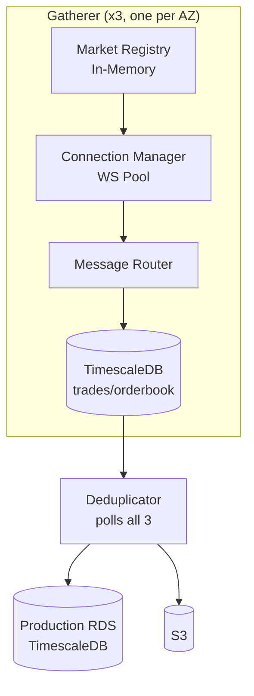

# CLAUDE.md

This file provides guidance to Claude Code (claude.ai/code) when working with code in this repository.

## Project Overview

Kalshi Data Platform - a real-time data capture system for Kalshi prediction market orderbooks and trades. Target scale: up to 1M markets.

## Architecture

3 independent gatherer instances (each collecting ALL markets) + 1 deduplicator → Production RDS.



### Components

| Component | Description |
|-----------|-------------|
| **Market Registry** | Discovers markets via REST API, receives live updates via `market_lifecycle` WebSocket. In-memory only (no persistence). |
| **Connection Manager** | Maintains 150 WebSocket connections per gatherer (144 orderbook + 6 global) |
| **Message Router** | Routes WebSocket messages to appropriate writers with non-blocking buffers |
| **Snapshot Poller** | Polls REST API every 15 minutes for orderbook snapshots as backup |
| **Writers** | Batch writers for orderbook deltas, trades, tickers, and snapshots |
| **Local Storage** | TimescaleDB per gatherer for time-series data (trades, orderbook_deltas, snapshots, tickers) |
| **Deduplicator** | Polls all gatherers via cursor-based sync, deduplicates time-series data, writes to production RDS |

### Key Design Decisions

- **No message queues** - IPC via database polling (cursor-based sync)
- **3-gatherer redundancy** - Any 2 can fail without data loss
- **Append-only writes** - Never update, only insert
- **Integer pricing** - Hundred-thousandths of a dollar (0-100,000 = $0.00-$1.00) for 5-digit sub-penny precision
- **Microsecond timestamps** - All timestamps as `BIGINT` (µs since epoch)

## Kalshi API

- **REST**: `https://api.elections.kalshi.com/trade-api/v2`
- **WebSocket**: `wss://api.elections.kalshi.com`
- **Demo**: `https://demo-api.kalshi.co/trade-api/v2`

Key WebSocket channels: `orderbook_delta`, `trade`, `ticker`, `market_lifecycle`

Rate limits apply only to order operations (writes), not market data reads.

## Repository Structure

```
kalshi-data/
├── cmd/
│   ├── gatherer/main.go        # Gatherer binary entrypoint
│   └── deduplicator/main.go    # Deduplicator binary entrypoint
├── internal/                    # Shared packages
│   ├── api/                     # Kalshi API client (REST + WebSocket)
│   ├── config/                  # Configuration loading
│   ├── connection/              # Connection Manager
│   ├── database/                # Database connection pools
│   ├── dedup/                   # Deduplication logic
│   ├── market/                  # Market Registry
│   ├── metrics/                 # Prometheus metrics
│   ├── model/                   # Shared data types (Market, Trade, etc.)
│   ├── poller/                  # Snapshot Poller
│   ├── router/                  # Message Router
│   ├── version/                 # Build-time version info
│   └── writer/                  # Batch writers
├── configs/                     # Configuration files
│   ├── gatherer.example.yaml   # Example gatherer config
│   └── deduplicator.example.yaml
├── deploy/terraform/            # Infrastructure-as-Code
├── docs/                        # Documentation (see below)
├── go.mod
└── Makefile
```

## Documentation

```
docs/
├── STYLE_GUIDE.md              # Documentation standards
├── kalshi-api/                 # Kalshi API reference
│   ├── rest-api/               # REST endpoints (exchange, markets, orders, portfolio)
│   └── websocket/              # WebSocket protocol and channels
└── kalshi-data/                # Platform design docs
    ├── architecture/           # System design, data model, scaling
    │   ├── data-model.md       # Gatherer schema (with sid)
    │   └── data-model-production.md  # Production schema (no sid)
    ├── market-registry/        # Market discovery and tracking
    ├── connection-manager/     # WebSocket pool (150 connections)
    ├── message-router/         # Message routing, buffer overflow handling
    ├── websocket/              # WebSocket client behavior and lifecycle
    ├── writers/                # Batch writers, price conversion
    ├── snapshot-poller/        # REST polling (15-min interval, concurrent)
    ├── storage/                # TimescaleDB, PostgreSQL, S3 export
    ├── monitoring/             # Metrics, alerts, dashboards
    ├── recovery/               # Failure handling, runbooks
    ├── development/            # Local development setup
    └── deployment/             # Infrastructure, config, Terraform
        ├── configuration.md    # YAML config schemas, secrets
        ├── startup.md          # Database users, systemd, health checks
        └── terraform.md        # IaC templates
```

## Data Model

### Price Format

Internal: integer hundred-thousandths (0-100,000 = $0.00-$1.00) for 5-digit sub-penny precision.

| API Value | Internal | Notes |
|-----------|----------|-------|
| `"0.52"` | 52000 | Standard penny |
| `"0.5250"` | 52500 | Sub-penny (0.1 cent) |
| `"0.52505"` | 52505 | Sub-penny (0.01 cent) |

### Deduplication Keys

| Table | Primary Key |
|-------|-------------|
| trades | `trade_id` (UUID from Kalshi) |
| orderbook_deltas | `(ticker, exchange_ts, price, side)` |
| orderbook_snapshots | `(ticker, snapshot_ts, source)` |
| tickers | `(ticker, exchange_ts)` |

Note: `seq` (sequence number) is NOT part of deduplication keys - it's per-subscription and differs across gatherers.

## Build Commands

```bash
# Build both binaries
make build

# Build for production (ARM64)
make build-linux-arm64

# Run tests
make test
```

## Configuration

Binaries use YAML config with environment variable substitution:

```bash
./gatherer --config /etc/kalshi/gatherer.yaml
./deduplicator --config /etc/kalshi/deduplicator.yaml
```

See `docs/kalshi-data/deployment/configuration.md` for full schemas.

## Language

Go backend. Use standard library where possible.

Use Mermaid for all diagrams (no ASCII art).
