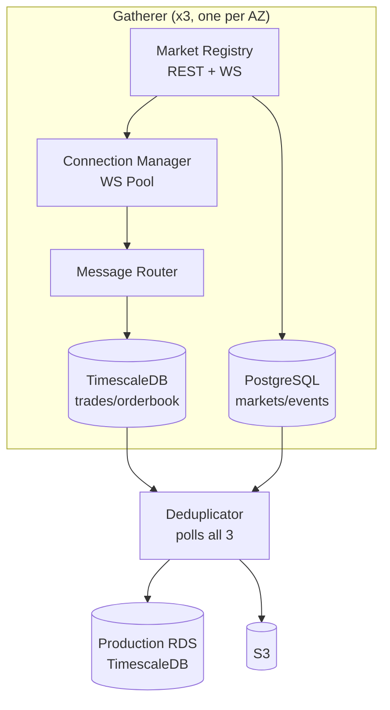

# CLAUDE.md

This file provides guidance to Claude Code (claude.ai/code) when working with code in this repository.

## Project Overview

Kalshi Data Platform - a real-time data capture system for Kalshi prediction market orderbooks and trades. Target scale: up to 1M markets.

## Architecture

3 independent gatherer instances (each collecting ALL markets) + 1 deduplicator → Production RDS.

- **Market Registry**: Discovers markets via REST API, receives live updates via `market_lifecycle` WebSocket
- **Connection Manager**: Maintains WebSocket pool, subscribes to orderbook/trade/ticker channels
- **Message Router**: Routes WebSocket messages to appropriate writers
- **Snapshot Poller**: Polls REST API every 1 minute for orderbook snapshots as backup
- **Writers**: Batch writers for orderbook deltas, trades, tickers, and snapshots
- **Local Storage**: TimescaleDB (time-series) + PostgreSQL (relational) per gatherer
- **Deduplicator**: Polls all gatherers, deduplicates, writes to production RDS

## Kalshi API

- **REST**: `https://api.elections.kalshi.com/trade-api/v2`
- **WebSocket**: `wss://api.elections.kalshi.com`
- **Demo**: `https://demo-api.kalshi.co/trade-api/v2`

Key WebSocket channels: `orderbook_delta`, `trade`, `ticker`, `market_lifecycle`

Rate limits apply only to order operations (writes), not market data reads.

## Documentation

- `docs/STYLE_GUIDE.md` - Documentation standards
- `docs/kalshi-api/` - Kalshi API reference (REST + WebSocket)
- `docs/kalshi-data/` - Platform design docs by component

Use Mermaid for all diagrams (no ASCII art).

## Language

Go backend. Use standard library where possible.
