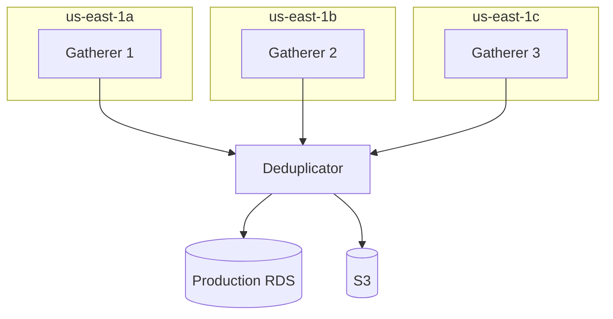

# Deployment

Infrastructure and deployment configuration for Kalshi Data Platform.

## Structure

```
deploy/
└── terraform/          # Infrastructure-as-Code
```

## Architecture



## Resources

- **EC2**: 3 gatherer instances + 1 deduplicator
- **RDS**: Production TimescaleDB
- **S3**: Data archival bucket
- **VPC**: Private networking with NAT
