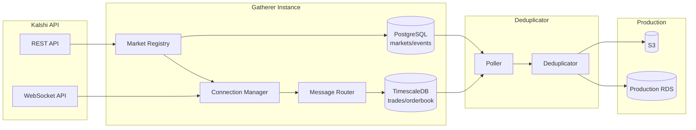
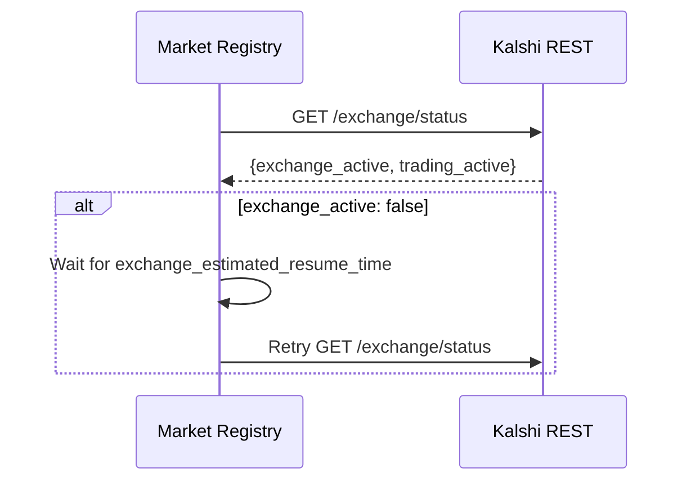
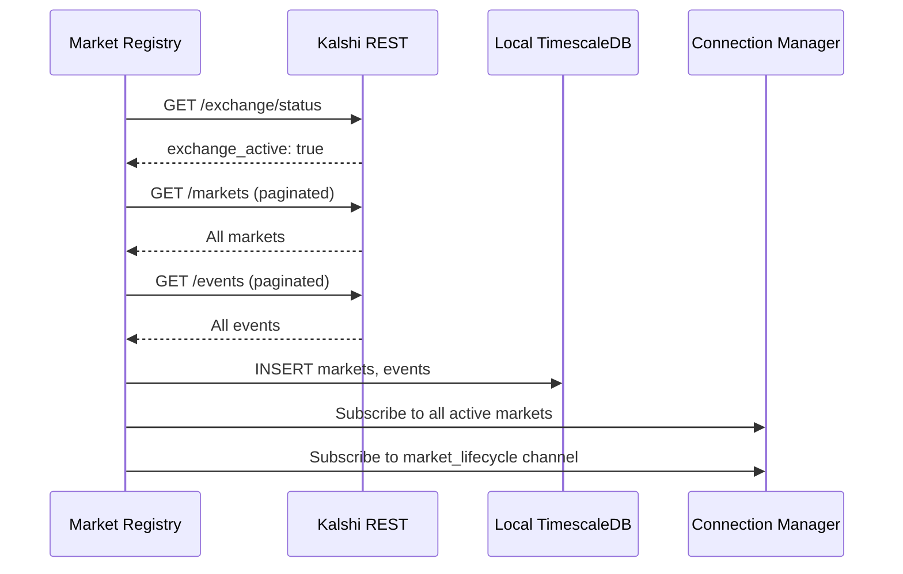
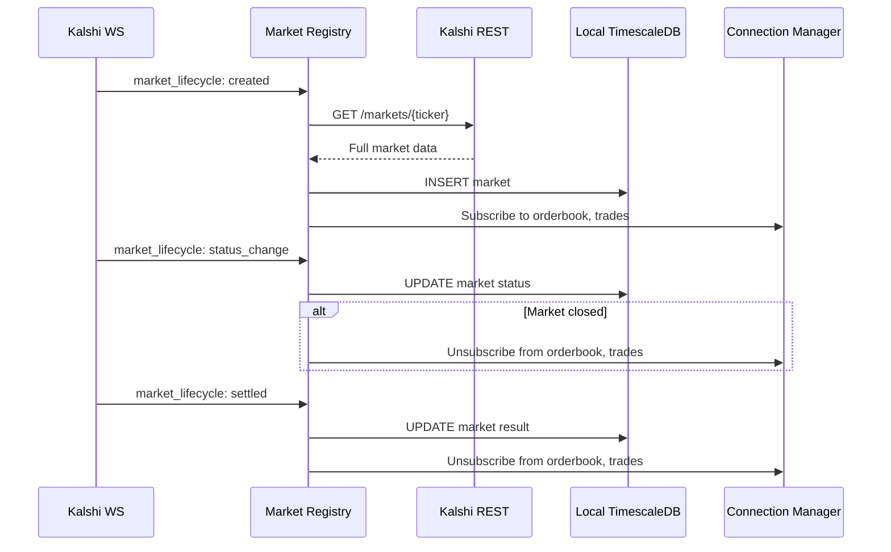
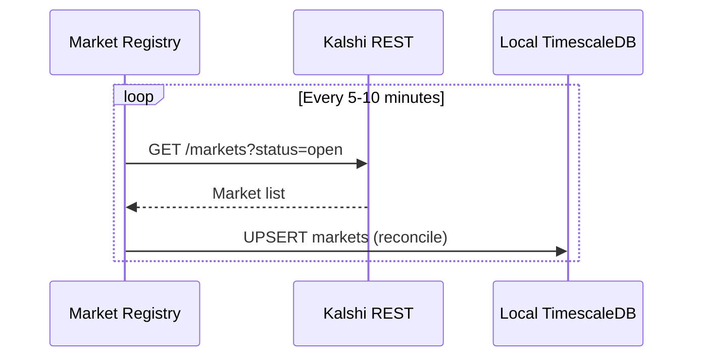
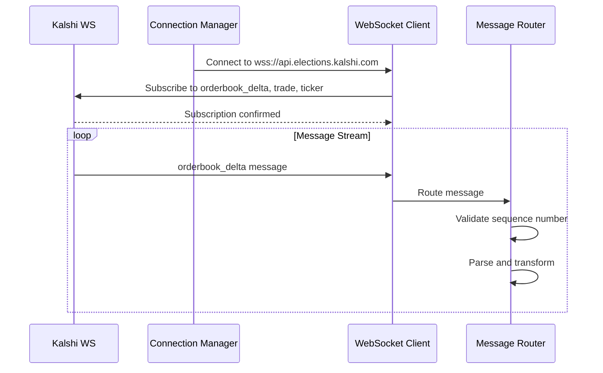
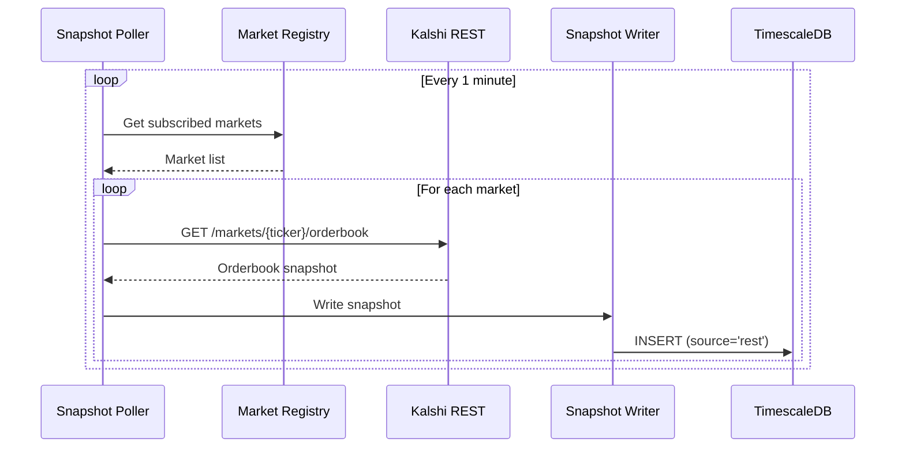
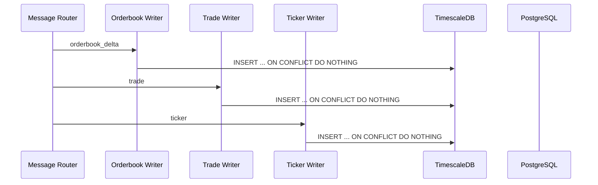
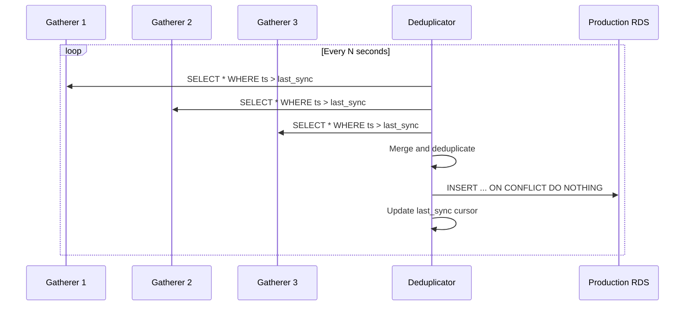
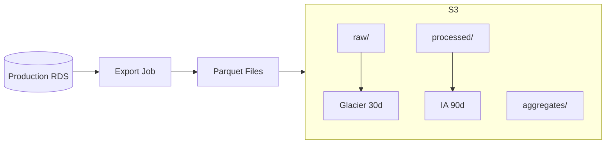

# Data Flow

Message lifecycle from Kalshi APIs to production storage.

---

## End-to-End Flow



---

## Stage 0: Market Discovery

The Market Registry uses both REST API and WebSocket for market discovery.

### Exchange Status Check

Before connecting, verify the exchange is operational.



### Initial Sync (REST)

On startup, fetch all markets via REST API.



### Live Updates (WebSocket)

After initial sync, receive real-time market updates via `market_lifecycle` channel.



### Periodic Reconciliation (REST)

Backup polling to catch any missed WebSocket events.



**Data Sources:**

| Source | Purpose | Frequency |
|--------|---------|-----------|
| REST `GET /markets` | Initial sync, reconciliation | On startup, every 5-10 min |
| REST `GET /events` | Event metadata | Every 10 min |
| REST `GET /markets/{ticker}/orderbook` | Snapshot recovery after gap | On demand |
| WS `market_lifecycle` | New markets, status changes, settlements | Real-time |

**market_lifecycle Event Types:**

| Event | Action |
|-------|--------|
| `created` | Fetch full market via REST, subscribe to data channels |
| `status_change` | Update DB, adjust subscriptions if closed |
| `settled` | Update result, unsubscribe from data channels |

---

## Stage 1: WebSocket Ingestion



**Message Types:**

| Channel | Data | Table |
|---------|------|-------|
| `orderbook_delta` | Snapshots + deltas | `orderbook_deltas`, `orderbook_snapshots` |
| `trade` | Public trades | `trades` |
| `ticker` | Price/volume updates | `tickers` |

---

## Stage 1.5: REST Snapshot Polling

Every 1 minute, poll orderbook snapshots for all subscribed markets as backup.



**Purpose:** Ensures at least 1-minute resolution orderbook data even if WebSocket deltas are missed.

---

## Stage 2: Local Storage



Each gatherer has two local databases:

| Database | Tables | Purpose |
|----------|--------|---------|
| TimescaleDB | trades, orderbook_deltas, orderbook_snapshots, tickers | Time-series data (hypertables) |
| PostgreSQL | series, events, markets | Relational data |

---

## Stage 3: Deduplication



**Deduplication Keys (Kalshi exchange identifiers):**

| Data Type | Unique Key |
|-----------|------------|
| Orderbook deltas | `(ticker, exchange_ts, seq, price, side)` |
| Orderbook snapshots | `(ticker, snapshot_ts, source)` |
| Trades | `trade_id` |
| Tickers | `(ticker, exchange_ts)` |
| Markets | `ticker` |

---

## Stage 4: Cold Storage Export



Periodic export job writes Parquet files to S3 with lifecycle policies.

---

## Message Formats

### Orderbook Delta (Inbound)

```json
{
  "type": "orderbook_delta",
  "sid": 12345,
  "seq": 100,
  "msg": {
    "market_ticker": "INXD-25JAN10-T4600",
    "price": 56,
    "delta": 100,
    "side": "yes",
    "ts": 1704067200
  }
}
```

### Trade (Inbound)

```json
{
  "type": "trade",
  "sid": 12346,
  "msg": {
    "market_ticker": "INXD-25JAN10-T4600",
    "trade_id": "abc123",
    "count": 50,
    "yes_price": 56,
    "no_price": 44,
    "taker_side": "yes",
    "ts": 1704067200
  }
}
```

---

## Throughput Estimates

| Stage | Throughput |
|-------|------------|
| WebSocket ingestion | 2000 msg/s per gatherer |
| Local DB writes | 2000 inserts/s (batched) |
| Deduplicator sync | Configurable (e.g., every 5s) |
| Production RDS writes | ~6000 inserts/s peak (3 gatherers) |
