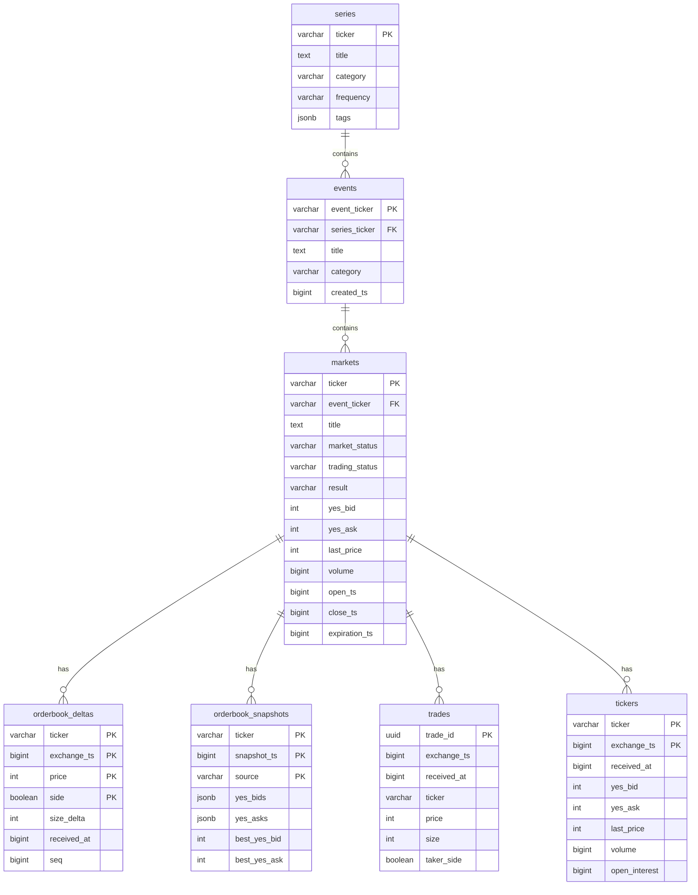

# Data Model (Gatherer-Local)

TimescaleDB schema for individual gatherer instances. Production/Aurora schema documented separately.

---

## Design Principles

1. **Append-only writes** — Never update, only insert
2. **Microsecond precision** — All timestamps as `BIGINT` (µs since epoch)
3. **Integer pricing** — Hundred-thousandths of a dollar (0-100,000) to avoid float errors
4. **TimescaleDB hypertables** — Automatic partitioning by time

---

## Schema Overview



---

## Data Formats

### Price Format

Kalshi API returns prices in both cent and dollar formats. Use `*_dollars` fields for subpenny precision.

Internal format: integer hundred-thousandths (0-100,000 = $0.00000-$1.00000)

**Conversion (done by gatherer before storage):**

| Kalshi `price_dollars` | Internal | Notes |
|------------------------|----------|-------|
| `"0.52"` | 52000 | 1 cent precision |
| `"0.5250"` | 52500 | Subpenny (0.1 cent) |
| `"0.5255"` | 52550 | Subpenny (0.01 cent) |
| `"0.99"` | 99000 | Near 100% |
| `"0.9999"` | 99990 | Tail pricing |

### Timestamp Format

**Two timestamp fields in time-series tables:**

| Field | Source | Description |
|-------|--------|-------------|
| `exchange_ts` | Kalshi API `ts` field | When Kalshi processed the event (server-side) |
| `received_at` | Gatherer `time.Now()` | When gatherer received the message (client-side) |

Both stored as `BIGINT` in microseconds (µs since Unix epoch).

**Use cases:**
- `exchange_ts`: Ordering events, deduplication, analytics
- `received_at`: Debugging latency, identifying gatherer delays

### All Conversions in Application Layer

**Design principle:** The database stores raw values only. All conversions happen in Go code:

| Conversion | Location | Implementation |
|------------|----------|----------------|
| `"0.52"` → `52000` | `internal/api/convert.go` | `DollarsToCents()` |
| ISO 8601 → µs | `internal/api/convert.go` | `ParseTimestamp()` |
| `time.Time` → µs | Go code | `time.UnixMicro()` |
| µs → `time.Time` | Go code | `time.UnixMicro(ts)` |
| Internal → dollars | Go code | `float64(price) / 100000.0` |

**Why no database functions:**
- Simpler schema with no custom functions to maintain
- All logic in one place (Go binary)
- Easier testing and debugging
- Portable across database instances

---

## Relational Tables

### series

```sql
CREATE TABLE series (
    ticker          VARCHAR(128) PRIMARY KEY,
    title           TEXT,
    category        VARCHAR(64),
    frequency       VARCHAR(32),
    tags            JSONB,
    settlement_sources JSONB,
    updated_at      BIGINT NOT NULL
);

CREATE INDEX idx_series_category ON series(category);
```

### events

```sql
CREATE TABLE events (
    event_ticker    VARCHAR(128) PRIMARY KEY,
    series_ticker   VARCHAR(128) REFERENCES series(ticker),
    title           TEXT,
    category        VARCHAR(64),
    created_ts      BIGINT,
    updated_at      BIGINT NOT NULL
);

CREATE INDEX idx_events_series ON events(series_ticker);
```

### markets

```sql
CREATE TABLE markets (
    ticker          VARCHAR(128) PRIMARY KEY,
    event_ticker    VARCHAR(128) REFERENCES events(event_ticker),
    title           TEXT,
    subtitle        TEXT,

    -- Status (see "Market Status Values" section below)
    market_status   VARCHAR(16) NOT NULL,
    trading_status  VARCHAR(16) NOT NULL,
    market_type     VARCHAR(8) NOT NULL,
    result          VARCHAR(8),

    -- Current prices (from REST, updated periodically)
    yes_bid         INTEGER,
    yes_ask         INTEGER,
    last_price      INTEGER,

    -- Volume
    volume          BIGINT,
    volume_24h      BIGINT,
    open_interest   BIGINT,

    -- Timing (µs since epoch)
    open_ts         BIGINT,
    close_ts        BIGINT,
    expiration_ts   BIGINT,
    created_ts      BIGINT,
    updated_at      BIGINT NOT NULL,

    CONSTRAINT valid_market_status CHECK (market_status IN ('initialized', 'inactive', 'active', 'closed', 'determined', 'disputed', 'amended', 'finalized')),
    CONSTRAINT valid_market_type CHECK (market_type IN ('binary', 'scalar'))
);

CREATE INDEX idx_markets_event ON markets(event_ticker);
CREATE INDEX idx_markets_status ON markets(market_status, trading_status);
```

### Market Status Values

The Kalshi API uses two different status representations:

#### 1. Gatherer Status (8 values)

The gatherer stores the granular `market_status` from Kalshi API:

| Gatherer Status | Description |
|-----------------|-------------|
| `initialized` | Market created, not yet active |
| `inactive` | Temporarily inactive |
| `active` | Open for trading |
| `closed` | Trading closed, awaiting settlement |
| `determined` | Outcome determined |
| `disputed` | Settlement disputed |
| `amended` | Settlement amended |
| `finalized` | Fully settled, final |

#### 2. Production Status (4 values) — Authoritative Mapping

The deduplicator converts gatherer statuses to simplified production statuses when writing to production RDS:

| Production Status | Gatherer Statuses | Description |
|-------------------|-------------------|-------------|
| `unopened` | `initialized`, `inactive` | Not yet tradeable |
| `open` | `active` | Currently tradeable |
| `closed` | `closed`, `disputed` | Trading ended, not yet settled |
| `settled` | `determined`, `amended`, `finalized` | Final outcome known |

**Implementation:** The deduplicator performs this mapping in the `syncMarkets()` function before upserting to production.

---

## Time-Series Tables (TimescaleDB)

### trades

```sql
CREATE TABLE trades (
    trade_id        UUID PRIMARY KEY,

    -- Timing (µs since epoch)
    exchange_ts     BIGINT NOT NULL,
    received_at     BIGINT NOT NULL,

    -- Market
    ticker          VARCHAR(128) NOT NULL,

    -- Trade data
    price           INTEGER NOT NULL,      -- 0-100,000 (hundred-thousandths)
    size            INTEGER NOT NULL,
    taker_side      BOOLEAN NOT NULL,      -- TRUE = YES, FALSE = NO

    -- Metadata
    sid             BIGINT                 -- Subscription ID for debugging
);

SELECT create_hypertable('trades', 'exchange_ts',
    chunk_time_interval => 86400000000);  -- 1 day in µs

CREATE INDEX idx_trades_ticker_time ON trades(ticker, exchange_ts DESC);

-- Compression after 1 day
ALTER TABLE trades SET (
    timescaledb.compress,
    timescaledb.compress_segmentby = 'ticker',
    timescaledb.compress_orderby = 'exchange_ts DESC'
);

SELECT add_compression_policy('trades', INTERVAL '1 day');
```

### orderbook_deltas

```sql
CREATE TABLE orderbook_deltas (
    -- Timing (µs since epoch)
    exchange_ts     BIGINT NOT NULL,       -- Kalshi exchange timestamp
    received_at     BIGINT NOT NULL,       -- When gatherer received

    -- Market
    ticker          VARCHAR(128) NOT NULL,

    -- Delta data
    side            BOOLEAN NOT NULL,      -- TRUE = YES, FALSE = NO
    price           INTEGER NOT NULL,      -- 0-100,000
    size_delta      INTEGER NOT NULL,      -- Positive = add, negative = remove

    -- Metadata (not part of deduplication key)
    seq             BIGINT,                -- Kalshi sequence number (per-subscription, for gap detection)
    sid             BIGINT,                -- Subscription ID for debugging

    PRIMARY KEY (ticker, exchange_ts, price, side)
);

-- Note: seq is NOT part of the primary key because it is per-subscription (sid).
-- Two gatherers receiving the same delta will have different seq values.
-- Deduplication uses (ticker, exchange_ts, price, side) which uniquely identifies
-- a price level change at a specific time.

SELECT create_hypertable('orderbook_deltas', 'exchange_ts',
    chunk_time_interval => 3600000000);  -- 1 hour in µs

CREATE INDEX idx_orderbook_ticker_time ON orderbook_deltas(ticker, exchange_ts DESC);

-- Compression after 1 day, retention 7 days
ALTER TABLE orderbook_deltas SET (
    timescaledb.compress,
    timescaledb.compress_segmentby = 'ticker',
    timescaledb.compress_orderby = 'exchange_ts DESC'
);

SELECT add_compression_policy('orderbook_deltas', INTERVAL '1 day');
SELECT add_retention_policy('orderbook_deltas', INTERVAL '7 days');
```

### orderbook_snapshots

Full orderbook state from WebSocket snapshots and 15-minute REST polling.

```sql
CREATE TABLE orderbook_snapshots (
    -- Timing (µs since epoch)
    snapshot_ts     BIGINT NOT NULL,
    exchange_ts     BIGINT,                -- 0 for WS/REST snapshots (not provided by API)

    -- Market
    ticker          VARCHAR(128) NOT NULL,

    -- Source
    source          VARCHAR(8) NOT NULL,   -- Values: 'ws' (2 chars) or 'rest' (4 chars)

    -- Book data (JSONB for flexibility)
    yes_bids        JSONB NOT NULL,        -- [{price: int, size: int}, ...]
    yes_asks        JSONB NOT NULL,
    no_bids         JSONB NOT NULL,
    no_asks         JSONB NOT NULL,

    -- Derived fields (for fast filtering)
    best_yes_bid    INTEGER,
    best_yes_ask    INTEGER,
    spread          INTEGER,

    -- Metadata
    sid             BIGINT,                -- Subscription ID (0 for REST)

    PRIMARY KEY (ticker, snapshot_ts, source)
);

SELECT create_hypertable('orderbook_snapshots', 'snapshot_ts',
    chunk_time_interval => 3600000000);  -- 1 hour in µs

CREATE INDEX idx_ob_snapshots_ticker ON orderbook_snapshots(ticker, snapshot_ts DESC);
CREATE INDEX idx_ob_snapshots_source ON orderbook_snapshots(source, snapshot_ts DESC);

-- Compression after 1 day, retention 30 days
ALTER TABLE orderbook_snapshots SET (
    timescaledb.compress,
    timescaledb.compress_segmentby = 'ticker',
    timescaledb.compress_orderby = 'snapshot_ts DESC'
);

SELECT add_compression_policy('orderbook_snapshots', INTERVAL '1 day');
SELECT add_retention_policy('orderbook_snapshots', INTERVAL '30 days');
```

### tickers

```sql
CREATE TABLE tickers (
    -- Timing (µs since epoch)
    exchange_ts     BIGINT NOT NULL,       -- Kalshi exchange timestamp
    received_at     BIGINT NOT NULL,       -- When gatherer received

    -- Market
    ticker          VARCHAR(128) NOT NULL,

    -- Ticker data
    yes_bid         INTEGER,
    yes_ask         INTEGER,
    last_price      INTEGER,
    volume          BIGINT,
    open_interest   BIGINT,
    dollar_volume   BIGINT,                -- Dollar-denominated volume
    dollar_open_interest BIGINT,           -- Dollar-denominated open interest

    -- Metadata
    sid             BIGINT,                -- Subscription ID for debugging

    PRIMARY KEY (ticker, exchange_ts)
);

SELECT create_hypertable('tickers', 'exchange_ts',
    chunk_time_interval => 3600000000);  -- 1 hour in µs

CREATE INDEX idx_tickers_ticker_time ON tickers(ticker, exchange_ts DESC);

-- Compression after 1 day, retention 7 days
ALTER TABLE tickers SET (
    timescaledb.compress,
    timescaledb.compress_segmentby = 'ticker',
    timescaledb.compress_orderby = 'exchange_ts DESC'
);

SELECT add_compression_policy('tickers', INTERVAL '1 day');
SELECT add_retention_policy('tickers', INTERVAL '7 days');
```

---

## Deduplication Keys

Uses Kalshi's exchange-provided identifiers for deduplication:

| Table | Primary Key | Conflict Handling |
|-------|-------------|-------------------|
| `trades` | `trade_id` | `ON CONFLICT DO NOTHING` |
| `orderbook_deltas` | `(ticker, exchange_ts, price, side)` | `ON CONFLICT DO NOTHING` |
| `orderbook_snapshots` | `(ticker, snapshot_ts, source)` | `ON CONFLICT DO NOTHING` |
| `tickers` | `(ticker, exchange_ts)` | `ON CONFLICT DO NOTHING` |
| `markets` | `ticker` | `ON CONFLICT DO UPDATE` |
| `events` | `event_ticker` | `ON CONFLICT DO UPDATE` |

---

## Storage Estimates

| Table | Row Size | Daily Rows (Peak) | Daily Size |
|-------|----------|-------------------|------------|
| `trades` | ~80 bytes | 1M | ~80 MB |
| `orderbook_deltas` | ~60 bytes | 10M | ~600 MB |
| `orderbook_snapshots` | ~2 KB | 100K | ~200 MB |
| `tickers` | ~50 bytes | 1M | ~50 MB |

**With 10x compression:** ~100 MB/day per gatherer

---

## Queries

### Latest orderbook state

```sql
SELECT price, SUM(size_delta) as quantity, side
FROM orderbook_deltas
WHERE ticker = $1
  AND received_at >= (
    SELECT snapshot_ts FROM orderbook_snapshots
    WHERE ticker = $1
    ORDER BY snapshot_ts DESC
    LIMIT 1
  )
GROUP BY price, side
HAVING SUM(size_delta) > 0
ORDER BY price DESC;
```

### Recent trades

```sql
-- Returns raw values; convert in application layer
SELECT trade_id, exchange_ts, size, price, taker_side
FROM trades
WHERE ticker = $1
ORDER BY exchange_ts DESC
LIMIT 100;
```

**Go code to display results:**
```go
for rows.Next() {
    var t Trade
    rows.Scan(&t.TradeID, &t.ExchangeTs, &t.Size, &t.Price, &t.TakerSide)

    // Convert in Go
    ts := time.UnixMicro(t.ExchangeTs)
    dollars := float64(t.Price) / 100000.0
    fmt.Printf("%s: $%.5f x %d @ %s\n", t.TradeID, dollars, t.Size, ts.Format(time.RFC3339))
}
```

### Market activity (last 24h)

```sql
-- Pass cutoff timestamp from Go: time.Now().Add(-24*time.Hour).UnixMicro()
SELECT
    m.ticker,
    m.title,
    COUNT(t.trade_id) as trade_count,
    SUM(t.size) as total_volume
FROM markets m
LEFT JOIN trades t ON t.ticker = m.ticker
    AND t.exchange_ts > $2  -- cutoff_ts parameter
WHERE m.market_status = 'open'
GROUP BY m.ticker, m.title
ORDER BY total_volume DESC
LIMIT 100;
```

**Go code:**
```go
cutoffTs := time.Now().Add(-24 * time.Hour).UnixMicro()
rows, err := db.Query(query, ticker, cutoffTs)
```
