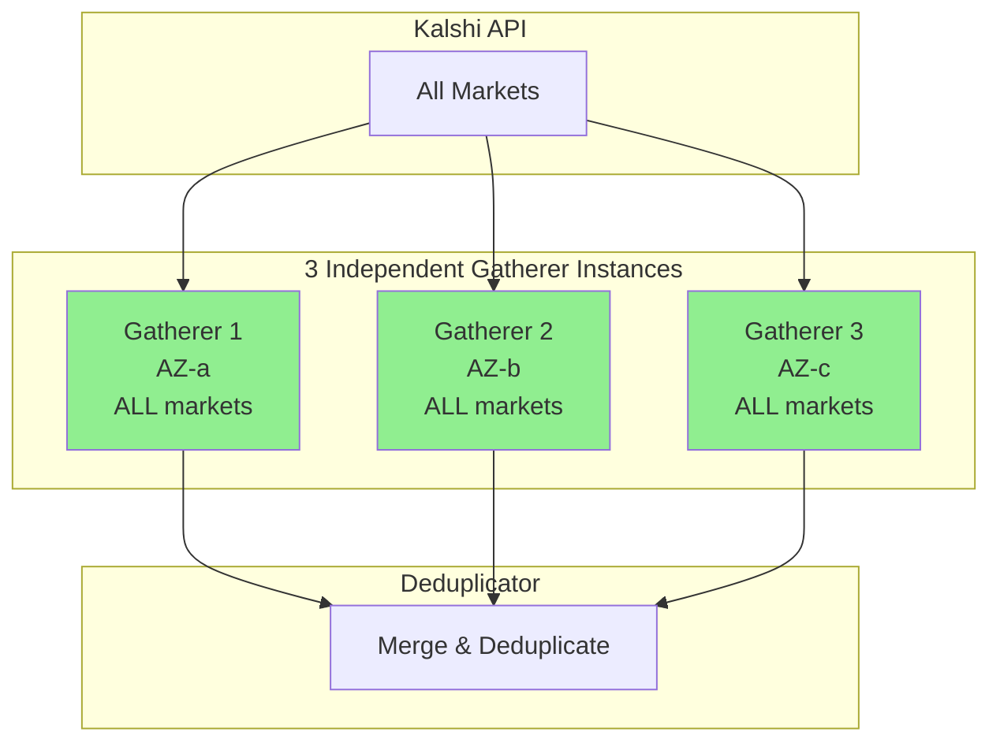
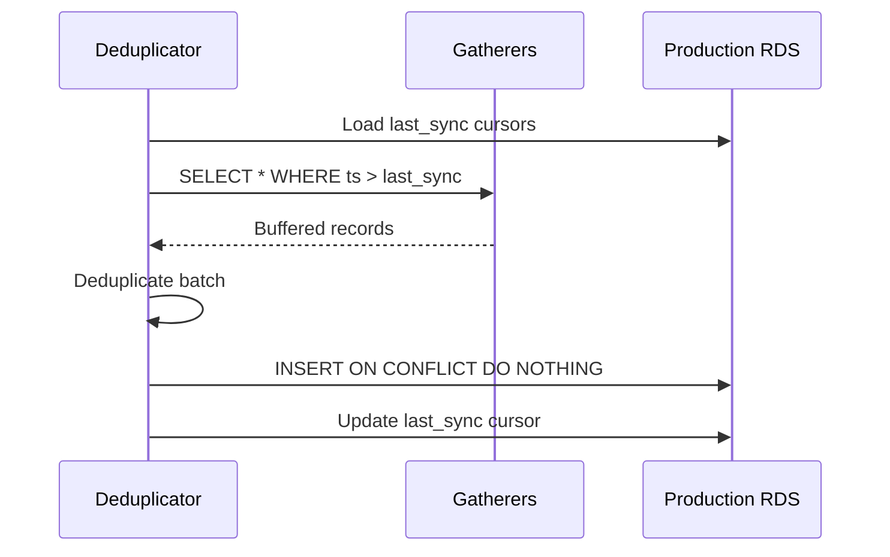

# Reliability

Failure modes, recovery procedures, and consistency guarantees.

---

## Architecture Resilience

Each gatherer independently collects ALL markets. The deduplicator merges 3 complete copies, ensuring no data loss even if 2 gatherers fail.

---

## Failure Modes

### Gatherer Instance Failure

| Scenario | Detection | Impact | Recovery |
|----------|-----------|--------|----------|
| Process crash | Health check (30s) | None (2 copies remain) | Auto-restart via systemd |
| Instance termination | CloudWatch alarm | None (2 copies remain) | Launch replacement |
| AZ outage | Cross-AZ health check | None (2 copies remain) | Other AZs continue |
| 2 gatherers down | CloudWatch alarm | None (1 copy remains) | Launch replacements |

**Mitigation:** Each gatherer has a complete copy of all data. Any single gatherer surviving means zero data loss.

### Deduplicator Failure

| Scenario | Detection | Impact | Recovery |
|----------|-----------|--------|----------|
| Process crash | Health check (30s) | Sync delay | Auto-restart |
| Instance failure | CloudWatch alarm | Sync delay | Launch replacement |

**Mitigation:** Gatherers buffer data locally. Deduplicator resumes from last sync cursor.

### Production RDS Failure

| Scenario | Detection | Impact | Recovery |
|----------|-----------|--------|----------|
| Instance failure | RDS events | Write failure | Manual failover / restore |
| Storage full | CloudWatch alarm | Write failure | Increase storage |
| Connection exhaustion | App metrics | Partial writes | Connection pooling |

**Mitigation:** Gatherers continue buffering. Deduplicator retries with backoff.

---

## Recovery Procedures

### Deduplicator Recovery

---

## Consistency Guarantees

### At-Least-Once Delivery

- Deduplication at gatherer level: `ON CONFLICT DO NOTHING`
- Deduplication at production level: `ON CONFLICT DO NOTHING`

### Eventual Consistency

| Tier | Latency | Guarantee |
|------|---------|-----------|
| Gatherer local DB | < 1s | Immediate |
| Production RDS | < 10s | Near real-time |
| S3 cold storage | < 1 hour | Batch |

### Data Completeness

With 3 independent gatherers each collecting ALL markets:

| Gatherers Running | Data Captured | Notes |
|-------------------|---------------|-------|
| 3 | 100% (3 copies) | Normal operation |
| 2 | 100% (2 copies) | Single failure |
| 1 | 100% (1 copy) | Degraded but complete |
| 0 | 0% | Total outage |

**Key insight:** Data completeness depends on at least one gatherer running, not on specific gatherers. Any single gatherer captures everything.

---

## Backup Strategy

### Local DB (Gatherers)

- EBS snapshots: Not required (ephemeral buffer)
- Data can be reconstructed from production RDS

### Production RDS

| Backup Type | Frequency | Retention |
|-------------|-----------|-----------|
| Automated snapshots | Daily | 7 days |
| Manual snapshots | Before migrations | 30 days |
| Point-in-time recovery | Continuous | 7 days |

### S3 Cold Storage

| Tier | Lifecycle |
|------|-----------|
| `raw/` | Glacier after 30 days |
| `processed/` | IA after 90 days |
| `aggregates/` | Standard (frequently accessed) |

---

## Monitoring Alerts

### Critical (Page)

| Alert | Condition | Action |
|-------|-----------|--------|
| All gatherers down | 0 healthy instances | Immediate investigation |
| Production RDS unreachable | Connection failures > 1m | Check RDS status |
| Deduplicator sync stalled | No sync > 5m | Check deduplicator logs |

### Warning

| Alert | Condition | Action |
|-------|-----------|--------|
| Single gatherer down | < 3 healthy instances | Investigate within 1h |
| Disk usage high | > 80% EBS | Increase storage |
| RDS connections high | > 80% max connections | Scale or add pooling |

---

## RTO/RPO Targets

| Component | RTO (Recovery Time) | RPO (Data Loss) |
|-----------|---------------------|-----------------|
| Single Gatherer | 5 minutes | 0 (other gatherers have data) |
| All Gatherers | 10 minutes | Duration of outage |
| Deduplicator | 10 minutes | 0 (gatherers buffer) |
| Production RDS | 30 minutes | < 5 minutes (PITR) |
| S3 | N/A | 0 (durable) |

---

## Incident Response

### Gatherer Failure

1. CloudWatch alarm triggers
2. Auto-scaling replaces instance (if configured)
3. New instance connects and resumes
4. No manual intervention required

### RDS Failure

1. CloudWatch alarm triggers
2. Assess failure type (instance vs storage vs connection)
3. If instance: Restore from snapshot or PITR
4. Update deduplicator connection string if needed
5. Resume sync from last cursor

### Complete Outage Recovery

1. Restore production RDS from snapshot
2. Launch 3 gatherer instances
3. Launch deduplicator
4. Gatherers connect and begin data collection
5. Normal operation resumes
