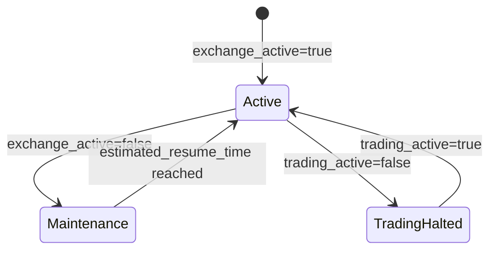

# Reliability

Failure modes, recovery procedures, and consistency guarantees.

---

## Architecture Resilience


Each gatherer independently collects ALL markets. The deduplicator merges 3 complete copies, ensuring no data loss even if 2 gatherers fail.

---

## Failure Modes

### Gatherer Instance Failure

| Scenario | Detection | Impact | Recovery |
|----------|-----------|--------|----------|
| Process crash | Health check (30s) | None (2 copies remain) | Auto-restart via systemd |
| Instance termination | CloudWatch alarm | None (2 copies remain) | Launch replacement |
| AZ outage | Cross-AZ health check | None (2 copies remain) | Other AZs continue |
| 2 gatherers down | CloudWatch alarm | None (1 copy remains) | Launch replacements |

**Mitigation:** Each gatherer has a complete copy of all data. Any single gatherer surviving means zero data loss.

### Deduplicator Failure

| Scenario | Detection | Impact | Recovery |
|----------|-----------|--------|----------|
| Process crash | Health check (30s) | Sync delay | Auto-restart |
| Instance failure | CloudWatch alarm | Sync delay | Launch replacement |

**Mitigation:** Gatherers buffer data locally. Deduplicator resumes from last sync cursor.

### Production RDS Failure

| Scenario | Detection | Impact | Recovery |
|----------|-----------|--------|----------|
| Instance failure | RDS events | Write failure | Manual failover / restore |
| Storage full | CloudWatch alarm | Write failure | Increase storage |
| Connection exhaustion | App metrics | Partial writes | Connection pooling |

**Mitigation:** Gatherers continue buffering. Deduplicator retries with backoff.

---

## Error Handling Philosophy

Components use different error handling strategies based on their criticality and the availability of fallback mechanisms.

### Strategy by Component

| Component | Strategy | Rationale |
|-----------|----------|-----------|
| **Market Registry** | Retry forever (exponential backoff, max 5min) | Cannot operate without market list; transient errors resolve |
| **Connection Manager** | Reconnect with backoff | WebSocket disconnects are transient; other gatherers cover gaps |
| **Snapshot Poller** | Skip failed market, continue | 3 gatherers provide redundancy; next cycle will retry |
| **Writers** | Drop failed batch, continue | Non-blocking; redundancy from 3 gatherers covers lost batches |
| **Deduplicator** | Retry with backoff | Must succeed eventually; gatherers buffer indefinitely |

### Design Principles

1. **Critical path retries forever**: Market Registry must have data to operate, so it retries until success
2. **Non-blocking components skip and continue**: Writers and Snapshot Poller prioritize throughput over individual record success
3. **Redundancy enables graceful degradation**: 3 gatherers mean any single component failure doesn't cause data loss
4. **Cursors enable resumption**: Deduplicator and gatherers track progress via cursors, enabling recovery from any point

### Error Metrics

All components emit error metrics for monitoring:

| Metric Pattern | Example | Purpose |
|----------------|---------|---------|
| `*_errors_total` | `fetch_errors_total` | Track error rate |
| `*_retries_total` | `rest_retries_total` | Track retry frequency |
| `*_dropped_total` | `messages_dropped_total` | Track data loss |

### When Data Loss is Acceptable

Data loss at a single component is acceptable when:
1. Other gatherers captured the same data
2. The lost data can be recovered via REST polling
3. The data type is low-priority (e.g., ticker updates vs trades)

Data loss is **never acceptable** for:
- Trade records (use deduplicator cross-validation)
- Market metadata changes (use reconciliation)

---

## Kalshi API Error Handling

### REST API HTTP Errors

| Status Code | Meaning | Handling Strategy | Backoff |
|-------------|---------|-------------------|---------|
| 400 Bad Request | Malformed request | Log error, do not retry (bug in our code) | None |
| 401 Unauthorized | Invalid/expired credentials | Log critical, alert, halt component | None |
| 403 Forbidden | Insufficient permissions | Log critical, alert, halt component | None |
| 404 Not Found | Resource doesn't exist | Skip resource, continue (market may have been delisted) | None |
| 429 Too Many Requests | Rate limited | Retry with backoff; should not occur for read operations | Exponential (1s → 5min) |
| 500 Internal Server Error | Kalshi server error | Retry with backoff | Exponential (1s → 5min) |
| 502 Bad Gateway | Upstream error | Retry with backoff | Exponential (1s → 5min) |
| 503 Service Unavailable | Maintenance/overload | Check exchange status endpoint, wait for recovery | Exponential (1s → 5min) |
| 504 Gateway Timeout | Request timeout | Retry with backoff | Exponential (1s → 5min) |

### WebSocket Errors

| Error | Meaning | Handling Strategy |
|-------|---------|-------------------|
| Connection refused | Server unavailable | Reconnect with exponential backoff |
| Connection closed (1000) | Normal close | Reconnect immediately |
| Connection closed (1001) | Server going away | Reconnect with backoff (maintenance) |
| Connection closed (1006) | Abnormal close | Reconnect with backoff |
| Connection closed (1008) | Policy violation | Log error, check credentials, alert |
| Connection closed (1011) | Server error | Reconnect with backoff |
| Ping timeout | No heartbeat response | Close connection, reconnect |
| Subscribe error `INVALID_CHANNEL` | Unknown channel name | Log error, do not retry (bug in our code) |
| Subscribe error `INVALID_MARKET` | Market doesn't exist | Remove from subscription list, continue |
| Subscribe error `SUBSCRIPTION_LIMIT` | Too many subscriptions | Reduce subscriptions, alert |

### Exchange Status Handling

The exchange may be temporarily unavailable for maintenance or other operational reasons.



| Status | API Behavior | Platform Response |
|--------|--------------|-------------------|
| `exchange_active: true, trading_active: true` | Normal operation | Full data collection |
| `exchange_active: true, trading_active: false` | Markets update, no trades | Continue collection (orderbooks still move) |
| `exchange_active: false` | API may return 503 | Poll `/exchange/status` until `estimated_resume_time`, then resume |

**Exchange maintenance handling:**

```go
func (c *Component) handleMaintenanceWindow(ctx context.Context) error {
    for {
        status, err := c.rest.GetExchangeStatus(ctx)
        if err != nil {
            // Even status endpoint may be down during maintenance
            c.logger.Warn("exchange status check failed", "err", err)
            select {
            case <-ctx.Done():
                return ctx.Err()
            case <-time.After(30 * time.Second):
                continue
            }
        }

        if status.ExchangeActive {
            return nil // Exchange is back
        }

        // Wait until estimated resume time (with buffer)
        waitDuration := time.Until(status.EstimatedResumeTime) + 10*time.Second
        if waitDuration < 30*time.Second {
            waitDuration = 30 * time.Second
        }

        c.logger.Info("exchange in maintenance",
            "resume_at", status.EstimatedResumeTime,
            "waiting", waitDuration)

        select {
        case <-ctx.Done():
            return ctx.Err()
        case <-time.After(waitDuration):
        }
    }
}
```

### Backoff Strategy

All components use the same exponential backoff with jitter:

```go
func backoffWithJitter(attempt int, base, max time.Duration) time.Duration {
    backoff := base * time.Duration(1<<attempt) // 2^attempt
    if backoff > max {
        backoff = max
    }
    // Add 0-25% jitter to prevent thundering herd
    jitter := time.Duration(rand.Int63n(int64(backoff / 4)))
    return backoff + jitter
}
```

| Component | Base | Max | Notes |
|-----------|------|-----|-------|
| Market Registry (REST) | 1s | 5min | Critical path, retries forever |
| Connection Manager (WS) | 1s | 5min | Per-connection backoff |
| Snapshot Poller (REST) | 1s | 1min | Non-critical, skips on persistent failure |
| Deduplicator (DB) | 1s | 30s | Shorter max, must stay responsive |

### Authentication Failures

Authentication errors (401, 403) require special handling as they indicate configuration problems, not transient failures.

```go
func (c *Component) handleAuthError(err error) {
    c.logger.Error("authentication failure", "err", err)
    c.metrics.AuthFailures.Inc()

    // Alert immediately - this requires human intervention
    c.alerter.Critical("kalshi_auth_failure", map[string]string{
        "component": c.name,
        "error":     err.Error(),
    })

    // Halt this component to prevent log spam
    // Other gatherers continue; manual fix required
    c.Stop()
}
```

---

## Recovery Procedures

### Deduplicator Recovery


---

## Consistency Guarantees

### At-Least-Once Delivery

- Deduplication at gatherer level: `ON CONFLICT DO NOTHING`
- Deduplication at production level: `ON CONFLICT DO NOTHING`

### Eventual Consistency

| Tier | Latency | Guarantee |
|------|---------|-----------|
| Gatherer local DB | < 1s | Immediate |
| Production RDS | < 10s | Near real-time |
| S3 cold storage | < 1 hour | Batch |

### Data Completeness

With 3 independent gatherers each collecting ALL markets:

| Gatherers Running | Data Captured | Notes |
|-------------------|---------------|-------|
| 3 | 100% (3 copies) | Normal operation |
| 2 | 100% (2 copies) | Single failure |
| 1 | 100% (1 copy) | Degraded but complete |
| 0 | 0% | Total outage |

**Key insight:** Data completeness depends on at least one gatherer running, not on specific gatherers. Any single gatherer captures everything.

---

## Backup Strategy

### Local DB (Gatherers)

- EBS snapshots: Not required (ephemeral buffer)
- Data can be reconstructed from production RDS

### Production RDS

| Backup Type | Frequency | Retention |
|-------------|-----------|-----------|
| Automated snapshots | Daily | 7 days |
| Manual snapshots | Before migrations | 30 days |
| Point-in-time recovery | Continuous | 7 days |

### S3 Cold Storage

| Tier | Lifecycle |
|------|-----------|
| `raw/` | Glacier after 30 days |
| `processed/` | IA after 90 days |
| `aggregates/` | Standard (frequently accessed) |

---

## Monitoring Alerts

### Critical (Page)

| Alert | Condition | Action |
|-------|-----------|--------|
| All gatherers down | 0 healthy instances | Immediate investigation |
| Production RDS unreachable | Connection failures > 1m | Check RDS status |
| Deduplicator sync stalled | No sync > 5m | Check deduplicator logs |

### Warning

| Alert | Condition | Action |
|-------|-----------|--------|
| Single gatherer down | < 3 healthy instances | Investigate within 1h |
| Disk usage high | > 80% EBS | Increase storage |
| RDS connections high | > 80% max connections | Scale or add pooling |

---

## RTO/RPO Targets

| Component | RTO (Recovery Time) | RPO (Data Loss) |
|-----------|---------------------|-----------------|
| Single Gatherer | 5 minutes | 0 (other gatherers have data) |
| All Gatherers | 10 minutes | Duration of outage |
| Deduplicator | 10 minutes | 0 (gatherers buffer) |
| Production RDS | 30 minutes | < 5 minutes (PITR) |
| S3 | N/A | 0 (durable) |

---

## Incident Response

### Gatherer Failure

1. CloudWatch alarm triggers
2. Auto-scaling replaces instance (if configured)
3. New instance connects and resumes
4. No manual intervention required

### RDS Failure

1. CloudWatch alarm triggers
2. Assess failure type (instance vs storage vs connection)
3. If instance: Restore from snapshot or PITR
4. Update deduplicator connection string if needed
5. Resume sync from last cursor

### Complete Outage Recovery

1. Restore production RDS from snapshot
2. Launch 3 gatherer instances
3. Launch deduplicator
4. Gatherers connect and begin data collection
5. Normal operation resumes
