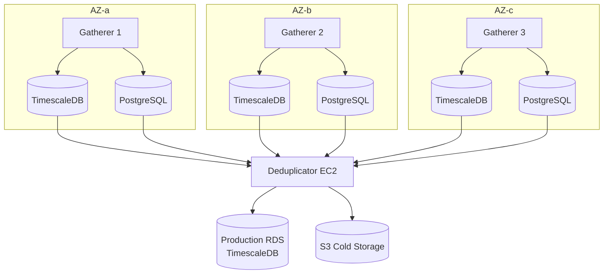
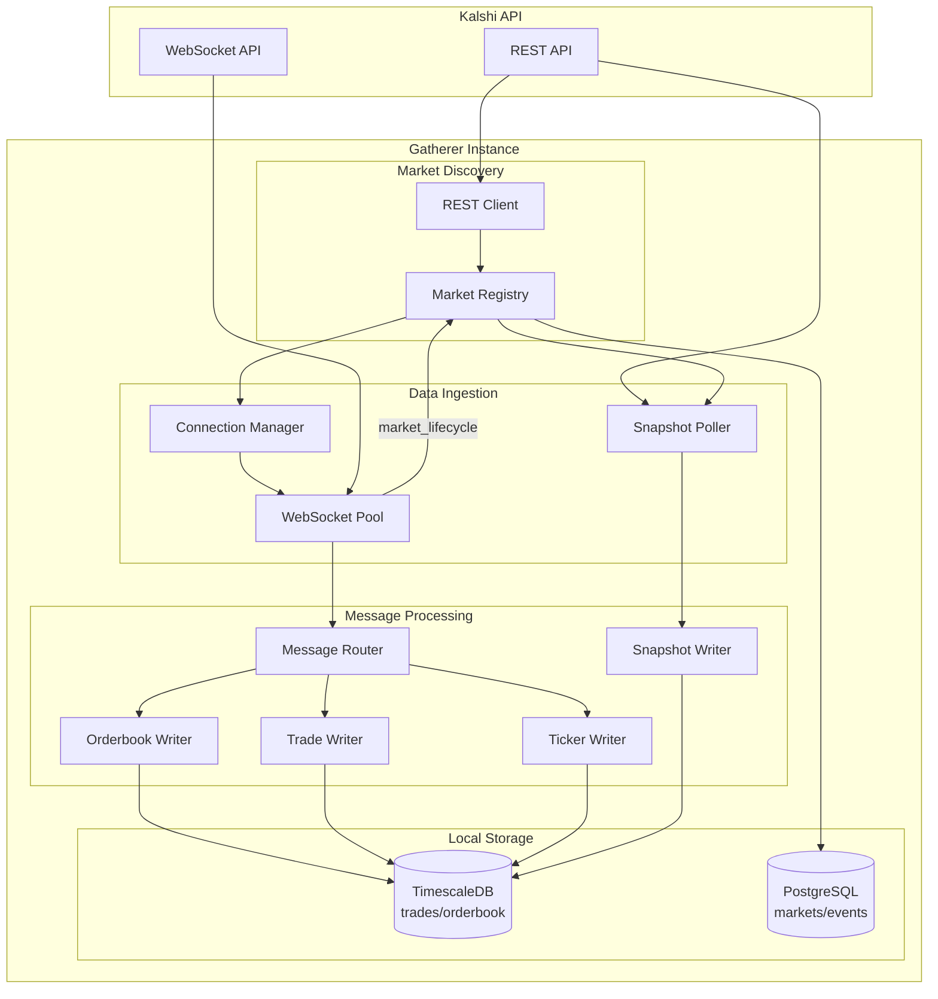

# System Design

End-to-end architecture for the Kalshi Data Platform.

---

## Overview



---

## Gatherer Internal Architecture

Each gatherer is fully self-contained with all components needed to operate independently.



### Market Registry

Discovers and tracks markets via REST API and WebSocket.

| Responsibility | Details |
|----------------|---------|
| Exchange status | Check `GET /exchange/status` before connecting |
| Initial sync | `GET /markets` on startup (full pagination) |
| Live updates | Subscribe to `market_lifecycle` WebSocket channel |
| Reconciliation | Periodic `GET /markets` as backup (every 5-10 min) |
| Event/Series discovery | `GET /events`, `GET /series/{ticker}` for metadata |
| Subscription management | Tell Connection Manager which markets to subscribe |
| Metadata storage | Write to local `markets` and `events` tables |

**Data Sources:**

| Source | Purpose | Frequency |
|--------|---------|-----------|
| REST `GET /exchange/status` | Check if exchange is active | On startup, every 1 min |
| REST `GET /markets` | Initial sync, reconciliation | On startup, every 5-10 min |
| REST `GET /events` | Event metadata | Every 10 min |
| REST `GET /series/{ticker}` | Series metadata | On demand |
| WS `market_lifecycle` | New markets, status changes | Real-time |

**Exchange Status Handling:**

| Status | Action |
|--------|--------|
| `exchange_active: false` | Pause connections, wait for resume |
| `trading_active: false` | Continue data collection (markets still update) |

**market_lifecycle Events:**

| Event Type | Action |
|------------|--------|
| `created` | Fetch full market data via REST, subscribe to orderbook/trades |
| `status_change` | Update local `markets` table, adjust subscriptions |
| `settled` | Update result, unsubscribe from orderbook/trades |

### Connection Manager

Manages WebSocket connection pool.

| Responsibility | Details |
|----------------|---------|
| Connection lifecycle | Connect, reconnect with backoff |
| Market assignment | Distribute markets across connections |
| Subscription management | Subscribe/unsubscribe based on Market Registry |
| Health monitoring | Heartbeat handling, connection health |

### Snapshot Poller

Polls REST API for orderbook snapshots every 1 minute as backup data source.

| Responsibility | Details |
|----------------|---------|
| Market list | Gets subscribed markets from Market Registry |
| Polling interval | Every 1 minute |
| REST endpoint | `GET /markets/{ticker}/orderbook` |
| Output | Writes to `orderbook_snapshots` with `source = 'rest'` |

**Purpose:** Ensures at least 1-minute resolution orderbook data even if WebSocket deltas are missed.

### Message Router

Demultiplexes incoming WebSocket messages.

| Channel | Handler |
|---------|---------|
| `orderbook_delta` | Orderbook Writer |
| `trade` | Trade Writer |
| `ticker` | Ticker Writer |

---

## Components

### Gatherer Instances (3x)

| Specification | Value |
|--------------|-------|
| Instance Type | t4g.2xlarge (8 vCPU, 32GB RAM, ARM) |
| Capacity | 150 WebSocket connections, 2000 msg/s |
| Local DBs | TimescaleDB (trades, orderbook) + PostgreSQL (markets, events) |
| Storage | 200GB gp3 EBS |
| Cost | ~$170/month each (Savings Plan) |

Each gatherer is fully autonomous and continues operating if others fail.

### Deduplicator Instance (1x)

| Specification | Value |
|--------------|-------|
| Instance Type | t4g.xlarge (4 vCPU, 16GB RAM, ARM) |
| Role | Poll gatherers, deduplicate, write to production RDS |
| Cost | ~$100/month (Savings Plan) |

### Production Database

| Specification | Value |
|--------------|-------|
| Instance Type | db.t4g.large (2 vCPU, 8GB RAM) Single-AZ |
| Engine | TimescaleDB on PostgreSQL 16 |
| Storage | 500GB gp3 |
| Cost | ~$110/month (instance + storage) |

### S3 Cold Storage

```
s3://kalshi-data-prod/
├── raw/           → Glacier after 30 days
├── processed/     → Parquet, IA after 90 days
└── aggregates/    → Pre-computed OHLCV
```

---

## Deployment Model

| Component | AZ | Count |
|-----------|-----|-------|
| Gatherer | us-east-1a, 1b, 1c | 3 |
| Deduplicator | us-east-1a | 1 |
| RDS | us-east-1a | 1 (Single-AZ) |
| S3 | Regional | 1 |

---

## Memory Allocation (per Gatherer)

| Component | RAM |
|-----------|-----|
| 150 WS connections × 50MB | 7.5GB |
| TimescaleDB (shared_buffers) | 6GB |
| PostgreSQL (shared_buffers) | 2GB |
| Go application + buffers | 4GB |
| OS + headroom | 12.5GB |
| **Total** | **32GB** |

---

## Network

- VPC with 3 public subnets (one per AZ)
- Security groups:
  - Gatherers: Outbound to Kalshi WS, inbound from Deduplicator
  - Deduplicator: Outbound to RDS and S3
  - RDS: Inbound from Deduplicator only

---

## Cost Summary

| Service | Monthly |
|---------|---------|
| 3x EC2 t4g.2xlarge Gatherers | $510 |
| 1x EC2 t4g.xlarge Deduplicator | $100 |
| 3x EBS gp3 200GB | $60 |
| RDS TimescaleDB Single-AZ | $60 |
| RDS Storage gp3 500GB | $50 |
| S3 (1TB) | $25 |
| CloudWatch | $20 |
| **Total** | **~$825** |
