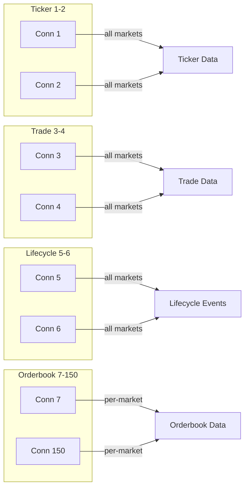
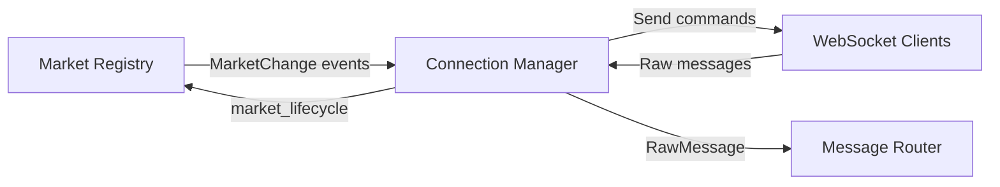

# Connection Manager

Orchestrates WebSocket connections and subscriptions. Bridges Market Registry (which discovers markets) with WebSocket Clients (which handle raw connections).

---

## Responsibilities

| Responsibility | Details |
|----------------|---------|
| Connection pool | Manage 150 WebSocket Client instances |
| Subscription orchestration | Subscribe/unsubscribe based on Market Registry events |
| Command/response correlation | Track pending commands, match responses |
| Reconnection | Reconnect with exponential backoff on errors |
| Message forwarding | Forward raw messages to Message Router |
| Sequence tracking | Track sequence numbers per subscription, detect gaps |

**Not responsible for** (handled by other components):
- Raw WebSocket I/O (WebSocket Client)
- Market discovery (Market Registry)
- Message parsing (Message Router)

**Important:** Connection Manager does not track markets independently. It receives `MarketChange` events from Market Registry and subscribes/unsubscribes accordingly. See [Market Registry: Single Source of Truth](../market-registry/README.md#single-source-of-truth).

---

## Connection Allocation

**150 connections per gatherer (fixed):**

| Connections | Channel | Count | Purpose |
|-------------|---------|-------|---------|
| 1-2 | `ticker` | 2 | Global ticker subscription (redundancy) |
| 3-4 | `trade` | 2 | Global trade subscription (redundancy) |
| 5-6 | `market_lifecycle` | 2 | Market lifecycle events → Market Registry |
| 7-150 | `orderbook_delta` | 144 | Per-market orderbook subscriptions |

Each gatherer has its own Kalshi API key.

---

## Subscription Model

| Channel | Market Param | Strategy |
|---------|--------------|----------|
| `ticker` | Omit (= all markets) | 1 global subscription per connection |
| `trade` | Omit (= all trades) | 1 global subscription per connection |
| `market_lifecycle` | Omit (= all markets) | 1 global subscription per connection |
| `orderbook_delta` | Required | 1 subscription per market, least-loaded assignment |

---

## Dependencies

| Dependency | Direction | Purpose |
|------------|-----------|---------|
| Market Registry | Bidirectional | Receives `MarketChange` events, sends `market_lifecycle` messages |
| WebSocket Client | Bidirectional | Sends commands, receives messages |
| Message Router | Output | Forwards raw messages (ticker, trade, orderbook) |

---

## Related Docs

- [Interface](./interface.md) - Public methods and types
- [Lifecycle](./lifecycle.md) - Startup, shutdown, reconnection
- [Behaviors](./behaviors.md) - Event handling, command correlation, sequence tracking
- [Configuration](./configuration.md) - Config options and metrics
- [WebSocket Client](../websocket/) - Low-level connection handling
- [Market Registry](../market-registry/) - Market discovery
