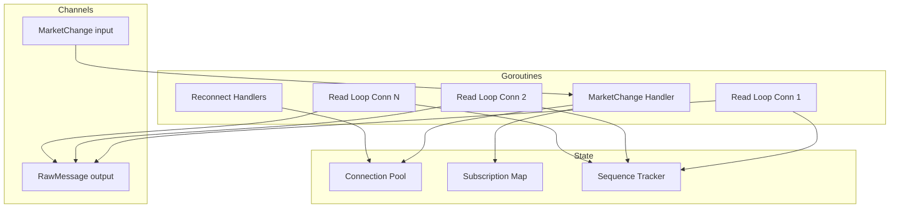

# Interface

Public methods and types for Connection Manager.

---

## Manager Interface

```go
type Manager interface {
    // Start begins listening for Market Registry events and manages connections
    Start(ctx context.Context) error

    // Stop gracefully shuts down all connections
    Stop(ctx context.Context) error

    // Messages returns channel of raw messages for Message Router
    Messages() <-chan RawMessage
}
```

---

## Types

### RawMessage

```go
type RawMessage struct {
    Data       []byte
    ConnID     int        // Which connection this came from (1-150)
    ReceivedAt time.Time  // Local timestamp when WS Client received message
    SeqGap     bool       // true if sequence gap detected before this message
    GapSize    int        // Number of missed messages (0 if no gap)
}
```

| Field | Type | Description |
|-------|------|-------------|
| `Data` | `[]byte` | Raw message bytes from WebSocket |
| `ConnID` | `int` | Connection ID (1-150) |
| `ReceivedAt` | `time.Time` | Local timestamp when WebSocket Client received message |
| `SeqGap` | `bool` | True if sequence gap detected before this message |
| `GapSize` | `int` | Number of missed messages (seq - lastSeq - 1) |

**Note:** Server-side `exchange_ts` is in the message payload, parsed by Router/Writers.

### Response Types

```go
type Response struct {
    ID   int64           `json:"id"`
    Type string          `json:"type"` // "subscribed", "unsubscribed", "error"
    Msg  json.RawMessage `json:"msg"`
}

type SubscribedMsg struct {
    SID     int64  `json:"sid"`
    Channel string `json:"channel"`
}

type ErrorMsg struct {
    Code    string `json:"code"`
    Message string `json:"message"`
}
```

---

## Internal State

```go
type manager struct {
    cfg        ManagerConfig
    registry   Registry              // Market Registry
    router     chan<- RawMessage     // Output to Message Router
    lifecycle  chan<- []byte         // Output to Market Registry (market_lifecycle messages)
    ctx        context.Context
    cancel     context.CancelFunc
    wg         sync.WaitGroup        // Wait for goroutines on shutdown

    // Fixed connection pool (150 connections)
    tickerConns    [2]*connState     // Connections 1-2
    tradeConns     [2]*connState     // Connections 3-4
    lifecycleConns [2]*connState     // Connections 5-6
    orderbookConns [144]*connState   // Connections 7-150

    // Market → connection mapping (for orderbook)
    marketConnMu  sync.RWMutex
    marketToConn  map[string]int     // market ticker → connection ID (7-150)

    // Subscription tracking
    subsMu     sync.RWMutex
    subs       map[int64]*subscription  // SID → subscription info

    // Sequence tracking (per SID)
    seqMu      sync.RWMutex
    lastSeq    map[int64]int64         // SID → last sequence number

    logger *slog.Logger
}

type connState struct {
    client       Client                   // WebSocket Client
    id           int                      // Connection ID (1-150)
    role         string                   // "ticker", "trade", "lifecycle", or "orderbook"

    // Markets on this connection (orderbook only)
    mu           sync.Mutex               // Protects markets map
    markets      map[string]struct{}

    // Goroutine coordination
    readLoopDone chan struct{}            // Closed when readLoop exits

    // Command/response correlation
    pendingMu    sync.Mutex
    pending      map[int64]chan Response  // Command ID → response channel
    cmdID        int64                    // Atomic counter
}

type subscription struct {
    SID     int64
    Channel string
    ConnID  int
    Ticker  string  // Empty for global (ticker/trade/lifecycle)
}
```

---

## Concurrency Model



| Goroutine | Count | Purpose |
|-----------|-------|---------|
| MarketChange Handler | 1 | Process registry events |
| Read Loop | 150 | One per connection, forward messages |
| Reconnect Handler | 150 | One per connection, handle errors |

**Thread Safety:**
- `marketConnMu` protects market-to-connection mapping
- `subsMu` protects subscription map
- `seqMu` protects sequence tracking
- `conn.mu` (per connection) protects markets map
- `conn.pendingMu` (per connection) protects pending requests
