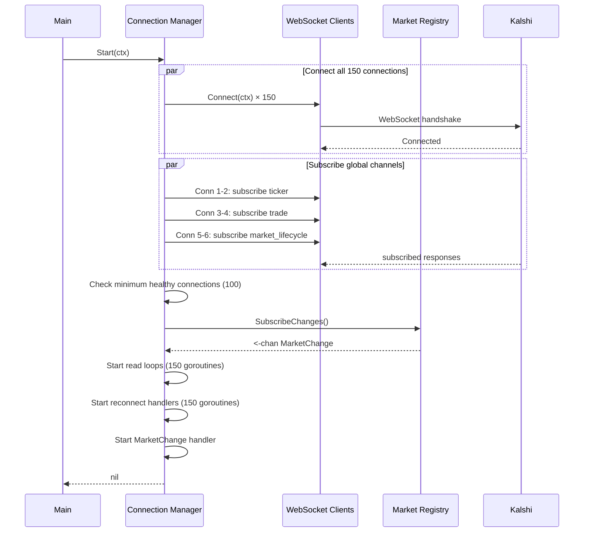
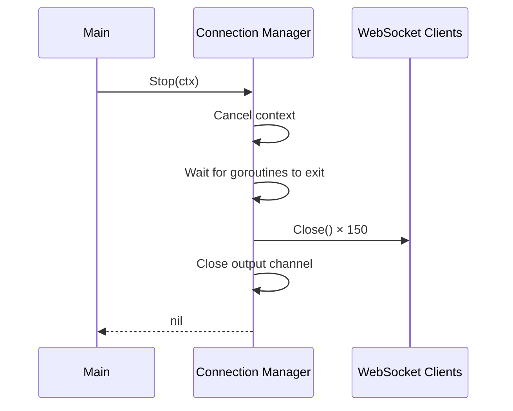

# Lifecycle

Startup, shutdown, and reconnection for Connection Manager.

---

## Startup Sequence



```go
const MinHealthyConnections = 100

func (m *manager) Start(ctx context.Context) error {
    m.ctx, m.cancel = context.WithCancel(ctx)

    // Connect all 150 connections in parallel
    var startupWg sync.WaitGroup
    errCh := make(chan error, 150)

    for i := 0; i < 150; i++ {
        startupWg.Add(1)
        go func(id int) {
            defer startupWg.Done()
            if err := m.connectAndSetup(id); err != nil {
                errCh <- fmt.Errorf("conn %d: %w", id, err)
            }
        }(i + 1)
    }

    startupWg.Wait()
    close(errCh)

    // Log connection failures
    for err := range errCh {
        m.logger.Warn("connection failed during startup", "err", err)
    }

    // Check minimum healthy connections
    healthy := m.countHealthy()
    if healthy < MinHealthyConnections {
        return fmt.Errorf("only %d/%d connections healthy, need %d",
            healthy, 150, MinHealthyConnections)
    }

    // Subscribe to global channels
    m.subscribeGlobalChannels()

    // Start MarketChange handler
    m.wg.Add(1)
    go m.handleMarketChanges()

    return nil
}

func (m *manager) connectAndSetup(id int) error {
    conn := m.getConn(id)
    conn.readLoopDone = make(chan struct{})

    if err := conn.client.Connect(m.ctx); err != nil {
        return err
    }

    m.wg.Add(2)
    go m.readLoop(conn)
    go m.reconnectLoop(conn)

    return nil
}
```

---

## Shutdown Sequence



```go
func (m *manager) Stop(ctx context.Context) error {
    // Signal all goroutines to stop
    m.cancel()

    // Wait for all goroutines to exit
    m.wg.Wait()

    // Close all connections
    for _, conn := range m.tickerConns {
        if conn != nil {
            conn.client.Close()
        }
    }
    for _, conn := range m.tradeConns {
        if conn != nil {
            conn.client.Close()
        }
    }
    for _, conn := range m.lifecycleConns {
        if conn != nil {
            conn.client.Close()
        }
    }
    for _, conn := range m.orderbookConns {
        if conn != nil {
            conn.client.Close()
        }
    }

    // Safe to close now - no goroutines are sending
    close(m.router)
    close(m.lifecycle)
    return nil
}
```

---

## Reconnection

On connection error, reconnect with exponential backoff and resubscribe.

```go
func (m *manager) reconnectLoop(conn *connState) {
    defer m.wg.Done()

    backoff := 1 * time.Second
    maxBackoff := 5 * time.Minute

    for {
        select {
        case <-m.ctx.Done():
            return
        case err := <-conn.client.Errors():
            m.logger.Warn("connection error", "conn", conn.id, "err", err)

            // Wait for old readLoop to exit
            <-conn.readLoopDone

            // Reconnect with backoff
            for {
                select {
                case <-m.ctx.Done():
                    return
                case <-time.After(backoff):
                }

                if err := conn.client.Connect(m.ctx); err == nil {
                    m.resubscribe(conn)
                    backoff = 1 * time.Second

                    // Start new readLoop
                    conn.readLoopDone = make(chan struct{})
                    m.wg.Add(1)
                    go m.readLoop(conn)
                    break
                }

                m.logger.Warn("reconnect failed", "conn", conn.id, "backoff", backoff)
                backoff = min(backoff*2, maxBackoff)
            }
        }
    }
}
```

### Resubscription After Reconnect

```go
func (m *manager) resubscribe(conn *connState) {
    switch conn.role {
    case "ticker":
        m.subscribe(conn, "ticker", "")

    case "trade":
        m.subscribe(conn, "trade", "")

    case "lifecycle":
        m.subscribe(conn, "market_lifecycle", "")

    case "orderbook":
        // Resubscribe to all markets assigned to this connection
        conn.mu.Lock()
        tickers := make([]string, 0, len(conn.markets))
        for ticker := range conn.markets {
            tickers = append(tickers, ticker)
        }
        conn.mu.Unlock()

        for _, ticker := range tickers {
            m.subscribe(conn, "orderbook_delta", ticker)
        }
    }
}
```

---

## Connection Failure Handling

If an orderbook connection fails and cannot reconnect:

1. Log error
2. Continue retry attempts
3. Markets on failed connection get no orderbook updates
4. REST snapshot polling provides backup data
5. Deduplicator fills gaps from other gatherers

**No market redistribution** - markets stay assigned to their original connection. Simplifies logic and avoids subscription churn.
