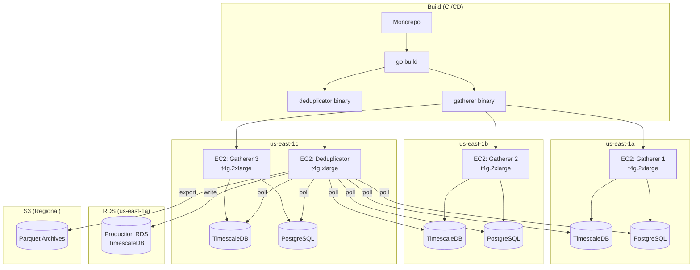
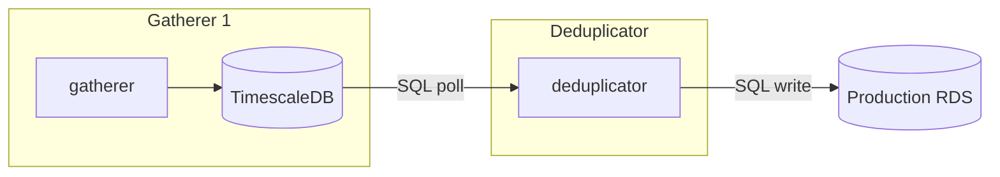

# Deployment

Infrastructure setup, build process, and deployment topology.

---

## Overview

The Kalshi Data Platform runs as two separate binaries from a monorepo:

| Binary | Instances | Role |
|--------|-----------|------|
| `gatherer` | 3 (one per AZ) | Collect all market data independently |
| `deduplicator` | 1 | Merge data from gatherers, write to production |



---

## Key Principles

### Monorepo, Multiple Binaries

Single codebase produces two binaries:

```
kalshi-data/
├── cmd/
│   ├── gatherer/main.go      → gatherer binary
│   └── deduplicator/main.go  → deduplicator binary
├── internal/                  → shared packages
└── ...
```

- Same repo, same Go modules
- Shared code in `internal/` (database clients, message types, etc.)
- Different entrypoints with different component compositions

### No Shared Runtime

- Each gatherer runs independently on its own EC2 instance
- Deduplicator runs on a separate EC2 instance
- **No message queues** - IPC via database polling only
- Each gatherer has its own local databases

### Database as IPC



Deduplicator polls gatherer databases using cursor-based sync. No message broker required.

---

## Documentation

| Document | Description |
|----------|-------------|
| [Binaries](binaries.md) | Monorepo structure and build commands |
| [Infrastructure](infrastructure.md) | AWS resource specifications |
| [Terraform](terraform.md) | Infrastructure-as-Code templates |
| [IPC](ipc.md) | Interprocess communication via database polling |
| [Startup](startup.md) | Initialization order and systemd configuration |

---

## Quick Reference

### Instance Summary

| Component | Instance Type | vCPU | RAM | Storage | Count |
|-----------|--------------|------|-----|---------|-------|
| Gatherer | t4g.2xlarge | 8 | 32GB | 200GB gp3 | 3 |
| Deduplicator | t4g.xlarge | 4 | 16GB | 50GB gp3 | 1 |
| Production RDS | db.t4g.large | 2 | 8GB | 500GB gp3 | 1 |

### Network

| Component | Inbound | Outbound |
|-----------|---------|----------|
| Gatherer | Deduplicator (5432) | Kalshi API (443) |
| Deduplicator | None | Gatherers (5432), RDS (5432), S3 (443) |
| RDS | Deduplicator (5432) | None |

### Startup Order

1. **RDS** - Must be available first
2. **Gatherers** - Can start in parallel, connect to Kalshi independently
3. **Deduplicator** - Waits for at least one gatherer to be healthy
