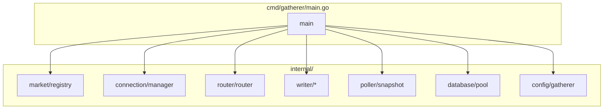
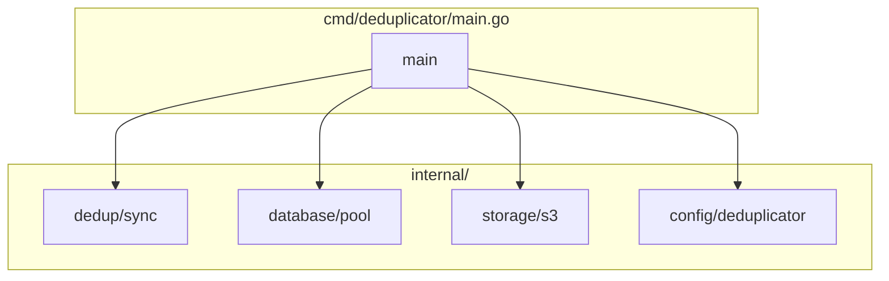

# Binaries

Monorepo structure and build process.

---

## Repository Structure

```
kalshi-data/
├── cmd/
│   ├── gatherer/
│   │   └── main.go           # Gatherer entrypoint
│   └── deduplicator/
│       └── main.go           # Deduplicator entrypoint
├── internal/
│   ├── api/                  # Kalshi API client (REST + WebSocket)
│   ├── config/               # Configuration loading
│   ├── database/             # Database connection pools
│   ├── market/               # Market Registry
│   ├── connection/           # Connection Manager
│   ├── router/               # Message Router
│   ├── writer/               # Batch writers
│   ├── poller/               # Snapshot Poller
│   ├── dedup/                # Deduplication logic
│   └── metrics/              # Prometheus metrics
├── pkg/                      # Public packages (if any)
├── scripts/                  # Build and deployment scripts
├── deploy/
│   └── terraform/            # Infrastructure-as-Code
├── docs/                     # Documentation
├── go.mod
├── go.sum
└── Makefile
```

---

## Binary Compositions

### Gatherer



**Includes:**
- Market Registry (REST client, lifecycle handler)
- Connection Manager (WebSocket pool)
- Message Router
- All Writers (orderbook, trade, ticker, snapshot)
- Snapshot Poller
- Local database connections (TimescaleDB + PostgreSQL)

**Excludes:**
- Deduplication logic
- Production RDS connection
- S3 export

### Deduplicator



**Includes:**
- Deduplication sync engine
- Gatherer database connections (read-only)
- Production RDS connection (read-write)
- S3 export client

**Excludes:**
- Market Registry
- Connection Manager
- Message Router
- Writers

---

## Build Commands

### Development

```bash
# Build both binaries
make build

# Build specific binary
go build -o bin/gatherer ./cmd/gatherer
go build -o bin/deduplicator ./cmd/deduplicator

# Run locally (development)
./bin/gatherer --config configs/gatherer-dev.yaml
./bin/deduplicator --config configs/deduplicator-dev.yaml
```

### Production (ARM64)

```bash
# Cross-compile for ARM64 (t4g instances)
GOOS=linux GOARCH=arm64 go build -o bin/gatherer-arm64 ./cmd/gatherer
GOOS=linux GOARCH=arm64 go build -o bin/deduplicator-arm64 ./cmd/deduplicator

# Or use Makefile
make build-linux-arm64
```

### Docker (Optional)

```dockerfile
# Dockerfile.gatherer
FROM golang:1.22-alpine AS builder
WORKDIR /app
COPY go.mod go.sum ./
RUN go mod download
COPY . .
RUN CGO_ENABLED=0 GOOS=linux GOARCH=arm64 go build -o gatherer ./cmd/gatherer

FROM alpine:3.19
RUN apk --no-cache add ca-certificates
COPY --from=builder /app/gatherer /usr/local/bin/
ENTRYPOINT ["gatherer"]
```

```bash
# Build images
docker build -f Dockerfile.gatherer -t kalshi-gatherer:latest .
docker build -f Dockerfile.deduplicator -t kalshi-deduplicator:latest .
```

---

## Makefile

```makefile
.PHONY: build build-linux-arm64 test lint clean

# Local build
build:
	go build -o bin/gatherer ./cmd/gatherer
	go build -o bin/deduplicator ./cmd/deduplicator

# Production build (ARM64 for t4g instances)
build-linux-arm64:
	GOOS=linux GOARCH=arm64 go build -o bin/gatherer-arm64 ./cmd/gatherer
	GOOS=linux GOARCH=arm64 go build -o bin/deduplicator-arm64 ./cmd/deduplicator

# Tests
test:
	go test -v ./...

test-coverage:
	go test -coverprofile=coverage.out ./...
	go tool cover -html=coverage.out -o coverage.html

# Lint
lint:
	golangci-lint run ./...

# Clean
clean:
	rm -rf bin/
	rm -f coverage.out coverage.html
```

---

## Shared Packages

| Package | Used By | Purpose |
|---------|---------|---------|
| `internal/api` | Gatherer | Kalshi REST + WebSocket clients |
| `internal/config` | Both | Configuration loading and validation |
| `internal/database` | Both | Connection pool management |
| `internal/metrics` | Both | Prometheus metrics registration |
| `internal/model` | Both | Shared data types (Market, Trade, etc.) |

---

## Configuration

Each binary has its own configuration structure:

### Gatherer Config

```yaml
# configs/gatherer.yaml
api:
  base_url: "https://api.elections.kalshi.com/trade-api/v2"
  ws_url: "wss://api.elections.kalshi.com"
  api_key: "${KALSHI_API_KEY}"

database:
  timescaledb:
    host: "localhost"
    port: 5432
    database: "kalshi_ts"
    user: "gatherer"
    password: "${TS_PASSWORD}"
  postgresql:
    host: "localhost"
    port: 5433
    database: "kalshi_meta"
    user: "gatherer"
    password: "${PG_PASSWORD}"

connection_manager:
  connect_timeout: 10s
  initial_backoff: 1s
  max_backoff: 5m

writers:
  batch_size: 1000
  flush_interval: 1s
```

### Deduplicator Config

```yaml
# configs/deduplicator.yaml
gatherers:
  - host: "gatherer-1.internal"
    timescaledb_port: 5432
    postgresql_port: 5433
  - host: "gatherer-2.internal"
    timescaledb_port: 5432
    postgresql_port: 5433
  - host: "gatherer-3.internal"
    timescaledb_port: 5432
    postgresql_port: 5433

production:
  host: "kalshi-prod.xxx.rds.amazonaws.com"
  port: 5432
  database: "kalshi_prod"
  user: "deduplicator"
  password: "${PROD_PASSWORD}"

sync:
  poll_interval: 100ms
  batch_size: 5000

s3:
  bucket: "kalshi-data-prod"
  region: "us-east-1"
```

---

## Versioning

Binaries embed version information at build time:

```go
// internal/version/version.go
var (
    Version   = "dev"
    Commit    = "unknown"
    BuildTime = "unknown"
)
```

```bash
# Build with version info
go build -ldflags "-X internal/version.Version=1.0.0 \
                   -X internal/version.Commit=$(git rev-parse --short HEAD) \
                   -X internal/version.BuildTime=$(date -u +%Y-%m-%dT%H:%M:%SZ)" \
    -o bin/gatherer ./cmd/gatherer
```

```bash
# Check version
./gatherer --version
# kalshi-gatherer v1.0.0 (abc1234) built 2024-01-15T10:30:00Z
```
