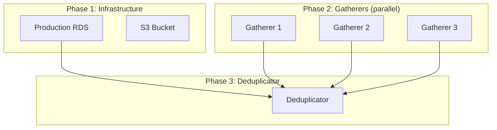
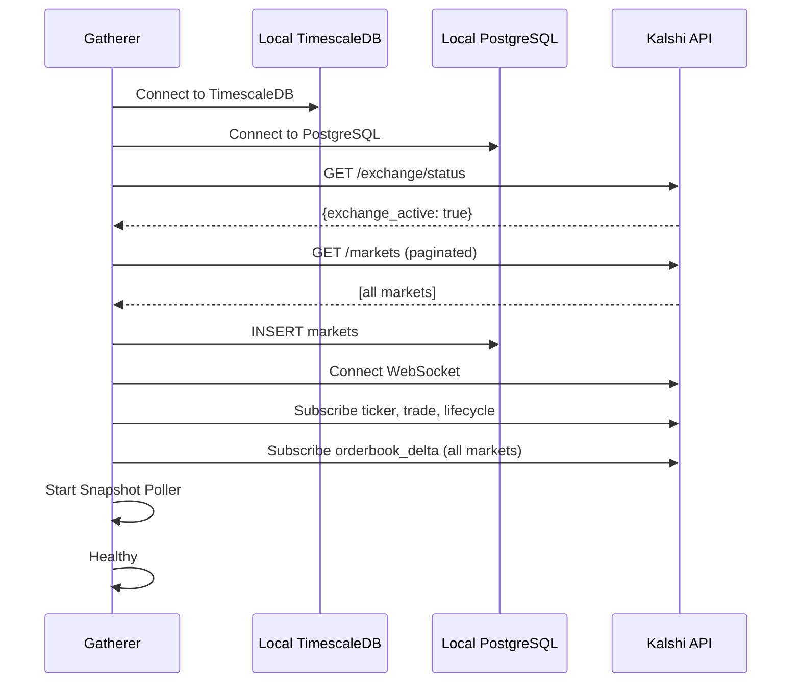
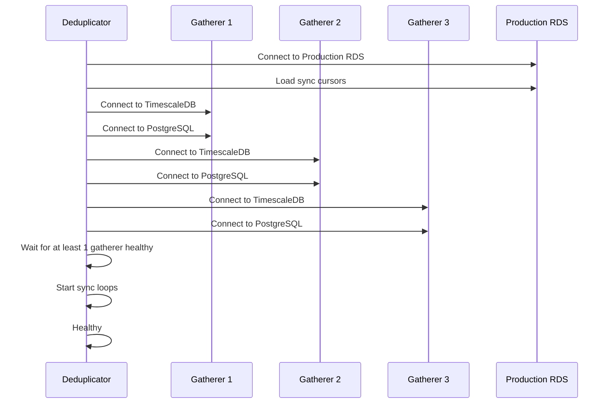

# Startup

Initialization order, dependencies, and systemd configuration.

---

## Startup Order



| Phase | Component | Dependencies | Can Start In Parallel |
|-------|-----------|--------------|----------------------|
| 1 | RDS | None | - |
| 1 | S3 | None | Yes (with RDS) |
| 2 | Gatherer 1 | None | Yes |
| 2 | Gatherer 2 | None | Yes |
| 2 | Gatherer 3 | None | Yes |
| 3 | Deduplicator | RDS, at least 1 Gatherer | No |

---

## Gatherer Startup

### Initialization Sequence



### Startup Script

```bash
#!/bin/bash
# scripts/gatherer-init.sh

set -e

# Install dependencies
dnf install -y postgresql16-server timescaledb

# Initialize databases
postgresql-setup --initdb
systemctl start postgresql

# Create databases
sudo -u postgres psql -c "CREATE DATABASE kalshi_ts;"
sudo -u postgres psql -c "CREATE DATABASE kalshi_meta;"
sudo -u postgres psql -d kalshi_ts -c "CREATE EXTENSION IF NOT EXISTS timescaledb;"

# Run migrations
/opt/kalshi/gatherer migrate --config /etc/kalshi/gatherer.yaml

# Start gatherer service
systemctl enable gatherer
systemctl start gatherer
```

### Health Check

Gatherer exposes `/health` endpoint:

```bash
curl http://localhost:8080/health
```

```json
{
  "status": "healthy",
  "components": {
    "timescaledb": "connected",
    "postgresql": "connected",
    "websocket": {
      "connections": 150,
      "healthy": 148
    },
    "market_registry": {
      "markets": 7500
    }
  }
}
```

**Healthy criteria:**
- Both databases connected
- At least 100 WebSocket connections healthy
- Market Registry has loaded markets

---

## Deduplicator Startup

### Initialization Sequence



### Startup Script

```bash
#!/bin/bash
# scripts/deduplicator-init.sh

set -e

# Wait for RDS to be available
until pg_isready -h $RDS_HOST -p 5432; do
  echo "Waiting for RDS..."
  sleep 5
done

# Wait for at least one gatherer
GATHERER_READY=false
for i in {1..60}; do
  for g in $GATHERER_IPS; do
    if curl -s "http://$g:8080/health" | grep -q '"status":"healthy"'; then
      GATHERER_READY=true
      break 2
    fi
  done
  echo "Waiting for gatherers... ($i/60)"
  sleep 5
done

if [ "$GATHERER_READY" = false ]; then
  echo "ERROR: No gatherers available after 5 minutes"
  exit 1
fi

# Start deduplicator service
systemctl enable deduplicator
systemctl start deduplicator
```

### Health Check

```bash
curl http://localhost:8080/health
```

```json
{
  "status": "healthy",
  "components": {
    "production_rds": "connected",
    "gatherers": {
      "gatherer-1": "connected",
      "gatherer-2": "connected",
      "gatherer-3": "connected"
    },
    "sync": {
      "max_lag_seconds": 0.5,
      "tables_syncing": 6
    }
  }
}
```

**Healthy criteria:**
- Production RDS connected
- At least 1 gatherer connected
- Sync lag < 30 seconds

---

## Systemd Units

### Gatherer Service

```ini
# /etc/systemd/system/gatherer.service
[Unit]
Description=Kalshi Data Gatherer
After=network.target postgresql.service
Requires=postgresql.service

[Service]
Type=simple
User=kalshi
Group=kalshi
ExecStart=/opt/kalshi/gatherer --config /etc/kalshi/gatherer.yaml
Restart=always
RestartSec=10
StartLimitInterval=60
StartLimitBurst=3

# Logging
StandardOutput=journal
StandardError=journal
SyslogIdentifier=gatherer

# Security
NoNewPrivileges=true
ProtectSystem=strict
ProtectHome=true
ReadWritePaths=/var/lib/kalshi

# Resource limits
LimitNOFILE=65536
MemoryMax=28G

[Install]
WantedBy=multi-user.target
```

### Deduplicator Service

```ini
# /etc/systemd/system/deduplicator.service
[Unit]
Description=Kalshi Data Deduplicator
After=network.target

[Service]
Type=simple
User=kalshi
Group=kalshi
ExecStart=/opt/kalshi/deduplicator --config /etc/kalshi/deduplicator.yaml
Restart=always
RestartSec=10
StartLimitInterval=60
StartLimitBurst=3

# Logging
StandardOutput=journal
StandardError=journal
SyslogIdentifier=deduplicator

# Security
NoNewPrivileges=true
ProtectSystem=strict
ProtectHome=true
ReadWritePaths=/var/lib/kalshi

# Resource limits
LimitNOFILE=65536
MemoryMax=14G

[Install]
WantedBy=multi-user.target
```

### PostgreSQL Service (Gatherer)

```ini
# /etc/systemd/system/postgresql.service.d/override.conf
[Service]
# Increase shared memory for TimescaleDB
LimitMEMLOCK=infinity
```

---

## Database Initialization

### TimescaleDB (Gatherer)

```sql
-- migrations/001_timescaledb.sql

-- Enable TimescaleDB
CREATE EXTENSION IF NOT EXISTS timescaledb;

-- Trades table
CREATE TABLE trades (
    trade_id        UUID PRIMARY KEY,
    exchange_ts     BIGINT NOT NULL,
    received_at     BIGINT NOT NULL,
    ticker          VARCHAR(128) NOT NULL,
    event_ticker    VARCHAR(128),
    price           INTEGER NOT NULL,
    size            INTEGER NOT NULL,
    taker_side      BOOLEAN NOT NULL,
    sid             BIGINT
);

SELECT create_hypertable('trades', 'received_at',
    chunk_time_interval => 86400000000);  -- 1 day in microseconds

CREATE INDEX idx_trades_ticker ON trades (ticker, received_at DESC);

-- Orderbook deltas table
CREATE TABLE orderbook_deltas (
    id              BIGSERIAL,
    exchange_ts     BIGINT NOT NULL,
    received_at     BIGINT NOT NULL,
    ticker          VARCHAR(128) NOT NULL,
    price           INTEGER NOT NULL,
    side            BOOLEAN NOT NULL,
    delta           INTEGER NOT NULL,
    seq             BIGINT,
    sid             BIGINT,
    PRIMARY KEY (id, received_at)
);

SELECT create_hypertable('orderbook_deltas', 'received_at',
    chunk_time_interval => 86400000000);

CREATE INDEX idx_deltas_ticker ON orderbook_deltas (ticker, received_at DESC);

-- Additional tables...
```

### PostgreSQL (Gatherer)

```sql
-- migrations/001_postgresql.sql

-- Markets table
CREATE TABLE markets (
    ticker              VARCHAR(128) PRIMARY KEY,
    event_ticker        VARCHAR(128) NOT NULL,
    series_ticker       VARCHAR(128),
    market_type         VARCHAR(32) NOT NULL,
    title               TEXT NOT NULL,
    subtitle            TEXT,
    yes_sub_title       TEXT,
    no_sub_title        TEXT,
    open_time           TIMESTAMPTZ,
    close_time          TIMESTAMPTZ,
    expiration_time     TIMESTAMPTZ,
    settlement_time     TIMESTAMPTZ,
    status              VARCHAR(32) NOT NULL,
    result              VARCHAR(8),
    created_at          TIMESTAMPTZ DEFAULT NOW(),
    updated_at          TIMESTAMPTZ DEFAULT NOW()
);

CREATE INDEX idx_markets_event ON markets (event_ticker);
CREATE INDEX idx_markets_status ON markets (status);

-- Events table
CREATE TABLE events (
    event_ticker    VARCHAR(128) PRIMARY KEY,
    series_ticker   VARCHAR(128),
    title           TEXT NOT NULL,
    category        VARCHAR(64),
    sub_title       TEXT,
    mutually_exclusive BOOLEAN DEFAULT FALSE,
    created_at      TIMESTAMPTZ DEFAULT NOW(),
    updated_at      TIMESTAMPTZ DEFAULT NOW()
);
```

---

## Graceful Shutdown

### Gatherer

```go
func (g *Gatherer) Shutdown(ctx context.Context) error {
    g.logger.Info("shutting down gatherer")

    // 1. Stop accepting new WebSocket messages
    g.connManager.StopReceiving()

    // 2. Flush all writers
    g.router.FlushAll(ctx)

    // 3. Close WebSocket connections
    g.connManager.Close()

    // 4. Close database connections
    g.timescaleDB.Close()
    g.postgresql.Close()

    g.logger.Info("gatherer shutdown complete")
    return nil
}
```

### Deduplicator

```go
func (d *Deduplicator) Shutdown(ctx context.Context) error {
    d.logger.Info("shutting down deduplicator")

    // 1. Stop sync loops
    d.cancelSync()

    // 2. Wait for in-flight writes to complete
    d.wg.Wait()

    // 3. Close gatherer connections
    for _, g := range d.gatherers {
        g.Close()
    }

    // 4. Close production connection
    d.production.Close()

    d.logger.Info("deduplicator shutdown complete")
    return nil
}
```

### Systemd Stop

```bash
# Graceful stop (SIGTERM)
systemctl stop gatherer

# Force stop after 30s timeout
# (Configured via TimeoutStopSec in unit file)
```

---

## Deployment Checklist

### Pre-Deployment

- [ ] RDS instance available and accessible
- [ ] S3 bucket created with lifecycle policies
- [ ] Security groups configured
- [ ] IAM roles created
- [ ] Secrets stored in Parameter Store/Secrets Manager
- [ ] AMI built with dependencies

### Gatherer Deployment

- [ ] EC2 instance launched in correct AZ
- [ ] EBS volume attached
- [ ] Local PostgreSQL and TimescaleDB initialized
- [ ] Database migrations applied
- [ ] Configuration file deployed
- [ ] Systemd service enabled and started
- [ ] Health check passing

### Deduplicator Deployment

- [ ] EC2 instance launched
- [ ] At least one gatherer healthy
- [ ] Production RDS accessible
- [ ] Configuration file deployed
- [ ] Systemd service enabled and started
- [ ] Health check passing
- [ ] Sync lag within acceptable range

### Post-Deployment

- [ ] All gatherers healthy
- [ ] Deduplicator syncing all gatherers
- [ ] Prometheus scraping metrics
- [ ] Alerts configured and firing correctly
- [ ] Grafana dashboards showing data
