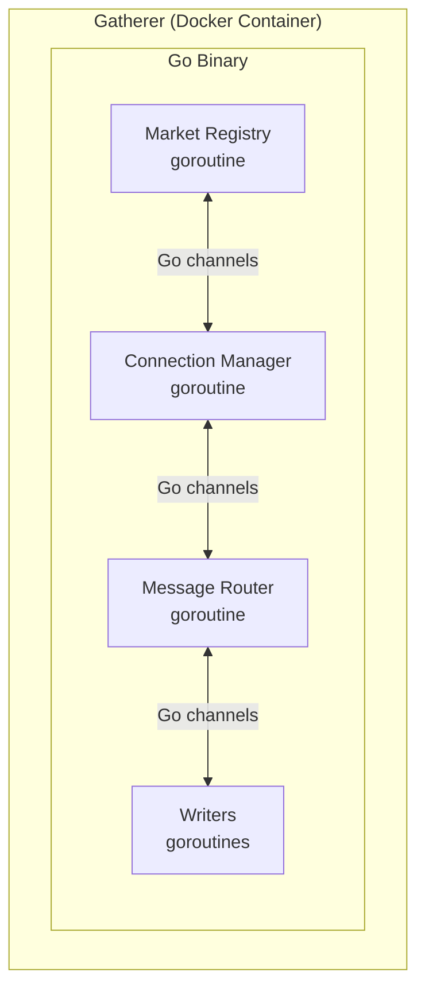
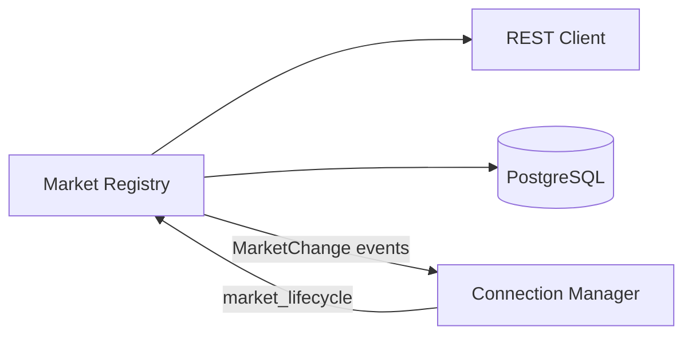

# Market Registry

Discovers and tracks all Kalshi markets. Entry point for the gatherer's data collection pipeline.

---

## Responsibilities

| Responsibility | Details |
|----------------|---------|
| Exchange status | Check `GET /exchange/status` before connecting |
| Initial sync | Fetch all markets/events via REST on startup |
| Live updates | Subscribe to `market_lifecycle` WebSocket channel |
| Reconciliation | Periodic REST poll as backup |
| Metadata storage | Write to local `markets`, `events`, `series` tables |
| Subscription control | Tell Connection Manager which markets to subscribe |

---

## Single Source of Truth

Market Registry is the **only** source of truth for market lists within a gatherer. No other component should track markets independently.

| Component | How it gets markets |
|-----------|---------------------|
| Connection Manager | Receives `MarketChange` events via channel |
| Snapshot Poller | Calls `registry.GetActiveMarkets()` |

This prevents divergence between components. If Connection Manager or Snapshot Poller tracked their own market lists, they could drift from Market Registry (e.g., missing a `settled` event).

---

## Deployment Model

Market Registry runs as a goroutine within a single Go binary alongside Connection Manager, Message Router, and Writers. All components communicate via Go channels and shared memory.

---

## Dependencies

| Dependency | Purpose |
|------------|---------|
| REST Client | Fetch markets, events, series, exchange status |
| PostgreSQL | Persist market/event/series metadata |
| Connection Manager | Receives MarketChange events; provides `market_lifecycle` messages |

**Note:** Connection Manager owns all WebSocket connections, including the `market_lifecycle` subscription. It routes lifecycle messages to Market Registry via a dedicated channel.

---

## Data Sources

### REST Endpoints

| Endpoint | Purpose | Frequency |
|----------|---------|-----------|
| `GET /exchange/status` | Exchange operational status | On startup, every 1 min |
| `GET /markets` | All markets (paginated) | On startup, reconciliation |
| `GET /markets/{ticker}` | Single market detail | On `created` lifecycle event |
| `GET /events` | All events (paginated) | On startup, every 10 min |
| `GET /series/{ticker}` | Series metadata | On demand (when new series seen) |

### WebSocket Channel

| Channel | Events | Action |
|---------|--------|--------|
| `market_lifecycle` | `created` | Fetch full market via REST, notify CM to subscribe |
| `market_lifecycle` | `status_change` | Update cache + DB, notify CM if status changed |
| `market_lifecycle` | `settled` | Update cache + DB, notify CM to unsubscribe |

---

## Related Docs

- [Interface](./interface.md) - Public methods and types
- [Lifecycle](./lifecycle.md) - Startup and shutdown sequences
- [Behaviors](./behaviors.md) - Event handling, reconciliation
- [Configuration](./configuration.md) - Config options
