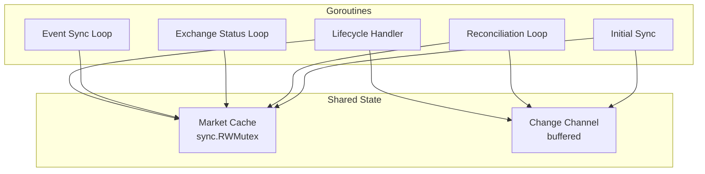

# Interface

Public methods and types for Market Registry.

---

## Registry Interface

```go
// Registry manages market discovery and lifecycle
type Registry interface {
    // Start begins market discovery in background, returns immediately.
    // Emits MarketChange events as markets are discovered.
    Start(ctx context.Context) error

    // Stop gracefully shuts down
    Stop(ctx context.Context) error

    // GetActiveMarkets returns all markets currently open for trading
    GetActiveMarkets() []Market

    // GetMarket returns a specific market by ticker
    GetMarket(ticker string) (Market, bool)

    // SubscribeChanges returns a channel of market state changes.
    // Connection Manager uses this to know when to subscribe/unsubscribe.
    SubscribeChanges() <-chan MarketChange
}
```

**Design Decision**: Channel-based interface for async notification to Connection Manager. Go-idiomatic and non-blocking.

---

## Types

### MarketChange

```go
// MarketChange represents a market state transition
type MarketChange struct {
    Ticker    string
    EventType string  // "created", "status_change", "settled"
    OldStatus string
    NewStatus string
    Market    *Market // Full market data (nil for "settled")
}
```

| Field | Type | Description |
|-------|------|-------------|
| `Ticker` | string | Market ticker |
| `EventType` | string | `created`, `status_change`, or `settled` |
| `OldStatus` | string | Previous status (for `status_change`) |
| `NewStatus` | string | New status |
| `Market` | *Market | Full market data (nil for `settled`) |

### Market

```go
type Market struct {
    Ticker        string
    EventTicker   string
    Title         string
    MarketStatus  string  // initialized, inactive, active, closed, determined, disputed, amended, finalized
    TradingStatus string
    MarketType    string  // binary, scalar
    Result        string  // yes, no, empty
    YesBid        int
    YesAsk        int
    LastPrice     int
    Volume        int64
    OpenTs        int64   // microseconds
    CloseTs       int64
    ExpirationTs  int64
    UpdatedAt     int64
}
```

---

## Internal State

### In-Memory Cache

```go
type registryState struct {
    mu sync.RWMutex

    // All known markets indexed by ticker
    markets map[string]*Market

    // Markets currently active (open for trading)
    activeSet map[string]struct{}

    // Last successful REST sync timestamp
    lastSyncAt time.Time

    // Exchange status
    exchangeActive bool
    tradingActive  bool
}
```

**Design Decision**: Cache ALL markets in memory. At 1M markets × ~500 bytes = 500MB, which is acceptable for a 32GB instance. Simpler than LRU and avoids DB lookups.

---

## Concurrency Model



| Goroutine | Purpose | Access |
|-----------|---------|--------|
| Initial Sync | Fetch all markets on startup | Write lock per page |
| Reconciliation Loop | Periodic REST sync | Read + Write lock |
| Exchange Status Loop | Poll exchange status | Write lock |
| Event Sync Loop | Sync events table | Write lock |
| Lifecycle Handler | Process WS events | Write lock |

All access to `registryState` protected by `sync.RWMutex`.
