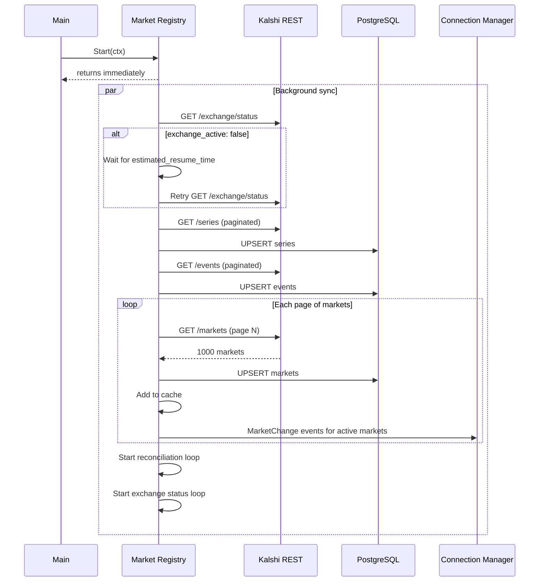
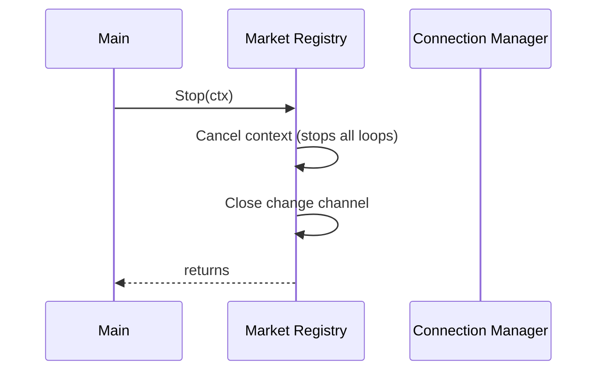

# Lifecycle

Startup and shutdown sequences for Market Registry.

---

## Startup Sequence

`Start()` returns immediately and syncs in the background. This allows Connection Manager to begin subscribing to markets as they are discovered, rather than waiting for the full sync to complete.

**Design Decision**: Non-blocking startup. Connection Manager can subscribe to markets incrementally as each page is fetched, rather than waiting 5-10 minutes for full sync.

---

## Shutdown Sequence

---

## Background Loops

After initial sync completes, these loops run continuously:

| Loop | Interval | Purpose |
|------|----------|---------|
| Exchange Status | 1 min | Check if exchange is operational |
| Reconciliation | 5 min | Fetch all markets, detect missed changes |
| Event Sync | 10 min | Sync events table |

All loops respect context cancellation for graceful shutdown.
