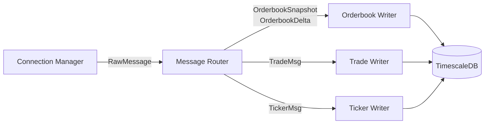
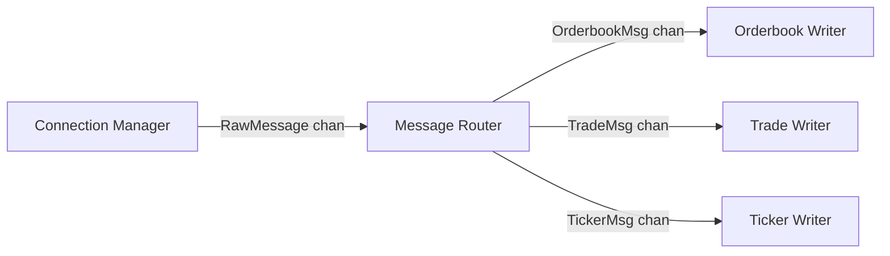

# Message Router

Stateless demultiplexer that parses raw WebSocket messages and routes them to specialized Writers.

---

## Responsibilities

| Responsibility | Details |
|----------------|---------|
| Message parsing | Parse JSON, extract message type and fields |
| Routing | Route to correct Writer based on message type |
| Timestamp conversion | Convert Unix seconds to microseconds |
| Backpressure handling | Non-blocking sends, drop on buffer full |

**Not responsible for** (handled by other components):
- WebSocket I/O (Connection Manager)
- Sequence detection (Connection Manager)
- Database writes (Writers)
- Market discovery (Market Registry)

---

## Message Types

| Type | Channel | Destination |
|------|---------|-------------|
| `orderbook_snapshot` | orderbook_delta | Orderbook Writer |
| `orderbook_delta` | orderbook_delta | Orderbook Writer |
| `trade` | trade | Trade Writer |
| `ticker` | ticker | Ticker Writer |

---

## Data Flow

---

## Dependencies

| Dependency | Direction | Purpose |
|------------|-----------|---------|
| Connection Manager | Input | Receives `RawMessage` with raw bytes + metadata |
| Orderbook Writer | Output | Sends parsed orderbook snapshots and deltas |
| Trade Writer | Output | Sends parsed trade messages |
| Ticker Writer | Output | Sends parsed ticker messages |

---

## Design Principles

1. **Stateless**: No caching, no market tracking, no sequence state
2. **Non-blocking**: Drop messages on backpressure rather than block pipeline
3. **Pass-through metadata**: SeqGap, ReceivedAt flow through to Writers
4. **Single goroutine**: Simple select loop, no concurrency complexity

---

## Related Docs

- [Interface](./interface.md) - Public methods and types
- [Lifecycle](./lifecycle.md) - Startup and shutdown
- [Behaviors](./behaviors.md) - Routing logic, parsing, timestamp conversion
- [Configuration](./configuration.md) - Config options and metrics
- [Connection Manager](../connection-manager/) - Upstream component
- [Writers](../writers/) - Downstream components
