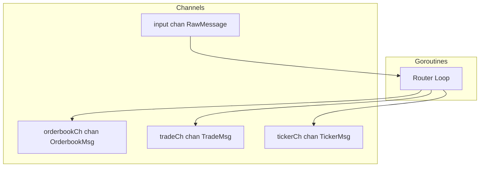

# Interface

Public methods and types for Message Router.

---

## Router Interface

```go
type Router interface {
    // Start begins routing messages from input channel to writers
    Start(ctx context.Context) error

    // Stop gracefully shuts down the router
    Stop(ctx context.Context) error

    // Channels returns output channels for writers to consume
    Channels() RouterChannels
}

type RouterChannels struct {
    Orderbook <-chan OrderbookMsg  // Snapshots and deltas
    Trade     <-chan TradeMsg
    Ticker    <-chan TickerMsg
}
```

---

## Input Type

Received from Connection Manager:

```go
type RawMessage struct {
    Data       []byte     // Raw JSON bytes from WebSocket
    ConnID     int        // Connection ID (1-150)
    ReceivedAt time.Time  // Local timestamp when WS received message
    SeqGap     bool       // True if sequence gap detected before this message
    GapSize    int        // Number of missed messages (0 if no gap)
}
```

---

## Output Types

### Orderbook Messages

Two message types share the same channel:

```go
// OrderbookMsg is a union type for snapshots and deltas
type OrderbookMsg struct {
    Type string  // "snapshot" or "delta"

    // Common fields
    Ticker     string
    SID        int64
    Seq        int64
    ReceivedAt time.Time
    SeqGap     bool
    GapSize    int

    // Snapshot-only fields (empty for delta)
    Yes []PriceLevel
    No  []PriceLevel

    // Delta-only fields (zero/empty for snapshot)
    PriceDollars string  // e.g. "0.52" or "0.5250" for subpenny
    Delta        int
    Side         string  // "yes" or "no"
    ExchangeTs   int64
}

type PriceLevel struct {
    Dollars  string  // e.g. "0.52", "0.5250" - Writer converts to internal format
    Quantity int
}
```

**Note:** Router passes `*_dollars` strings unchanged. Writers convert to internal format (hundred-thousandths).

### Trade Message

```go
type TradeMsg struct {
    Ticker          string
    TradeID         string
    Size            int     // Number of contracts (Kalshi: "count")
    YesPriceDollars string  // e.g. "0.52"
    NoPriceDollars  string  // e.g. "0.48"
    TakerSide       string  // "yes" or "no"
    SID             int64
    Seq             int64
    ExchangeTs      int64   // Microseconds
    ReceivedAt      time.Time
}
```

### Ticker Message

```go
type TickerMsg struct {
    Ticker             string
    PriceDollars       string  // Last price, e.g. "0.52"
    YesBidDollars      string
    YesAskDollars      string
    NoBidDollars       string
    Volume             int64
    OpenInterest       int64
    DollarVolume       int64
    DollarOpenInterest int64
    SID                int64
    ExchangeTs         int64   // Microseconds
    ReceivedAt         time.Time
    // Note: Ticker messages have no Seq field
}
```

---

## Internal State

```go
type router struct {
    cfg    RouterConfig
    ctx    context.Context
    cancel context.CancelFunc
    wg     sync.WaitGroup
    logger *slog.Logger

    // Input from Connection Manager
    input <-chan RawMessage

    // Output to Writers (buffered)
    orderbookCh chan OrderbookMsg
    tradeCh     chan TradeMsg
    tickerCh    chan TickerMsg

    // Metrics
    metrics *RouterMetrics
}
```

---

## Concurrency Model



| Goroutine | Count | Purpose |
|-----------|-------|---------|
| Router Loop | 1 | Parse and route messages |

**Thread Safety:**
- No shared mutable state
- All communication via channels
- Single goroutine design eliminates race conditions
