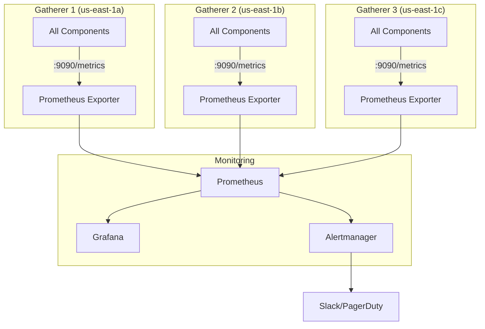

# Monitoring

Observability for the Kalshi Data Platform.

---

## Overview

The platform uses a standard observability stack:

| Component | Purpose |
|-----------|---------|
| Prometheus | Metrics collection and storage |
| Grafana | Dashboards and visualization |
| Alertmanager | Alert routing and notifications |
| Structured Logs | Operational debugging (slog + JSON) |

---

## Architecture



Each gatherer exposes metrics on `:9090/metrics`. Central Prometheus scrapes all three instances.

---

## Service Level Objectives (SLOs)

| SLO | Target | Measurement | Metric |
|-----|--------|-------------|--------|
| Data Freshness | < 5 seconds | Time from Kalshi exchange_ts to DB insert | `received_at - exchange_ts` in query |
| Availability | 99.9% | At least 1 gatherer healthy | `sum(up{job="gatherers"}) >= 1` |
| Data Completeness | 99.99% | Trades captured vs Kalshi reported | Compare `writer_inserts_total{writer="trade"}` with Kalshi API |
| Deduplicator Lag | < 30 seconds | Time from gatherer insert to RDS insert | `dedup_sync_lag_seconds` |

**Note:** Data Freshness is measured per-record using `received_at - exchange_ts` columns in the database, not via a real-time metric. For real-time monitoring, track `writer_flush_duration_seconds` as a proxy.

---

## Key Metrics

| Category | Primary Metric | Alert Threshold |
|----------|----------------|-----------------|
| Throughput | `writer_inserts_total` | < 100/s for 5m |
| Errors | `*_errors_total` | > 1% error rate |
| Latency | `writer_flush_duration_seconds` | P99 > 1s |
| Connectivity | `ws_client_connected` | 0 for > 30s |
| Sync | `sync_lag_seconds` | > 30s |

See [metrics.md](./metrics.md) for complete reference.

---

## Health Endpoints

### Gatherer

```
GET /health
```

```json
{
  "status": "healthy",
  "components": {
    "market_registry": "healthy",
    "connection_manager": "healthy",
    "writers": "healthy",
    "snapshot_poller": "healthy"
  },
  "metrics": {
    "active_markets": 1250,
    "ws_connections": 150,
    "messages_per_second": 5000
  }
}
```

### Deduplicator

```
GET /health
```

```json
{
  "status": "healthy",
  "gatherers": {
    "gatherer-1": {"status": "connected", "lag_seconds": 2},
    "gatherer-2": {"status": "connected", "lag_seconds": 1},
    "gatherer-3": {"status": "connected", "lag_seconds": 3}
  },
  "production_rds": {"status": "connected"},
  "last_sync": "2024-01-15T10:30:00Z"
}
```

---

## Related Docs

- [Metrics Reference](./metrics.md) - All metrics by component
- [Alerts](./alerts.md) - Alert definitions and thresholds
- [Dashboards](./dashboards.md) - Grafana dashboard designs
- [Logging](./logging.md) - Structured logging standards
- [Runbooks](./runbooks.md) - Operational procedures
