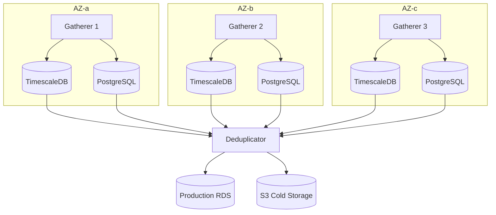

# Kalshi Data Platform Overview

## Objective

Capture and store every orderbook change and trade across all Kalshi markets in real-time.

## Scale Requirements

| Metric | Target |
|--------|--------|
| Peak markets | 1,000,000 |
| Data granularity | Every orderbook delta, every trade |
| Latency | Near real-time capture |
| Retention | Full historical |

---

## Data Sources

### Primary: WebSocket

| Channel | Data | Auth |
|---------|------|------|
| `orderbook_delta` | Snapshots + incremental deltas | No |
| `trade` | Public trades | No |
| `ticker` | Price/volume updates | No |

### Secondary: REST API

| Endpoint | Use Case |
|----------|----------|
| `GET /markets` | Market discovery, metadata |
| `GET /markets/{ticker}/orderbook` | Snapshot recovery |
| `GET /markets/{ticker}/trades` | Historical backfill |

---

## Constraints

### WebSocket

| Constraint | Value | Notes                             |
|------------|-------|-----------------------------------|
| Subscription limit per connection | 7,500 | Per Kalshi WebSocket API          |
| Message throughput | 2000  | Max 2000/s across all connections |
| Heartbeat interval | 10s   | Must respond to pings             |

### REST API

Rate limits only apply to order operations (writes), not market data reads.

### Implications at 1M Markets

- Cannot subscribe all markets on single connection
- Need horizontal scaling across multiple WebSocket connections
- Must prioritize active markets vs dormant ones

---

## Data Characteristics

### Orderbook Delta

```
{
  "type": "orderbook_delta",
  "sid": int,
  "seq": int,
  "msg": {
    "market_ticker": string,
    "price": int,           // cents
    "delta": int,           // +/- quantity
    "side": "yes" | "no",
    "ts": int               // unix seconds
  }
}
```

- Sequence numbers per subscription for gap detection
- Initial snapshot followed by deltas
- Must reconstruct full book from snapshot + deltas

### Trade

```
{
  "type": "trade",
  "sid": int,
  "msg": {
    "market_ticker": string,
    "trade_id": string,
    "count": int,
    "yes_price": int,
    "no_price": int,
    "taker_side": "yes" | "no",
    "ts": int
  }
}
```

---

## Architecture Overview

3 independent gatherer instances, each collecting ALL markets for redundancy. Deduplicator merges into production.



Each gatherer contains: Market Registry, Connection Manager, WebSocket Pool, Message Router, Writers.

---

## Key Components

### 1. Market Registry

- Initial sync via `GET /markets` on startup
- Live updates via `market_lifecycle` WebSocket channel
- Periodic reconciliation via REST as backup
- Triggers subscription updates to Connection Manager

### 2. Connection Manager

- Maintains pool of WebSocket connections (150 per gatherer)
- Subscribes to orderbook_delta, trade, ticker channels
- Handles connection lifecycle (connect, reconnect, backoff)

### 3. Message Router

- Receives raw messages from all connections
- Routes to appropriate writer by channel type

### 4. Writers

- Serialize and batch writes
- Handle backpressure

### 5. Storage Layer

Per gatherer:
- **TimescaleDB**: trades, orderbook_deltas, orderbook_snapshots, tickers (time-series hypertables)
- **PostgreSQL**: series, events, markets (relational data)

Production:
- **RDS TimescaleDB**: Deduplicated data from all gatherers
- **S3**: Cold storage (Parquet exports)

---

## Failure Modes

| Failure | Impact | Recovery |
|---------|--------|----------|
| Single gatherer down | None (2 copies remain) | Auto-restart or launch replacement |
| 2 gatherers down | None (1 copy remains) | Launch replacements |
| Deduplicator down | Sync delay | Gatherers buffer locally, resume from cursor |
| Production RDS down | Write failure | Restore from snapshot, resume sync |

---

## Storage Considerations

### Volume Estimates

| Metric | Low | High |
|--------|-----|------|
| Active markets | 200,000 | 600,000 |
| Deltas/market/day | 100 | 10,000 |
| Trades/market/day | 10 | 1,000 |
| Delta size | ~100 bytes | ~100 bytes |
| Trade size | ~150 bytes | ~150 bytes |

**Daily estimates vary significantly based on market activity.**

### Chosen Solution

| Layer | Technology | Purpose |
|-------|------------|---------|
| Local (per gatherer) | TimescaleDB | Time-series data (hypertables with compression) |
| Local (per gatherer) | PostgreSQL | Relational data (markets, events, series) |
| Production | RDS TimescaleDB | Deduplicated data store |
| Cold storage | S3 + Parquet | Historical exports, Glacier lifecycle |

---

## Implementation Phases

### Phase 1: Foundation
- VPC, S3 bucket, RDS TimescaleDB
- EC2 launch templates

### Phase 2: Single Gatherer
- 1 EC2 instance with local TimescaleDB + PostgreSQL
- Market Registry, Connection Manager, Writers
- WebSocket data collection

### Phase 3: Deduplicator
- 1 EC2 instance polling gatherer
- Deduplicate and write to production RDS

### Phase 4: Scale to 3 Gatherers
- Deploy to 3 AZs
- Each gatherer independently collects ALL markets

### Phase 5: Hardening
- EBS snapshots, RDS backups
- CloudWatch alerting
- S3 exports
