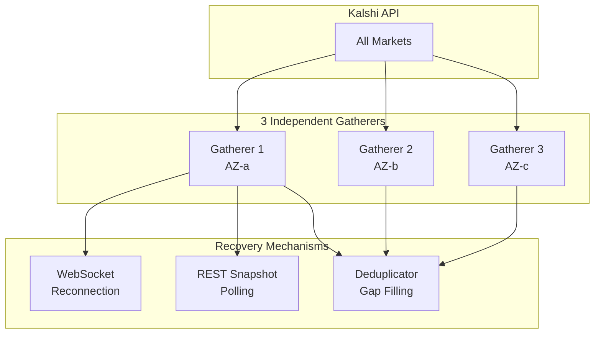
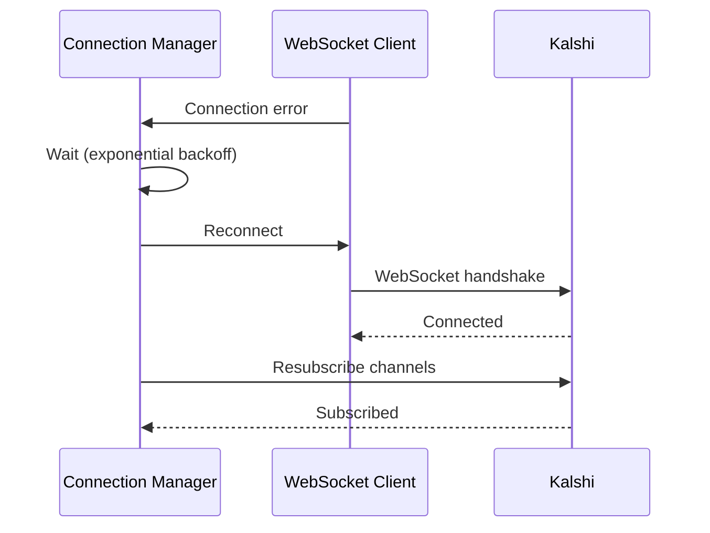
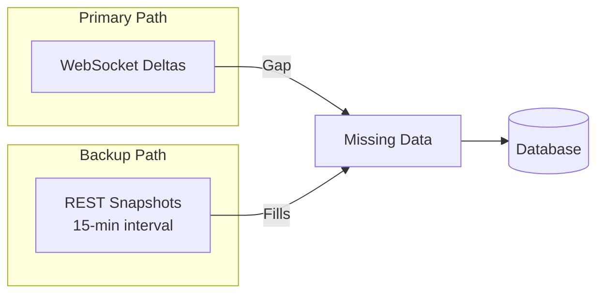
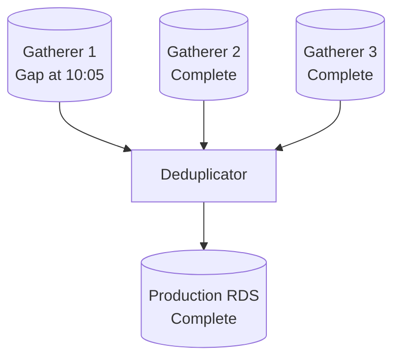

# Recovery

Failure handling and data recovery for the Kalshi Data Platform.

---

## Overview

The platform is designed for resilience through redundancy:

**Key principle:** Each gatherer independently collects ALL markets. Any single gatherer surviving means zero data loss.

---

## Failure Modes

| Component | Failure | Detection | Impact | Recovery |
|-----------|---------|-----------|--------|----------|
| WebSocket connection | Disconnect | Read error | Temporary data gap | Auto-reconnect with backoff |
| Single gatherer | Process crash | Health check | None (2 copies remain) | Auto-restart |
| Multiple gatherers | AZ outage | CloudWatch | Reduced redundancy | Other AZs continue |
| Deduplicator | Process crash | Health check | Sync delay | Resume from cursor |
| Production RDS | Instance failure | RDS events | Write failure | Failover/restore |
| Kalshi API | Outage | Connect errors | All gatherers affected | Wait for recovery |

---

## Recovery Layers

### Layer 1: WebSocket Auto-Recovery

Connection Manager handles WebSocket failures with automatic reconnection.

**Characteristics:**
- Exponential backoff: 1s → 2s → 4s → ... → 5min max
- Automatic resubscription to assigned markets
- No manual intervention required

See [WebSocket Recovery](./websocket-recovery.md) for details.

### Layer 2: REST Snapshot Backup

Snapshot Poller provides 15-minute resolution orderbook snapshots.

**Characteristics:**
- Polls all active markets every 15 minutes
- Independent of WebSocket state
- Stored with `source='rest'` for differentiation

### Layer 3: Cross-Gatherer Deduplication

Deduplicator merges data from all gatherers, filling gaps.

**Characteristics:**
- Any gatherer's data fills others' gaps
- Uses exchange-provided unique keys
- `ON CONFLICT DO NOTHING` for idempotency

See [Data Gaps](./data-gaps.md) for details.

---

## Recovery Time Objectives

| Component | RTO | RPO | Notes |
|-----------|-----|-----|-------|
| WebSocket connection | < 1 min | < 1 min | Auto-reconnect |
| Single gatherer | 5 min | 0 | Other gatherers have data |
| All gatherers | 10 min | Outage duration | Launch replacements |
| Deduplicator | 10 min | 0 | Gatherers buffer |
| Production RDS | 30 min | < 5 min | Point-in-time recovery |

---

## Data Completeness Guarantees

| Gatherers Running | Data Captured | Redundancy |
|-------------------|---------------|------------|
| 3 | 100% | 3 copies |
| 2 | 100% | 2 copies |
| 1 | 100% | 1 copy |
| 0 | 0% | Total outage |

**Key insight:** Data completeness depends on at least one gatherer running, not on specific gatherers.

---

## Documentation

| Document | Content |
|----------|---------|
| [WebSocket Recovery](./websocket-recovery.md) | Reconnection, resubscription, backoff |
| [Data Gaps](./data-gaps.md) | Sequence gaps, REST backfill, deduplication |
| [Component Failure](./component-failure.md) | Gatherer, deduplicator, RDS failure handling |
| [Runbooks](./runbooks.md) | Step-by-step recovery procedures |

---

## Related Documentation

- [Reliability](../architecture/reliability.md) - Architecture resilience, RTO/RPO targets
- [Monitoring Runbooks](../monitoring/runbooks.md) - Operational procedures
- [Storage Operations](../storage/operations.md) - Backup and restore
