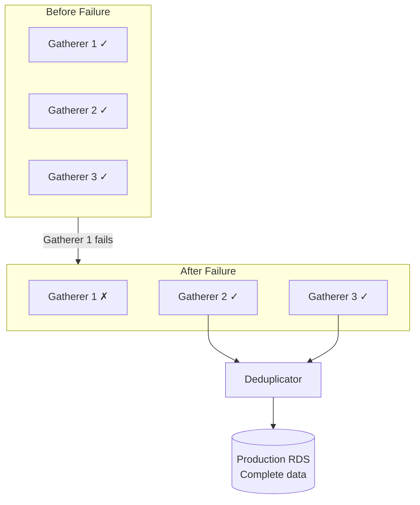
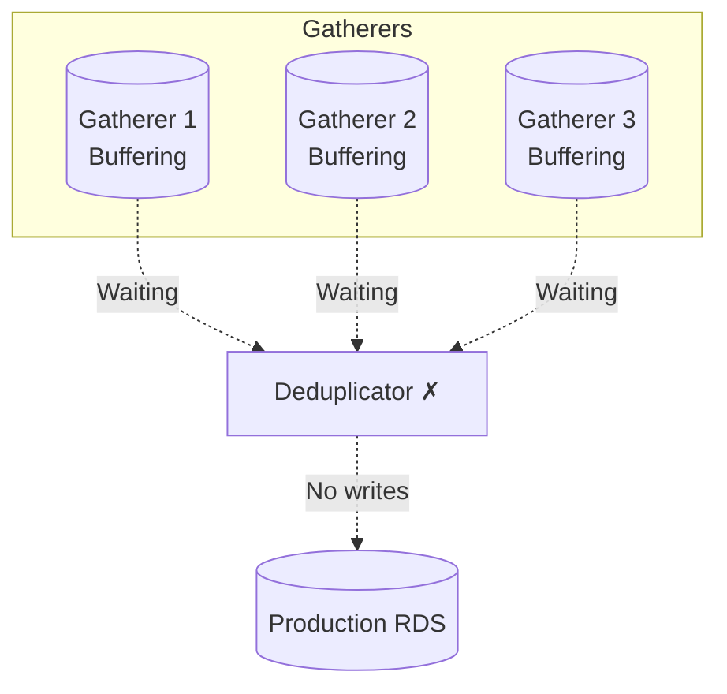
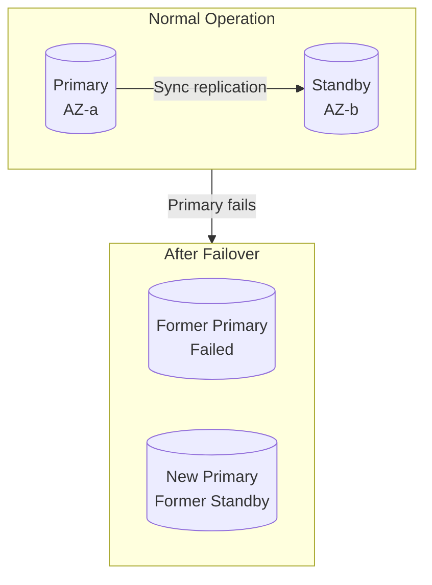
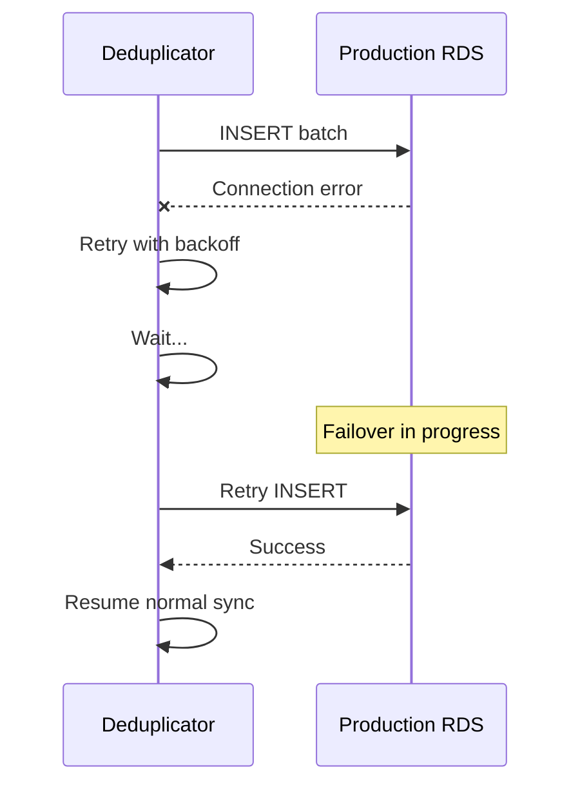
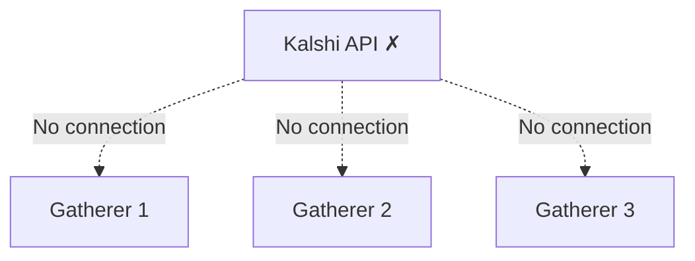

# Component Failure

Failure handling for gatherers, deduplicator, and production RDS.

---

## Gatherer Failure

### Single Gatherer Down



| Aspect | Impact |
|--------|--------|
| Data completeness | 100% (other gatherers have all data) |
| Redundancy | Reduced from 3 to 2 copies |
| Action required | None immediate, replace within hours |

### Multiple Gatherers Down

| Gatherers Running | Data Status | Action |
|-------------------|-------------|--------|
| 2 | 100% complete | Replace failed gatherer |
| 1 | 100% complete | Urgent: restore redundancy |
| 0 | Data collection stopped | Critical: immediate action |

### Gatherer Recovery

**Automatic (systemd):**
```bash
# Gatherer service configuration
[Service]
Restart=always
RestartSec=10
```

**Manual replacement:**
1. Launch new EC2 instance in target AZ
2. Deploy gatherer application
3. Start service - automatically connects to Kalshi
4. Update deduplicator configuration (if needed)
5. Verify data flow

```bash
# Verify gatherer is collecting data
psql -h gatherer-new -d kalshi_ts -c \
  "SELECT COUNT(*) FROM trades WHERE received_at > NOW() - INTERVAL '1 minute'"
```

---

## Deduplicator Failure

### Impact



| Aspect | Impact |
|--------|--------|
| Data collection | Continues (gatherers buffer locally) |
| Production RDS | No new writes |
| Data loss | None (recoverable from gatherers) |

### Recovery

Deduplicator uses cursor-based sync. On restart, it resumes from the last sync point:

```go
func (d *deduplicator) Start(ctx context.Context) error {
    // Load last sync cursors from production RDS
    cursors, err := d.loadCursors()
    if err != nil {
        return err
    }

    // Resume syncing from cursors
    for {
        for _, gatherer := range d.gatherers {
            records := d.poll(gatherer, cursors[gatherer.ID])
            d.deduplicate(records)
            d.write(records)
            d.updateCursor(gatherer.ID, records.LastTimestamp)
        }
    }
}
```

**Recovery steps:**

1. Restart deduplicator service
2. Deduplicator loads last sync cursors from RDS
3. Polls gatherers for records since last sync
4. Catches up at maximum throughput
5. Returns to normal sync interval

```bash
# Check sync lag after restart
curl http://deduplicator:9090/metrics | grep dedup_sync_lag_seconds
```

### Extended Outage

If deduplicator is down for extended period:

| Duration | Gatherer Buffer | Action |
|----------|-----------------|--------|
| < 7 days | Within retention | Normal catch-up |
| 7-30 days | Partial (deltas expired) | Catch-up with gaps |
| > 30 days | Minimal | Manual recovery from S3 |

---

## Production RDS Failure

### Failure Types

| Type | Detection | Recovery |
|------|-----------|----------|
| Instance failure | RDS events, connection errors | Automated failover (Multi-AZ) |
| Storage full | CloudWatch alarm | Increase storage |
| Connection exhaustion | Application errors | Connection pooling, scale up |
| Corruption | Query errors | Point-in-time recovery |

### Multi-AZ Failover



**Automatic failover:**
- Detects primary failure
- Promotes standby to primary
- Updates DNS endpoint
- ~60-120 seconds downtime

**Application behavior during failover:**
- Deduplicator connection fails
- Retries with backoff
- Reconnects to new primary
- Resumes from cursor

### Manual Recovery

**From snapshot:**
```bash
aws rds restore-db-instance-from-db-snapshot \
  --db-instance-identifier kalshi-prod-restored \
  --db-snapshot-identifier kalshi-prod-2024-01-15
```

**Point-in-time recovery:**
```bash
aws rds restore-db-instance-to-point-in-time \
  --source-db-instance-identifier kalshi-prod \
  --target-db-instance-identifier kalshi-prod-restored \
  --restore-time "2024-01-15T10:30:00Z"
```

### Impact on Data Flow



**During RDS outage:**
- Gatherers continue collecting (unaffected)
- Deduplicator retries with backoff
- No data loss (gatherers buffer)
- Catch-up after recovery

---

## Kalshi API Outage

### Impact

All gatherers affected simultaneously:



| Aspect | Impact |
|--------|--------|
| Data collection | Stopped for all gatherers |
| Existing data | Safe in databases |
| Recovery | Wait for Kalshi to recover |

### Behavior

1. WebSocket connections fail/disconnect
2. Connection Manager attempts reconnection with backoff
3. REST polling fails
4. All gatherers in reconnection loop
5. When Kalshi recovers, gatherers auto-reconnect

### Detection

```promql
# All WebSocket connections down
sum(ws_client_connected) == 0

# REST API errors across all gatherers
sum(market_registry_rest_errors_total) by (endpoint)
```

---

## Local Database Failure

### TimescaleDB (Gatherer)

| Type | Impact | Recovery |
|------|--------|----------|
| Process crash | Temporary write failure | Auto-restart |
| Disk failure | Data loss on that gatherer | Replace EBS, rely on other gatherers |
| Corruption | Query errors | Recreate from production RDS |

**Recovery from production:**

Gatherer data is a subset of production. To rebuild:

```sql
-- On new gatherer, pull recent data from production
INSERT INTO trades
SELECT * FROM dblink('host=prod-rds ...',
  'SELECT * FROM trades WHERE exchange_ts > ...')
AS t(trade_id UUID, ...);
```

### PostgreSQL (Gatherer)

Contains markets/events/series (relational data):

| Type | Impact | Recovery |
|------|--------|----------|
| Process crash | Temporary write failure | Auto-restart |
| Data loss | Market tracking lost | Reconcile from REST API |

**Recovery:**

Market Registry reconciles from REST API:

```go
// On startup, fetch all markets from REST
markets, _ := api.GetMarkets()
for _, m := range markets {
    db.UpsertMarket(m)
}
```

---

## Monitoring

### Key Metrics

| Metric | Alert Threshold | Severity |
|--------|-----------------|----------|
| Healthy gatherers | < 3 | Warning |
| Healthy gatherers | == 0 | Critical |
| Dedup sync lag | > 30s | Warning |
| Dedup sync lag | > 300s | Critical |
| RDS connection errors | > 0 sustained | Warning |

### Health Checks

**Gatherer:**
```bash
curl http://gatherer:8080/health
# {"status":"healthy","ws_connections":150,"db":"connected"}
```

**Deduplicator:**
```bash
curl http://deduplicator:8080/health
# {"status":"healthy","gatherers":{"g1":"connected",...},"rds":"connected"}
```

See [Monitoring Overview](../monitoring/README.md) for complete health endpoint documentation and response schemas.

---

## Recovery Priority

| Priority | Component | RTO | Action |
|----------|-----------|-----|--------|
| 1 | All gatherers down | 10 min | Launch new instances |
| 2 | Production RDS | 30 min | Failover or restore |
| 3 | Deduplicator | 10 min | Restart, resume from cursor |
| 4 | Single gatherer | 4 hours | Replace for redundancy |

---

## Automation

### Auto-Scaling (Gatherers)

```yaml
# AWS Auto Scaling configuration
AutoScalingGroup:
  MinSize: 3
  MaxSize: 4
  DesiredCapacity: 3
  HealthCheckType: EC2
  HealthCheckGracePeriod: 300
```

### Systemd Auto-Restart

```ini
[Service]
Restart=always
RestartSec=10
StartLimitInterval=60
StartLimitBurst=3
```

### CloudWatch Alarms

```yaml
GathererDownAlarm:
  MetricName: HealthyHostCount
  Threshold: 2
  ComparisonOperator: LessThanThreshold
  AlarmActions:
    - !Ref SNSTopic
```
