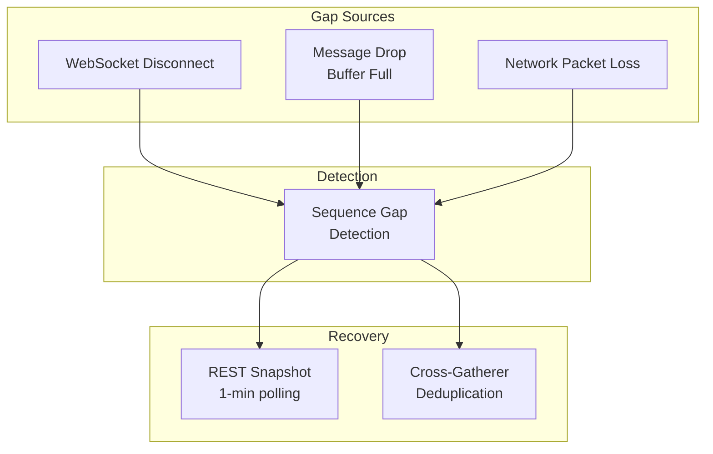
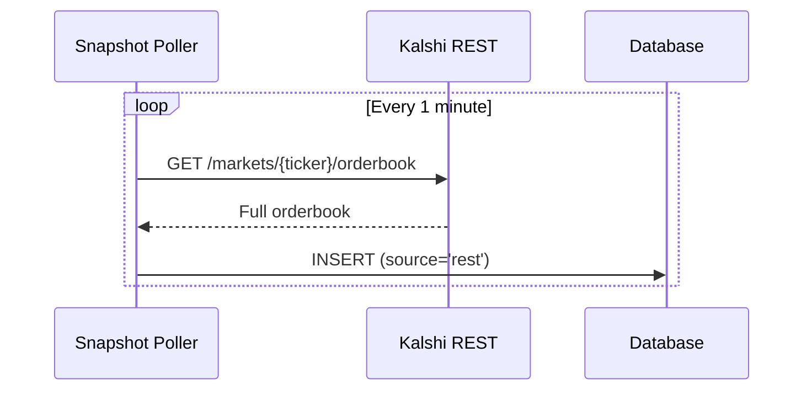
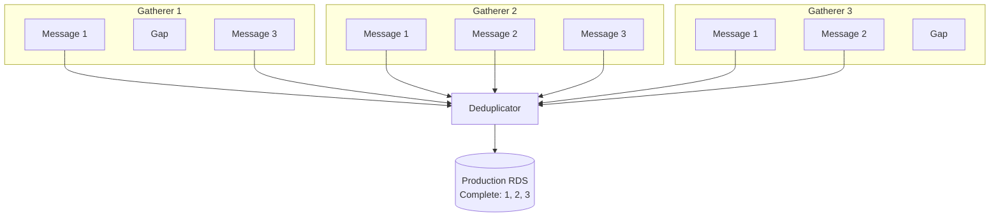

# Data Gaps

Sequence gap detection, REST backfill, and cross-gatherer recovery.

---

## Overview

Data gaps can occur from network issues, connection failures, or message drops. Multiple layers provide recovery:



---

## Sequence Gap Detection

### How It Works

Kalshi WebSocket messages include sequence numbers per subscription:

```json
{
  "type": "orderbook_delta",
  "sid": 12345,
  "seq": 100,
  "msg": { ... }
}
```

Connection Manager tracks the last sequence per SID and detects gaps:

```go
func (m *manager) checkSequence(sid int64, seq int64) (seqGap bool, gapSize int) {
    m.seqMu.Lock()
    defer m.seqMu.Unlock()

    last, exists := m.lastSeq[sid]
    if !exists {
        // First message for this subscription
        m.lastSeq[sid] = seq
        return false, 0
    }

    if seq != last+1 {
        gap := int(seq - last - 1)
        m.logger.Warn("sequence gap detected",
            "sid", sid,
            "expected", last+1,
            "got", seq,
            "gap", gap,
        )
        m.metrics.SequenceGaps.Inc()
        m.lastSeq[sid] = seq
        return true, gap
    }

    m.lastSeq[sid] = seq
    return false, 0
}
```

### Gap Flagging

Gaps are flagged in the message passed to writers:

```go
type RawMessage struct {
    Data       []byte
    ConnID     int
    ReceivedAt time.Time
    SeqGap     bool    // True if gap detected before this message
    GapSize    int     // Number of missed messages
}
```

Writers can use this information for logging and metrics but do not attempt recovery.

---

## Gap Causes

| Cause | Frequency | Gap Size | Recovery |
|-------|-----------|----------|----------|
| TCP packet loss | Rare | 1-10 | TCP retransmit (automatic) |
| Buffer overflow | Under load | 1-1000 | REST + deduplication |
| WebSocket disconnect | Occasional | Varies | Reconnect + resubscribe |
| Server-side drop | Rare | Unknown | REST + deduplication |

---

## Recovery Mechanisms

### 1. REST Snapshot Polling

Snapshot Poller fetches orderbook snapshots every 1 minute for all active markets:



**Characteristics:**
- 1-minute resolution (maximum gap window)
- Independent of WebSocket state
- Stored with `source='rest'` to differentiate from WS

**Limitation:** Does not capture individual trades or deltas between snapshots.

### 2. Cross-Gatherer Deduplication

Three gatherers independently collect the same data. The deduplicator merges them:



**Characteristics:**
- Real-time gap filling
- Uses exchange-provided unique keys
- No gap if at least one gatherer received the message

### 3. Orderbook Reconstruction

For orderbook analysis, gaps can be filled by applying deltas to snapshots:

```sql
-- Get last snapshot before gap
SELECT * FROM orderbook_snapshots
WHERE ticker = $1 AND snapshot_ts < $gap_start
ORDER BY snapshot_ts DESC
LIMIT 1;

-- Apply deltas after snapshot
SELECT price, side, SUM(size_delta) as quantity
FROM orderbook_deltas
WHERE ticker = $1
  AND exchange_ts > $snapshot_ts
  AND exchange_ts < $gap_end
GROUP BY price, side;
```

---

## Data Types and Gap Impact

| Data Type | Gap Impact | Recovery Source |
|-----------|------------|-----------------|
| Orderbook deltas | Missing price level changes | REST snapshots + other gatherers |
| Orderbook snapshots | None (periodic, not sequential) | N/A |
| Trades | Missing trade records | Other gatherers only |
| Ticker updates | Missing price/volume updates | Other gatherers only |

### Trade Gap Implications

Trades have unique `trade_id` from Kalshi. If one gatherer misses a trade:

- Other gatherers likely have it
- Deduplicator fills the gap
- If ALL gatherers miss it (extremely rare), trade is lost

### Orderbook Gap Implications

Orderbook deltas are cumulative. A gap means:

- Current orderbook state is unknown until next snapshot
- REST polling provides 1-minute snapshot backup
- Can reconstruct state from snapshot + subsequent deltas

---

## Metrics

| Metric | Type | Labels | Description |
|--------|------|--------|-------------|
| `conn_manager_sequence_gaps_total` | Counter | - | Total gaps detected |
| `writer_seq_gaps_total` | Counter | `writer`, `ticker` | Gaps by market |
| `router_messages_dropped_total` | Counter | `type` | Messages dropped (buffer full) |

### Example Queries

```promql
# Gap rate
rate(conn_manager_sequence_gaps_total[5m])

# Gaps by market (identify problematic markets)
topk(10, sum(increase(writer_seq_gaps_total[1h])) by (ticker))

# Message drop rate
rate(router_messages_dropped_total[5m])
```

---

## Alerts

| Alert | Condition | Severity | Action |
|-------|-----------|----------|--------|
| SequenceGapsDetected | > 0.1 gaps/s for 5m | Warning | Check network, connection health |
| HighMessageDropRate | > 0.1% drop rate | Warning | Increase buffer size, check throughput |

---

## Configuration

### Buffer Sizes

```go
type RouterConfig struct {
    OrderbookBufferSize int  // Default: 5000
    TradeBufferSize     int  // Default: 1000
    TickerBufferSize    int  // Default: 1000
}
```

Larger buffers reduce drops under load but increase memory usage.

See [Message Router Configuration](../message-router/configuration.md) for details.

### Snapshot Polling

```go
type SnapshotPollerConfig struct {
    PollInterval time.Duration  // Default: 1 minute
}
```

More frequent polling reduces maximum gap window but increases API load.

---

## Gap Analysis

### Investigating Gaps

```sql
-- Find gaps in orderbook deltas for a market
WITH sequenced AS (
    SELECT
        exchange_ts,
        seq,
        LAG(seq) OVER (ORDER BY exchange_ts) as prev_seq
    FROM orderbook_deltas
    WHERE ticker = $1
      AND exchange_ts BETWEEN $start AND $end
)
SELECT
    exchange_ts,
    prev_seq,
    seq,
    seq - prev_seq - 1 as gap_size
FROM sequenced
WHERE seq - prev_seq > 1;
```

### Checking Cross-Gatherer Coverage

```sql
-- Compare trade counts across gatherers for a time period
-- (Run on deduplicator against each gatherer)
SELECT
    'gatherer-1' as source,
    COUNT(DISTINCT trade_id) as trades
FROM gatherer1.trades
WHERE exchange_ts BETWEEN $start AND $end
UNION ALL
SELECT 'gatherer-2', COUNT(DISTINCT trade_id)
FROM gatherer2.trades
WHERE exchange_ts BETWEEN $start AND $end
UNION ALL
SELECT 'gatherer-3', COUNT(DISTINCT trade_id)
FROM gatherer3.trades
WHERE exchange_ts BETWEEN $start AND $end;
```

---

## Design Decisions

### Why No Active Gap Recovery?

The platform does NOT actively fetch missing data on gap detection:

| Approach | Pros | Cons |
|----------|------|------|
| Active fetch | Complete data | Complex, latency, API load |
| Passive (current) | Simple, robust | Relies on backup sources |

**Rationale:**
1. REST snapshot polling provides 1-minute backup
2. Other gatherers fill gaps via deduplication
3. Active fetching adds complexity and potential for cascading failures
4. Most gaps are filled automatically within seconds

### Why Log and Continue?

On gap detection, the system logs a warning and continues:

```go
if seq != last+1 {
    m.logger.Warn("sequence gap detected", ...)
    m.metrics.SequenceGaps.Inc()
    // Continue processing - do not block or retry
}
```

**Rationale:**
1. Blocking would delay all subsequent messages
2. Missing data is recovered through other mechanisms
3. Alerting via metrics allows investigation
4. Simplicity improves reliability
