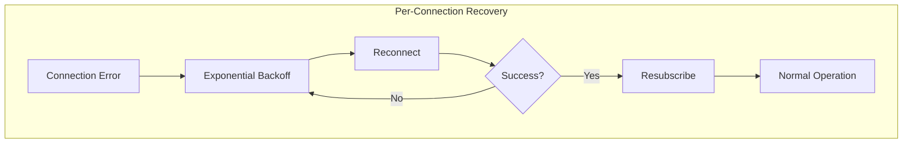
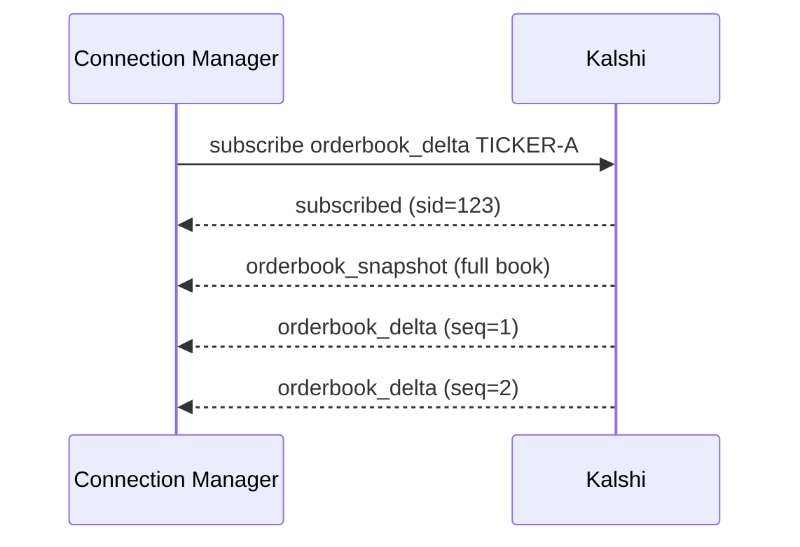

# WebSocket Recovery

Automatic reconnection and resubscription for WebSocket connections.

---

## Overview

Connection Manager maintains 150 WebSocket connections. Each connection has its own reconnection loop that handles failures independently.



---

## Failure Detection

### Error Sources

| Error Type | Source | Detection |
|------------|--------|-----------|
| Read error | `ReadMessage()` returns error | Immediate |
| Write error | `WriteMessage()` returns error | Immediate |
| Ping timeout | No ping received in 30s | Heartbeat monitor |
| Connection closed | Server closes connection | Read returns EOF |

### Error Flow

```go
// WebSocket Client detects error
func (c *client) readLoop() {
    for {
        _, data, err := c.conn.ReadMessage()
        if err != nil {
            // Signal error to Connection Manager
            c.errCh <- err
            return
        }
        // ... process message
    }
}

// Connection Manager receives error
func (m *manager) reconnectLoop(conn *connState) {
    for {
        select {
        case err := <-conn.client.Errors():
            m.logger.Warn("connection error", "conn", conn.id, "err", err)
            // Begin reconnection
            m.handleReconnect(conn)
        }
    }
}
```

---

## Reconnection Strategy

### Exponential Backoff

```go
const (
    InitialBackoff = 1 * time.Second
    MaxBackoff     = 5 * time.Minute
    BackoffFactor  = 2.0
)

func (m *manager) handleReconnect(conn *connState) {
    backoff := InitialBackoff

    for {
        select {
        case <-m.ctx.Done():
            return
        case <-time.After(backoff):
        }

        if err := conn.client.Connect(m.ctx); err == nil {
            m.resubscribe(conn)
            m.metrics.Reconnects.WithLabelValues(conn.role).Inc()
            return  // Success
        }

        m.logger.Warn("reconnect failed",
            "conn", conn.id,
            "backoff", backoff,
        )

        // Increase backoff
        backoff = min(backoff*BackoffFactor, MaxBackoff)
    }
}
```

### Backoff Timeline

| Attempt | Delay | Cumulative |
|---------|-------|------------|
| 1 | 1s | 1s |
| 2 | 2s | 3s |
| 3 | 4s | 7s |
| 4 | 8s | 15s |
| 5 | 16s | 31s |
| 6 | 32s | 63s |
| 7 | 64s | ~2 min |
| 8 | 128s | ~4 min |
| 9 | 256s | ~8.5 min |
| 10+ | 300s (max) | +5 min each |

---

## Resubscription

### By Connection Role

```go
func (m *manager) resubscribe(conn *connState) {
    switch conn.role {
    case "ticker":
        // Global subscription, no market-specific
        m.subscribe(conn, "ticker", "")

    case "trade":
        // Global subscription
        m.subscribe(conn, "trade", "")

    case "lifecycle":
        // Global subscription
        m.subscribe(conn, "market_lifecycle", "")

    case "orderbook":
        // Per-market subscriptions
        conn.mu.Lock()
        tickers := make([]string, 0, len(conn.markets))
        for ticker := range conn.markets {
            tickers = append(tickers, ticker)
        }
        conn.mu.Unlock()

        for _, ticker := range tickers {
            m.subscribe(conn, "orderbook_delta", ticker)
        }
    }
}
```

### Subscription State

Connection Manager tracks market assignments per connection:

```go
type connState struct {
    id      int
    role    string
    client  *websocket.Client
    markets map[string]struct{}  // Orderbook connections only
    mu      sync.Mutex
}
```

On reconnect, the same markets are resubscribed. No redistribution occurs.

---

## Sequence Numbers After Reconnect

### Initial Snapshot

When resubscribing to `orderbook_delta`, Kalshi sends a full snapshot:



### Sequence Reset

After reconnect, sequence tracking resets for that subscription:

```go
func (m *manager) checkSequence(sid int64, seq int64) (seqGap bool, gapSize int) {
    m.seqMu.Lock()
    defer m.seqMu.Unlock()

    last, exists := m.lastSeq[sid]
    if !exists {
        // First message (snapshot) - initialize
        m.lastSeq[sid] = seq
        return false, 0
    }

    // Check for gap
    if seq != last+1 {
        gap := int(seq - last - 1)
        m.lastSeq[sid] = seq
        return true, gap
    }

    m.lastSeq[sid] = seq
    return false, 0
}
```

**Note:** New SID is assigned on resubscribe, so old sequence tracking is irrelevant.

---

## Data During Reconnection

### Gap Period

During reconnection, data is missed on that connection:

| Connection Type | Impact |
|-----------------|--------|
| Ticker (1-2) | Miss ticker updates |
| Trade (3-4) | Miss trade notifications |
| Lifecycle (5-6) | Miss market lifecycle events |
| Orderbook (7-150) | Miss orderbook deltas for assigned markets |

### Recovery Sources

| Data Type | Backup Source | Resolution |
|-----------|---------------|------------|
| Orderbook | REST snapshot polling | 15 minutes |
| Orderbook | Other gatherers | Real-time |
| Trades | Other gatherers | Real-time |
| Ticker | Other gatherers | Real-time |
| Lifecycle | REST reconciliation | 5-10 minutes |

---

## Connection Role Redundancy

### Global Channels

| Channel | Connections | Redundancy |
|---------|-------------|------------|
| Ticker | 1-2 (2 conns) | If 1 fails, 1 remains |
| Trade | 3-4 (2 conns) | If 1 fails, 1 remains |
| Lifecycle | 5-6 (2 conns) | If 1 fails, 1 remains |

### Orderbook Connections

| Connection | Markets | Redundancy |
|------------|---------|------------|
| 7-150 (144 conns) | ~7K each | Other gatherers have same markets |

---

## Metrics

| Metric | Type | Labels | Description |
|--------|------|--------|-------------|
| `conn_manager_reconnects_total` | Counter | `conn_id`, `role` | Reconnection attempts |
| `conn_manager_connections_healthy` | Gauge | `role` | Healthy connections by role |
| `ws_client_errors_total` | Counter | `type` | Error types (read, write, connect) |

### Example Queries

```promql
# Reconnection rate
rate(conn_manager_reconnects_total[5m])

# Healthy connections by role
conn_manager_connections_healthy

# Connection stability (reconnects per connection)
sum(increase(conn_manager_reconnects_total[1h])) by (conn_id)
```

---

## Alerts

| Alert | Condition | Severity |
|-------|-----------|----------|
| HighReconnectRate | > 1 reconnect/s sustained | Warning |
| AllWebSocketsDisconnected | 0 healthy connections | Critical |
| SingleRoleDown | All connections for a role down | Warning |

---

## Configuration

```go
type ReconnectConfig struct {
    InitialBackoff time.Duration  // Default: 1s
    MaxBackoff     time.Duration  // Default: 5m
    BackoffFactor  float64        // Default: 2.0
}
```

### Environment Variables

| Variable | Default | Description |
|----------|---------|-------------|
| `WS_RECONNECT_INITIAL` | `1s` | Initial backoff |
| `WS_RECONNECT_MAX` | `5m` | Maximum backoff |
| `WS_RECONNECT_FACTOR` | `2.0` | Backoff multiplier |

---

## Troubleshooting

### Frequent Reconnections

| Symptom | Possible Cause | Solution |
|---------|----------------|----------|
| All connections cycling | Network instability | Check network, VPN |
| Single connection cycling | Kalshi-side issue | Check Kalshi status |
| Pattern at same time | Kalshi maintenance | Expected, monitor |

### Connection Won't Reconnect

| Symptom | Possible Cause | Solution |
|---------|----------------|----------|
| Auth failure | Invalid API key | Check credentials |
| DNS failure | Network issue | Check DNS resolution |
| Timeout | Firewall blocking | Check security groups |

### Logs to Check

```bash
# Connection errors
grep "connection error" /var/log/gatherer.log

# Reconnection attempts
grep "reconnect" /var/log/gatherer.log

# Subscription failures
grep "subscribe" /var/log/gatherer.log | grep -i error
```
