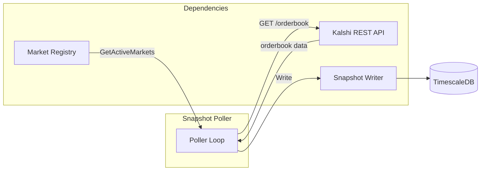
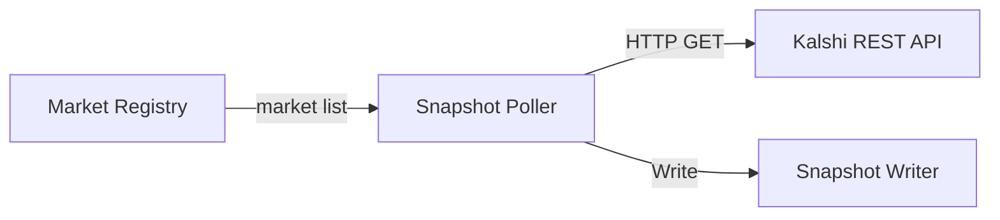

# Snapshot Poller

Backup data source that polls REST API for orderbook snapshots every 1 minute.

---

## Responsibilities

| Responsibility | Details |
|----------------|---------|
| Periodic polling | Fetch orderbook snapshots every 1 minute |
| Backup data source | Ensure data availability if WebSocket misses messages |
| Gap recovery | Provide at least 1-minute resolution even during outages |

**Not responsible for** (handled by other components):
- WebSocket data ingestion (Connection Manager)
- Market discovery (Market Registry)
- Data transformation (Snapshot Writer)
- Deduplication (Deduplicator)

---

## Purpose

The Snapshot Poller acts as a safety net for the WebSocket-based data pipeline:

1. **WebSocket deltas** provide real-time updates but can miss messages during:
   - Network interruptions
   - Sequence gaps
   - Reconnection periods

2. **Snapshot Poller** ensures:
   - At least 1-minute resolution orderbook data
   - Recovery point for reconstructing orderbook state
   - Independent data source for deduplicator cross-validation

---

## Data Flow

---

## Dependencies

| Dependency | Direction | Purpose |
|------------|-----------|---------|
| Market Registry | Input | Get list of active markets to poll |
| Kalshi REST API | Input | Fetch orderbook snapshots |
| Snapshot Writer | Output | Persist snapshots to database |

---

## Design Principles

1. **Market Registry as single source of truth**: Never maintains own market list
2. **Synchronous writes**: Each snapshot written immediately after fetch
3. **No retry logic**: Relies on next poll cycle and 3-gatherer redundancy
4. **Independent operation**: Runs on fixed 1-minute interval regardless of WebSocket state

---

## WebSocket vs REST Snapshots

| Aspect | WebSocket Snapshot | REST Snapshot |
|--------|-------------------|---------------|
| Trigger | On subscription | Every 1 minute |
| Source column | `'ws'` | `'rest'` |
| SID | From subscription | `0` |
| Exchange timestamp | From message | `0` (not provided) |
| Purpose | Initial state | Backup/recovery |

---

## Related Docs

- [Interface](./interface.md) - Public methods and types
- [Lifecycle](./lifecycle.md) - Startup and shutdown
- [Behaviors](./behaviors.md) - Polling loop, REST calls
- [Configuration](./configuration.md) - Config options and metrics
- [Market Registry](../market-registry/) - Source of market list
- [Writers](../writers/) - Snapshot Writer interface
