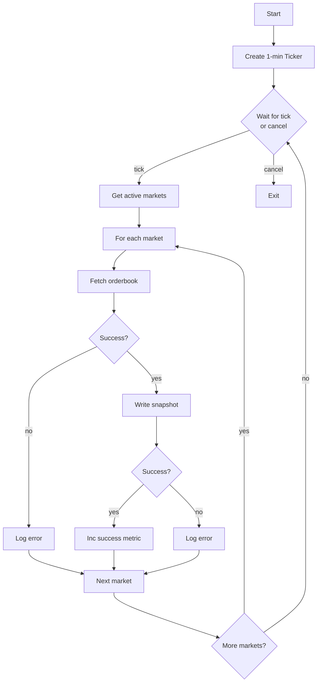

# Behaviors

Polling loop, REST API calls, and response parsing for Snapshot Poller.

---

## Polling Loop



### Main Loop

```go
func (p *snapshotPoller) run() {
    defer p.wg.Done()

    ticker := time.NewTicker(p.cfg.PollInterval)
    defer ticker.Stop()

    // Poll immediately on start, then on ticker
    p.pollAll()

    for {
        select {
        case <-p.ctx.Done():
            return
        case <-ticker.C:
            p.pollAll()
        }
    }
}
```

### Poll All Markets

```go
func (p *snapshotPoller) pollAll() {
    start := time.Now()

    markets := p.registry.GetActiveMarkets()
    p.metrics.MarketsPolled.Set(float64(len(markets)))

    if len(markets) == 0 {
        p.logger.Debug("no active markets to poll")
        return
    }

    var fetched, errors int
    for _, market := range markets {
        snapshot, err := p.fetchOrderbook(market.Ticker)
        if err != nil {
            p.logger.Warn("failed to fetch orderbook",
                "ticker", market.Ticker,
                "err", err,
            )
            p.metrics.FetchErrors.Inc()
            errors++
            continue
        }

        if err := p.writer.Write(snapshot); err != nil {
            p.logger.Warn("failed to write snapshot",
                "ticker", market.Ticker,
                "err", err,
            )
            p.metrics.WriteErrors.Inc()
            errors++
            continue
        }

        fetched++
    }

    p.metrics.SnapshotsFetched.Add(float64(fetched))
    p.metrics.PollDuration.Observe(time.Since(start).Seconds())

    p.logger.Debug("poll cycle complete",
        "markets", len(markets),
        "fetched", fetched,
        "errors", errors,
        "duration", time.Since(start),
    )
}
```

---

## REST API Call

### Endpoint

```
GET /markets/{ticker}/orderbook
```

See [REST API: Get Orderbook](../../kalshi-api/rest-api/markets/get-orderbook.md) for full API documentation.

### Fetch Implementation

```go
func (p *snapshotPoller) fetchOrderbook(ticker string) (RESTOrderbookSnapshot, error) {
    url := fmt.Sprintf("%s/markets/%s/orderbook", p.cfg.BaseURL, ticker)

    req, err := http.NewRequestWithContext(p.ctx, "GET", url, nil)
    if err != nil {
        return RESTOrderbookSnapshot{}, fmt.Errorf("create request: %w", err)
    }

    resp, err := p.client.Do(req)
    if err != nil {
        return RESTOrderbookSnapshot{}, fmt.Errorf("http request: %w", err)
    }
    defer resp.Body.Close()

    if resp.StatusCode != http.StatusOK {
        return RESTOrderbookSnapshot{}, fmt.Errorf("unexpected status: %d", resp.StatusCode)
    }

    var result orderbookResponse
    if err := json.NewDecoder(resp.Body).Decode(&result); err != nil {
        return RESTOrderbookSnapshot{}, fmt.Errorf("decode response: %w", err)
    }

    return RESTOrderbookSnapshot{
        Ticker:     ticker,
        SnapshotTs: time.Now().UnixMicro(),
        YesBids:    parsePriceLevels(result.Orderbook.YesDollars),
        NoBids:     parsePriceLevels(result.Orderbook.NoDollars),
    }, nil
}
```

---

## Response Parsing

### API Response Format

```go
type orderbookResponse struct {
    Orderbook struct {
        Yes        [][]interface{} `json:"yes"`         // [[price_cents, qty], ...]
        No         [][]interface{} `json:"no"`
        YesDollars [][]interface{} `json:"yes_dollars"` // [["price", qty], ...]
        NoDollars  [][]interface{} `json:"no_dollars"`
    } `json:"orderbook"`
}
```

**Note:** Use `*_dollars` fields for subpenny precision. The `yes`/`no` fields are in cents and lose precision.

### Parse Price Levels

```go
func parsePriceLevels(levels [][]interface{}) []PriceLevel {
    result := make([]PriceLevel, 0, len(levels))

    for _, level := range levels {
        if len(level) != 2 {
            continue
        }

        // level[0] is price as string (e.g., "0.52" or "0.5250")
        dollars, ok := level[0].(string)
        if !ok {
            continue
        }

        // level[1] is quantity as float64 (JSON numbers)
        qtyFloat, ok := level[1].(float64)
        if !ok {
            continue
        }

        result = append(result, PriceLevel{
            Dollars:  dollars,
            Quantity: int(qtyFloat),
        })
    }

    return result
}
```

### Example Response

```json
{
  "orderbook": {
    "yes": [[52, 100], [51, 200]],
    "no": [[48, 150], [47, 250]],
    "yes_dollars": [["0.52", 100], ["0.51", 200]],
    "no_dollars": [["0.48", 150], ["0.47", 250]]
  }
}
```

Parsed to:

```go
RESTOrderbookSnapshot{
    Ticker:     "EXAMPLE-TICKER",
    SnapshotTs: 1704067200000000,  // µs
    YesBids: []PriceLevel{
        {Dollars: "0.52", Quantity: 100},
        {Dollars: "0.51", Quantity: 200},
    },
    NoBids: []PriceLevel{
        {Dollars: "0.48", Quantity: 150},
        {Dollars: "0.47", Quantity: 250},
    },
}
```

---

## Error Handling

| Error | Behavior | Metric |
|-------|----------|--------|
| HTTP timeout | Log, skip market | `fetch_errors_total` |
| Non-200 status | Log, skip market | `fetch_errors_total` |
| JSON decode error | Log, skip market | `fetch_errors_total` |
| Writer error | Log, skip market | `write_errors_total` |
| Context cancelled | Exit loop | None |

**No retry logic**: Failed fetches wait for the next 1-minute poll cycle. With 3 gatherers polling independently, coverage is maintained.

---

## Rate Limiting

Per Kalshi API documentation, **read operations are not rate-limited**. Only order operations (writes) have rate limits.

However, the poller is naturally rate-limited:
- 1-minute poll interval
- Sequential market fetching (not concurrent by default)

## Scalability

**Current design**: Sequential fetching works for moderate market counts (~1000 markets × ~100ms = ~100 seconds).

**At scale (1M markets)**: Sequential polling cannot complete within a 1-minute cycle. Options:

| Approach | Trade-off |
|----------|-----------|
| Concurrent fetching with semaphore | Requires worker pool, increases complexity |
| Priority-based polling | Poll high-activity markets more frequently |
| Skip REST polling entirely | Rely on WebSocket snapshots + deltas only |

**Recommendation**: For 1M markets, REST snapshot polling becomes impractical. The WebSocket pipeline (subscription snapshots + deltas) should be the primary data source, with REST polling limited to gap recovery for specific markets on-demand rather than periodic full sweeps.
