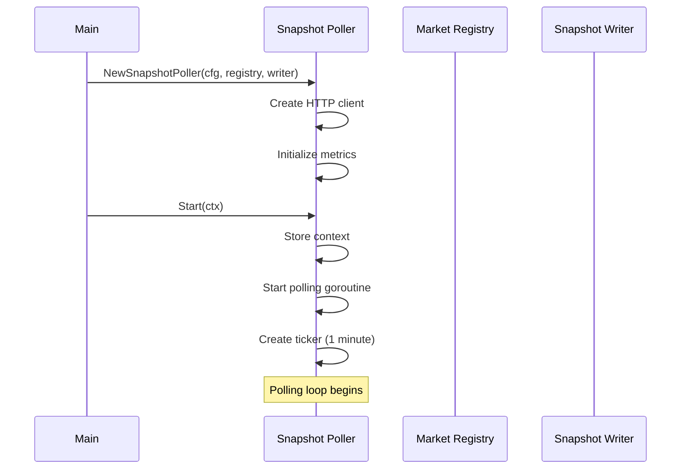
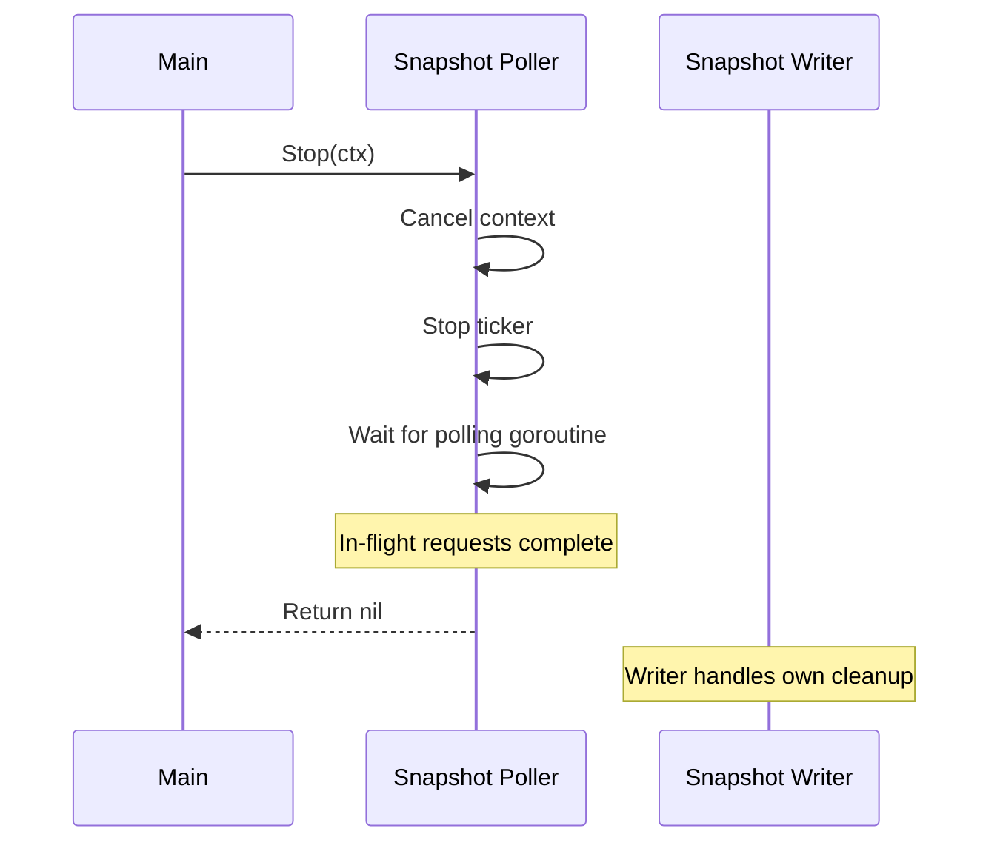

# Lifecycle

Startup and shutdown for Snapshot Poller.

---

## Startup



### Initialization

```go
func NewSnapshotPoller(cfg PollerConfig, registry MarketRegistry, writer *SnapshotWriter) *snapshotPoller {
    return &snapshotPoller{
        cfg:      cfg,
        logger:   slog.Default().With("component", "snapshot-poller"),
        registry: registry,
        writer:   writer,
        client: &http.Client{
            Timeout: cfg.RequestTimeout,
        },
        metrics: newPollerMetrics(),
    }
}
```

### Start

```go
func (p *snapshotPoller) Start(ctx context.Context) error {
    p.ctx, p.cancel = context.WithCancel(ctx)

    p.wg.Add(1)
    go p.run()

    p.logger.Info("snapshot poller started",
        "poll_interval", p.cfg.PollInterval,
    )

    return nil
}
```

---

## Shutdown



### Stop

```go
func (p *snapshotPoller) Stop(ctx context.Context) error {
    p.logger.Info("stopping snapshot poller")

    // Cancel context to stop polling loop
    p.cancel()

    // Wait for goroutine to finish
    done := make(chan struct{})
    go func() {
        p.wg.Wait()
        close(done)
    }()

    select {
    case <-done:
        p.logger.Info("snapshot poller stopped")
        return nil
    case <-ctx.Done():
        p.logger.Warn("shutdown timeout, forcing stop")
        return ctx.Err()
    }
}
```

---

## Dependency Lifecycle

Snapshot Poller does **not** own its dependencies:

| Dependency | Owned By | Notes |
|------------|----------|-------|
| Market Registry | Main | Must be started before Snapshot Poller |
| Snapshot Writer | Main | Synchronous, no start/stop needed |
| HTTP Client | Snapshot Poller | Created internally, no cleanup needed |

### Startup Order (Full System)

```
1. Database connection pool
2. Market Registry (starts REST polling for market discovery)
3. Snapshot Writer (receives DB pool)
4. Snapshot Poller (receives Market Registry + Snapshot Writer)
5. Connection Manager (establishes WebSocket connections)
6. Message Router (creates output channels)
7. Orderbook/Trade/Ticker Writers (receive channels from Message Router)
8. Connection Manager subscribes (triggers WebSocket message flow)
```

**Note:** Steps 5-8 are the WebSocket pipeline startup (see [writers/lifecycle.md](../writers/lifecycle.md)).

### Shutdown Order

```
1. Connection Manager (stop WebSocket, close connections)
2. Message Router (close output channels)
3. Orderbook/Trade/Ticker Writers (drain channels, flush batches)
4. Snapshot Poller (stop REST polling)
5. Market Registry (stop updates)
6. Database connection pool
```

---

## Error States

| State | Cause | Recovery |
|-------|-------|----------|
| Registry unavailable | Registry not started | Poller gets empty market list, skips cycle |
| Writer unavailable | Writer not initialized | Write calls fail, logged, next cycle retries |
| HTTP client timeout | Network issues | Request fails, logged, next cycle retries |
| Context cancelled | Shutdown requested | Goroutine exits cleanly |

**Design:** No retry logic within a poll cycle. Failed requests simply wait for the next 1-minute cycle. Combined with 3-gatherer redundancy, this provides sufficient coverage.
