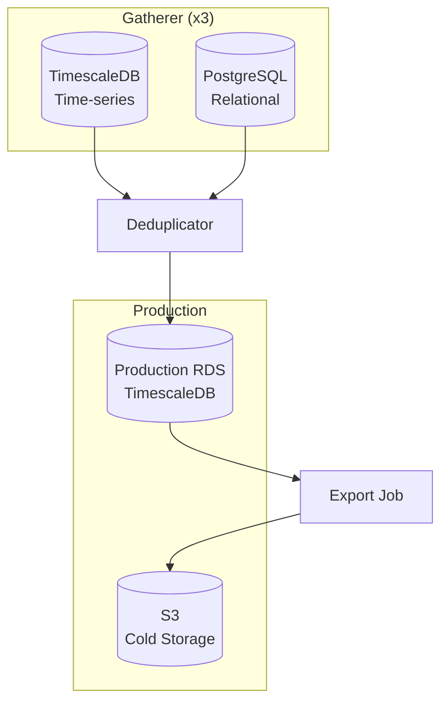
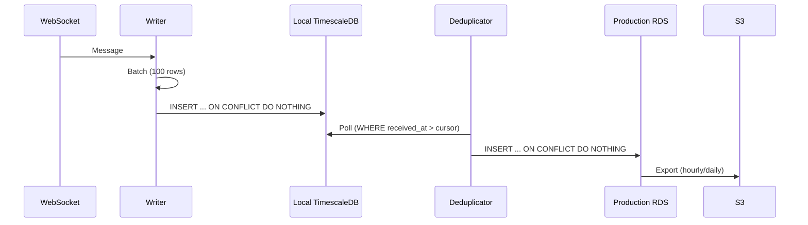
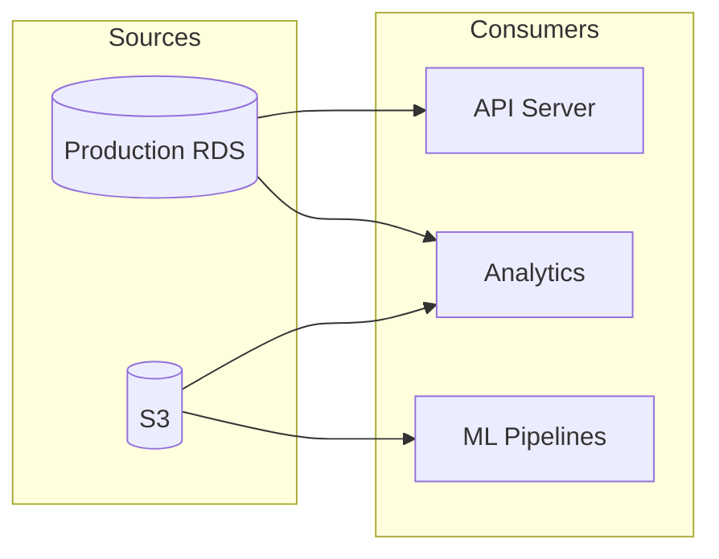

# Storage

Persistence layer for the Kalshi Data Platform.

---

## Overview

The platform uses a two-tier storage architecture:

| Tier | Purpose | Technology | Retention |
|------|---------|------------|-----------|
| Gatherer-local | Buffer, redundancy | TimescaleDB + PostgreSQL | 7-30 days |
| Production | Authoritative source | TimescaleDB on RDS | Varies by table |
| Cold storage | Archive, analytics | Parquet on S3 | Forever |

---

## Storage Components

### Gatherer-Local Storage

Each gatherer has two databases:

| Database | Purpose | Tables |
|----------|---------|--------|
| TimescaleDB | Time-series data | trades, orderbook_deltas, orderbook_snapshots, tickers |
| PostgreSQL | Relational data | series, events, markets |

**Characteristics:**
- Append-only writes (no updates to time-series)
- Short retention (data moves to production via deduplicator)
- 3 independent copies for redundancy
- ON CONFLICT DO NOTHING for deduplication

### Production RDS

Single authoritative database receiving deduplicated data.

| Database | Purpose | Tables |
|----------|---------|--------|
| TimescaleDB | All data types | series, events, markets, trades, orderbook_deltas, orderbook_snapshots, tickers |

**Characteristics:**
- Receives deduplicated data from all gatherers
- Longer retention with compression
- Read replicas for analytics
- Automated backups

### S3 Cold Storage

Parquet export for long-term archive and analytics.

| Bucket | Data | Format | Lifecycle |
|--------|------|--------|-----------|
| `raw/` | Unprocessed exports | Parquet | Glacier after 30 days |
| `processed/` | Cleaned, validated | Parquet | IA after 90 days |
| `aggregates/` | Pre-computed analytics | Parquet | Standard |

---

## Data Flow

### Write Path

### Read Path

---

## Connection Architecture

### Per-Gatherer Connections

| Component | Connections | Purpose |
|-----------|-------------|---------|
| Orderbook Writer | 2-3 | Batch inserts |
| Trade Writer | 2-3 | Batch inserts |
| Ticker Writer | 2-3 | Batch inserts |
| Snapshot Writer | 1-2 | REST snapshot inserts |
| Market Registry | 2-3 | Market/event updates |

**Total per gatherer:** 9-14 connections

### Deduplicator Connections

| Target | Connections | Mode |
|--------|-------------|------|
| Gatherer 1 TimescaleDB | 2 | Read-only |
| Gatherer 1 PostgreSQL | 2 | Read-only |
| Gatherer 2 TimescaleDB | 2 | Read-only |
| Gatherer 2 PostgreSQL | 2 | Read-only |
| Gatherer 3 TimescaleDB | 2 | Read-only |
| Gatherer 3 PostgreSQL | 2 | Read-only |
| Production RDS | 4-6 | Read-write |

**Total:** 16-18 connections

---

## Key Design Decisions

### Why TimescaleDB?

| Requirement | TimescaleDB Feature |
|-------------|---------------------|
| Time-series optimized | Hypertables with automatic chunking |
| High insert throughput | Parallel inserts, batch optimization |
| Compression | 10x compression for historical data |
| Retention policies | Automatic data expiration |
| SQL compatibility | Standard PostgreSQL queries |

### Why Separate Gatherer Databases?

| Reason | Benefit |
|--------|---------|
| Independence | Each gatherer can fail independently |
| Locality | Low-latency writes (same AZ) |
| Redundancy | 3 complete copies of all data |
| Recovery | Any gatherer can backfill others |

### Why Deduplication at Write?

All data has exchange-provided unique identifiers (trade_id, exchange_ts + seq).
Using `ON CONFLICT DO NOTHING` is:
- Idempotent: Safe to retry
- Efficient: No read-before-write
- Simple: No external dedup service

---

## Documentation

| Document | Content |
|----------|---------|
| [Configuration](./configuration.md) | Connection strings, pool settings, tuning |
| [TimescaleDB](./timescaledb.md) | Hypertables, compression, retention policies |
| [Operations](./operations.md) | Backup, restore, migrations, maintenance |
| [S3 Export](./s3.md) | Cold storage format, lifecycle, querying |

---

## Schema References

For detailed schema documentation:

- [Data Model (Gatherer)](../architecture/data-model.md) - Gatherer-local schema
- [Data Model (Production)](../architecture/data-model-production.md) - Production RDS schema
