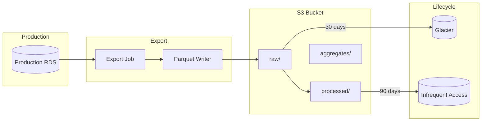

# S3 Export

Cold storage architecture, Parquet export, and lifecycle management.

---

## Overview



---

## Bucket Structure

```
s3://kalshi-data-archive/
├── raw/
│   ├── trades/
│   │   └── year=2024/month=01/day=15/
│   │       └── trades_2024-01-15_00-00-00.parquet
│   ├── orderbook_deltas/
│   │   └── year=2024/month=01/day=15/hour=10/
│   │       └── deltas_2024-01-15_10-00-00.parquet
│   ├── orderbook_snapshots/
│   │   └── year=2024/month=01/day=15/
│   │       └── snapshots_2024-01-15.parquet
│   └── tickers/
│       └── year=2024/month=01/day=15/hour=10/
│           └── tickers_2024-01-15_10-00-00.parquet
├── processed/
│   ├── trades/
│   ├── orderbook_snapshots/
│   └── market_activity/
└── aggregates/
    ├── daily_volume/
    ├── hourly_ohlc/
    └── market_stats/
```

### Prefix Descriptions

| Prefix | Content | Format | Retention |
|--------|---------|--------|-----------|
| `raw/` | Unprocessed exports from RDS | Parquet | Glacier after 30 days |
| `processed/` | Cleaned, validated, enriched | Parquet | IA after 90 days |
| `aggregates/` | Pre-computed analytics | Parquet | Standard |

---

## Parquet Schema

### trades

```
message trades {
  required binary trade_id (STRING);
  required int64 exchange_ts;
  required int64 received_at;
  required binary ticker (STRING);
  optional binary event_ticker (STRING);
  required int32 price;
  required int32 size;
  required boolean taker_side;
  optional int64 sid;
}
```

### orderbook_deltas

```
message orderbook_deltas {
  required int64 exchange_ts;
  required int64 received_at;
  required int64 seq;
  required binary ticker (STRING);
  required boolean side;
  required int32 price;
  required int32 size_delta;
  optional int64 sid;
}
```

### orderbook_snapshots

```
message orderbook_snapshots {
  required int64 snapshot_ts;
  optional int64 exchange_ts;
  required binary ticker (STRING);
  required binary source (STRING);
  required binary yes_bids (JSON);
  required binary yes_asks (JSON);
  required binary no_bids (JSON);
  required binary no_asks (JSON);
  optional int32 best_yes_bid;
  optional int32 best_yes_ask;
  optional int32 spread;
  optional int64 sid;
}
```

### tickers

```
message tickers {
  required int64 exchange_ts;
  required int64 received_at;
  required binary ticker (STRING);
  optional int32 yes_bid;
  optional int32 yes_ask;
  optional int32 last_price;
  optional int64 volume;
  optional int64 open_interest;
  optional int64 dollar_volume;
  optional int64 dollar_open_interest;
  optional int64 sid;
}
```

---

## Export Jobs

### Schedule

| Table | Frequency | Lag | File Size |
|-------|-----------|-----|-----------|
| trades | Hourly | 1 hour | ~5 MB |
| orderbook_deltas | Hourly | 1 hour | ~30 MB |
| orderbook_snapshots | Daily | 1 day | ~150 MB |
| tickers | Hourly | 1 hour | ~3 MB |

### Export Query

```sql
-- Export trades for a time range
COPY (
    SELECT
        trade_id,
        exchange_ts,
        received_at,
        ticker,
        event_ticker,
        price,
        size,
        taker_side
    FROM trades
    WHERE exchange_ts >= $start_ts
      AND exchange_ts < $end_ts
    ORDER BY exchange_ts
) TO STDOUT WITH (FORMAT 'csv', HEADER);
```

### Export Job Configuration

```go
type ExportConfig struct {
    Table         string
    Frequency     time.Duration
    Lag           time.Duration
    PartitionBy   []string       // ["year", "month", "day"]
    MaxFileSize   int64          // Target file size
    Compression   string         // "snappy", "gzip", "zstd"
}

var ExportConfigs = map[string]ExportConfig{
    "trades": {
        Table:       "trades",
        Frequency:   1 * time.Hour,
        Lag:         1 * time.Hour,
        PartitionBy: []string{"year", "month", "day"},
        Compression: "snappy",
    },
    "orderbook_deltas": {
        Table:       "orderbook_deltas",
        Frequency:   1 * time.Hour,
        Lag:         1 * time.Hour,
        PartitionBy: []string{"year", "month", "day", "hour"},
        Compression: "snappy",
    },
}
```

---

## Lifecycle Policies

### Bucket Policy

```json
{
  "Rules": [
    {
      "ID": "RawToGlacier",
      "Filter": { "Prefix": "raw/" },
      "Status": "Enabled",
      "Transitions": [
        {
          "Days": 30,
          "StorageClass": "GLACIER"
        }
      ]
    },
    {
      "ID": "ProcessedToIA",
      "Filter": { "Prefix": "processed/" },
      "Status": "Enabled",
      "Transitions": [
        {
          "Days": 90,
          "StorageClass": "STANDARD_IA"
        }
      ]
    },
    {
      "ID": "DeleteOldRaw",
      "Filter": { "Prefix": "raw/" },
      "Status": "Enabled",
      "Expiration": {
        "Days": 365
      }
    }
  ]
}
```

### Storage Classes

| Class | Use Case | Retrieval |
|-------|----------|-----------|
| Standard | Recent data, frequent access | Immediate |
| Standard-IA | Older data, occasional access | Immediate |
| Glacier | Archive, rare access | 3-5 hours |
| Glacier Deep Archive | Compliance, very rare | 12 hours |

---

## Querying S3 Data

### AWS Athena

Create external tables for SQL queries.

```sql
-- Create Athena table for trades
CREATE EXTERNAL TABLE trades (
    trade_id STRING,
    exchange_ts BIGINT,
    received_at BIGINT,
    ticker STRING,
    event_ticker STRING,
    price INT,
    size INT,
    taker_side BOOLEAN
)
PARTITIONED BY (year STRING, month STRING, day STRING)
STORED AS PARQUET
LOCATION 's3://kalshi-data-archive/raw/trades/'
TBLPROPERTIES ('parquet.compression'='SNAPPY');

-- Load partitions
MSCK REPAIR TABLE trades;

-- Query
SELECT ticker, COUNT(*), SUM(size) as volume
FROM trades
WHERE year = '2024' AND month = '01'
GROUP BY ticker
ORDER BY volume DESC
LIMIT 100;
```

### Spark

```python
from pyspark.sql import SparkSession

spark = SparkSession.builder \
    .appName("KalshiAnalytics") \
    .getOrCreate()

# Read trades
trades = spark.read.parquet("s3://kalshi-data-archive/raw/trades/")

# Filter and aggregate
daily_volume = trades \
    .filter(trades.exchange_ts >= start_ts) \
    .groupBy("ticker") \
    .agg({"size": "sum", "trade_id": "count"})

daily_volume.show()
```

### DuckDB

```sql
-- Direct S3 query with DuckDB
INSTALL httpfs;
LOAD httpfs;

SET s3_region='us-east-1';
SET s3_access_key_id='...';
SET s3_secret_access_key='...';

SELECT ticker, COUNT(*), SUM(size)
FROM read_parquet('s3://kalshi-data-archive/raw/trades/year=2024/month=01/day=15/*.parquet')
GROUP BY ticker;
```

---

## Export Implementation

### Go Exporter

```go
type S3Exporter struct {
    db       *pgxpool.Pool
    s3Client *s3.Client
    bucket   string
}

func (e *S3Exporter) ExportTable(ctx context.Context, table string, start, end int64) error {
    // Query data
    rows, err := e.db.Query(ctx, exportQuery(table), start, end)
    if err != nil {
        return err
    }
    defer rows.Close()

    // Write to Parquet buffer
    buf := new(bytes.Buffer)
    pw := parquet.NewWriter(buf, schema(table))

    for rows.Next() {
        record := scanRow(rows)
        pw.Write(record)
    }
    pw.Close()

    // Upload to S3
    key := fmt.Sprintf("raw/%s/%s", table, partitionPath(start))
    _, err = e.s3Client.PutObject(ctx, &s3.PutObjectInput{
        Bucket: aws.String(e.bucket),
        Key:    aws.String(key),
        Body:   buf,
    })
    return err
}
```

### Cursor Management

Track export progress to avoid duplicates.

```sql
CREATE TABLE export_cursors (
    table_name      VARCHAR(64) PRIMARY KEY,
    last_export_ts  BIGINT NOT NULL,
    last_export_at  TIMESTAMPTZ DEFAULT NOW()
);

-- Update after successful export
UPDATE export_cursors
SET last_export_ts = $1, last_export_at = NOW()
WHERE table_name = $2;
```

---

## Validation

### Row Counts

```sql
-- Compare RDS and S3 counts
-- RDS
SELECT COUNT(*) FROM trades
WHERE exchange_ts >= $start AND exchange_ts < $end;

-- Athena
SELECT COUNT(*) FROM trades
WHERE year = '2024' AND month = '01' AND day = '15';
```

### Checksums

```python
# Compute checksum for validation
import hashlib

def compute_checksum(parquet_path):
    df = pd.read_parquet(parquet_path)
    # Sort for consistent ordering
    df = df.sort_values(['exchange_ts', 'trade_id'])
    return hashlib.md5(df.to_json().encode()).hexdigest()
```

---

## Cost Optimization

### Storage Costs

| Class | Cost/GB/Month | 1 TB/Month |
|-------|---------------|------------|
| Standard | $0.023 | $23.55 |
| Standard-IA | $0.0125 | $12.80 |
| Glacier | $0.004 | $4.10 |
| Glacier Deep | $0.00099 | $1.01 |

### Optimization Strategies

| Strategy | Savings |
|----------|---------|
| Lifecycle to Glacier | 80% after 30 days |
| Snappy compression | 50% size reduction |
| Partition pruning | Reduce scan costs |
| Delete old raw after processed | 100% |

### Estimated Monthly Cost

| Data | Storage Class | Size | Cost |
|------|---------------|------|------|
| Recent raw (30 days) | Standard | 10 GB | $0.23 |
| Older raw (1 year) | Glacier | 100 GB | $0.40 |
| Processed (90 days) | Standard | 30 GB | $0.69 |
| Processed (older) | IA | 200 GB | $2.50 |
| Aggregates | Standard | 5 GB | $0.12 |
| **Total** | | **345 GB** | **~$4/month** |

---

## Monitoring

### Export Metrics

| Metric | Type | Description |
|--------|------|-------------|
| `export_rows_total` | Counter | Rows exported |
| `export_bytes_total` | Counter | Bytes written to S3 |
| `export_duration_seconds` | Histogram | Export job duration |
| `export_errors_total` | Counter | Failed exports |
| `export_lag_seconds` | Gauge | Time since last export |

### Alerts

| Condition | Threshold | Severity |
|-----------|-----------|----------|
| Export lag | > 2 hours | Warning |
| Export lag | > 6 hours | Critical |
| Export errors | > 3 consecutive | Warning |
| S3 upload failure | Any | Warning |

---

## Recovery

### Re-export from RDS

If S3 data is lost or corrupted:

```bash
# Re-export specific time range
./exporter --table trades \
  --start "2024-01-15T00:00:00Z" \
  --end "2024-01-16T00:00:00Z" \
  --force
```

### Restore Glacier Data

```bash
# Initiate restore (expedited: 1-5 min, standard: 3-5 hours)
aws s3api restore-object \
  --bucket kalshi-data-archive \
  --key raw/trades/year=2024/month=01/day=01/trades.parquet \
  --restore-request '{"Days":7,"GlacierJobParameters":{"Tier":"Standard"}}'

# Check restore status
aws s3api head-object \
  --bucket kalshi-data-archive \
  --key raw/trades/year=2024/month=01/day=01/trades.parquet
```
