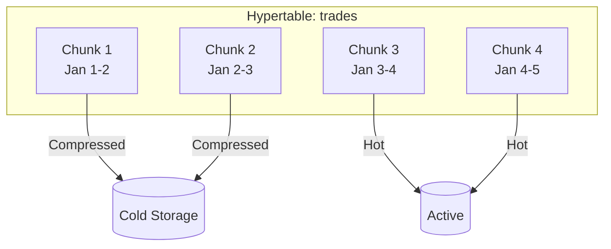

# TimescaleDB

Hypertable configuration, compression, and retention policies.

---

## Overview

TimescaleDB extends PostgreSQL with time-series optimizations:



| Feature | Benefit |
|---------|---------|
| Hypertables | Automatic time-based partitioning |
| Chunks | Efficient range queries, parallel operations |
| Compression | 10x storage reduction |
| Retention policies | Automatic data expiration |

---

## Hypertables

### Creation

```sql
-- Create regular table first
CREATE TABLE trades (
    trade_id        UUID PRIMARY KEY,
    exchange_ts     BIGINT NOT NULL,
    received_at     BIGINT NOT NULL,
    ticker          VARCHAR(128) NOT NULL,
    event_ticker    VARCHAR(128),
    price           INTEGER NOT NULL,
    size            INTEGER NOT NULL,
    taker_side      BOOLEAN NOT NULL,
    sid             BIGINT
);

-- Convert to hypertable
SELECT create_hypertable('trades', 'exchange_ts',
    chunk_time_interval => 86400000000);  -- 1 day in µs
```

**Note:** For complete schema including all tables, see [Data Model (Gatherer)](../architecture/data-model.md).

### Chunk Intervals

| Table | Interval | Rows/Chunk | Size/Chunk |
|-------|----------|------------|------------|
| trades | 1 day (86400000000 µs) | ~1M | ~100 MB |
| orderbook_deltas | 1 hour (3600000000 µs) | ~400K | ~25 MB |
| orderbook_snapshots | 1 hour (3600000000 µs) | ~60K | ~120 MB |
| tickers | 1 hour (3600000000 µs) | ~40K | ~2 MB |

**Guidelines:**
- Target 25-100 chunks for typical queries
- Chunk size ~100 MB compressed for optimal I/O
- Smaller chunks = more parallelism, more overhead

### Adjusting Chunk Interval

```sql
-- View current chunk intervals
SELECT hypertable_name, chunk_interval_microseconds
FROM timescaledb_information.dimensions;

-- Change interval (affects new chunks only)
SELECT set_chunk_time_interval('orderbook_deltas', INTERVAL '2 hours');
```

---

## Compression

### Configuration

```sql
ALTER TABLE trades SET (
    timescaledb.compress,
    timescaledb.compress_segmentby = 'ticker',
    timescaledb.compress_orderby = 'exchange_ts DESC'
);
```

| Setting | Value | Purpose |
|---------|-------|---------|
| `compress_segmentby` | `ticker` | Groups data by market for efficient filtering |
| `compress_orderby` | `exchange_ts DESC` | Optimizes time-range queries |

### Compression Policies

```sql
-- Compress chunks older than 1 day (gatherer)
SELECT add_compression_policy('trades', INTERVAL '1 day');
SELECT add_compression_policy('orderbook_deltas', INTERVAL '1 day');
SELECT add_compression_policy('orderbook_snapshots', INTERVAL '1 day');
SELECT add_compression_policy('tickers', INTERVAL '1 day');

-- Compress chunks older than 7 days (production)
SELECT add_compression_policy('trades', INTERVAL '7 days');
SELECT add_compression_policy('orderbook_deltas', INTERVAL '7 days');
```

### Compression Ratios

| Table | Uncompressed | Compressed | Ratio |
|-------|--------------|------------|-------|
| trades | 100 MB/day | 10 MB/day | 10x |
| orderbook_deltas | 600 MB/day | 60 MB/day | 10x |
| orderbook_snapshots | 2.8 GB/day | 280 MB/day | 10x |
| tickers | 50 MB/day | 5 MB/day | 10x |

### Manual Compression

```sql
-- Compress a specific chunk
SELECT compress_chunk(c.chunk_schema || '.' || c.chunk_name)
FROM timescaledb_information.chunks c
WHERE hypertable_name = 'trades'
  AND NOT is_compressed
  AND range_end < NOW() - INTERVAL '1 day';

-- Decompress for modifications (rare)
SELECT decompress_chunk('_timescaledb_internal._hyper_1_5_chunk');
```

---

## Retention Policies

### Gatherer Retention

Short retention - data moves to production via deduplicator.

```sql
-- Keep 7 days of deltas (high volume)
SELECT add_retention_policy('orderbook_deltas', INTERVAL '7 days');

-- Keep 7 days of tickers (derivable)
SELECT add_retention_policy('tickers', INTERVAL '7 days');

-- Keep 30 days of snapshots (backup)
SELECT add_retention_policy('orderbook_snapshots', INTERVAL '30 days');

-- Keep 30 days of trades (important, low volume)
SELECT add_retention_policy('trades', INTERVAL '30 days');
```

### Production Retention

Longer retention, some data exported to S3 before expiration.

```sql
-- Keep 90 days of deltas (export to S3 first)
SELECT add_retention_policy('orderbook_deltas', INTERVAL '90 days');

-- Keep 30 days of tickers
SELECT add_retention_policy('tickers', INTERVAL '30 days');

-- Keep forever: trades, snapshots (compressed)
-- No retention policy
```

### Retention Summary

| Table | Gatherer | Production | S3 Export |
|-------|----------|------------|-----------|
| trades | 30 days | Forever | Yes |
| orderbook_deltas | 7 days | 90 days | Yes (before expiry) |
| orderbook_snapshots | 30 days | Forever | Yes |
| tickers | 7 days | 30 days | Yes |
| markets | Forever | Forever | Snapshot only |
| events | Forever | Forever | Snapshot only |
| series | Forever | Forever | Snapshot only |

### Manual Retention

```sql
-- View retention policies
SELECT * FROM timescaledb_information.jobs
WHERE proc_name = 'policy_retention';

-- Remove policy
SELECT remove_retention_policy('orderbook_deltas');

-- Manual drop of old chunks
SELECT drop_chunks('orderbook_deltas', older_than => INTERVAL '7 days');
```

---

## Chunk Management

### Viewing Chunks

```sql
-- List all chunks
SELECT
    hypertable_name,
    chunk_name,
    range_start,
    range_end,
    is_compressed,
    pg_size_pretty(total_bytes) as size
FROM timescaledb_information.chunks
ORDER BY hypertable_name, range_start DESC;
```

### Chunk Statistics

```sql
-- Chunk count per hypertable
SELECT
    hypertable_name,
    COUNT(*) as total_chunks,
    COUNT(*) FILTER (WHERE is_compressed) as compressed_chunks,
    pg_size_pretty(SUM(total_bytes)) as total_size
FROM timescaledb_information.chunks
GROUP BY hypertable_name;
```

### Space Usage

```sql
-- Detailed space usage
SELECT
    hypertable_name,
    pg_size_pretty(table_bytes) as table_size,
    pg_size_pretty(index_bytes) as index_size,
    pg_size_pretty(toast_bytes) as toast_size,
    pg_size_pretty(total_bytes) as total_size
FROM timescaledb_information.hypertables;
```

---

## Indexes

### Default Indexes

Each hypertable automatically gets an index on the time dimension.

```sql
-- Trades: index on exchange_ts (automatic)
-- Additional indexes:
CREATE INDEX idx_trades_ticker_time ON trades(ticker, exchange_ts DESC);
CREATE INDEX idx_trades_event_time ON trades(event_ticker, exchange_ts DESC);
```

### Index Strategy

| Query Pattern | Index |
|---------------|-------|
| Recent trades for market | `(ticker, exchange_ts DESC)` |
| Recent trades for event | `(event_ticker, exchange_ts DESC)` |
| Time range scan | `(exchange_ts)` (automatic) |

### Compressed Chunk Indexes

Compressed chunks maintain indexes, but:
- Insert/update requires decompression
- Index lookups work but may decompress segments

---

## Parallel Operations

### Parallel Insert

```sql
-- Enable parallel workers
ALTER SYSTEM SET max_worker_processes = 8;
ALTER SYSTEM SET max_parallel_workers = 8;
ALTER SYSTEM SET max_parallel_workers_per_gather = 4;
```

### Parallel Query

```sql
-- Force parallel scan for analytics
SET parallel_tuple_cost = 0.001;
SET parallel_setup_cost = 0.001;

-- Example parallel aggregation
SELECT ticker, COUNT(*), AVG(price)
FROM trades
WHERE exchange_ts > timestamp_to_us(NOW() - INTERVAL '1 hour')
GROUP BY ticker;
```

---

## Continuous Aggregates

Pre-computed rollups for analytics queries.

### Creating Aggregates

```sql
-- Hourly trade summary
CREATE MATERIALIZED VIEW trades_hourly
WITH (timescaledb.continuous) AS
SELECT
    time_bucket('1 hour', us_to_timestamp(exchange_ts)) AS bucket,
    ticker,
    COUNT(*) as trade_count,
    SUM(size) as total_volume,
    AVG(price) as avg_price,
    MIN(price) as min_price,
    MAX(price) as max_price
FROM trades
GROUP BY bucket, ticker
WITH NO DATA;

-- Refresh policy
SELECT add_continuous_aggregate_policy('trades_hourly',
    start_offset => INTERVAL '2 hours',
    end_offset => INTERVAL '1 hour',
    schedule_interval => INTERVAL '1 hour');
```

### Querying Aggregates

```sql
-- Fast query against pre-computed data
SELECT ticker, SUM(trade_count), SUM(total_volume)
FROM trades_hourly
WHERE bucket >= NOW() - INTERVAL '24 hours'
GROUP BY ticker
ORDER BY SUM(total_volume) DESC
LIMIT 10;
```

---

## Maintenance

### Reorder Chunks

Optimize chunk layout for query patterns.

```sql
-- Reorder by ticker for better locality
SELECT reorder_chunk(c.chunk_schema || '.' || c.chunk_name,
    'idx_trades_ticker_time')
FROM timescaledb_information.chunks c
WHERE hypertable_name = 'trades'
  AND NOT is_compressed;
```

### Analyze

Keep statistics up to date for query planning.

```sql
-- Analyze specific hypertable
ANALYZE trades;

-- Schedule automatic analyze
ALTER TABLE trades SET (autovacuum_analyze_scale_factor = 0.005);
```

### Job Monitoring

```sql
-- View scheduled jobs
SELECT * FROM timescaledb_information.jobs;

-- View job history
SELECT * FROM timescaledb_information.job_stats
ORDER BY last_run_started_at DESC;
```

---

## Troubleshooting

### Common Issues

| Issue | Symptom | Solution |
|-------|---------|----------|
| Slow inserts | High latency | Check chunk count, reduce interval |
| Large chunks | Memory issues | Decrease chunk interval |
| Too many chunks | Query planning slow | Increase chunk interval |
| Compression backlog | Disk filling | Run manual compression |

### Diagnostics

```sql
-- Check for uncompressed old chunks
SELECT COUNT(*)
FROM timescaledb_information.chunks
WHERE NOT is_compressed
  AND range_end < NOW() - INTERVAL '1 day';

-- Check compression job status
SELECT * FROM timescaledb_information.jobs
WHERE proc_name = 'policy_compression';
```
