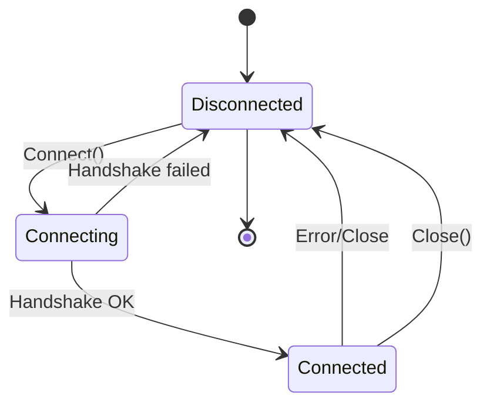
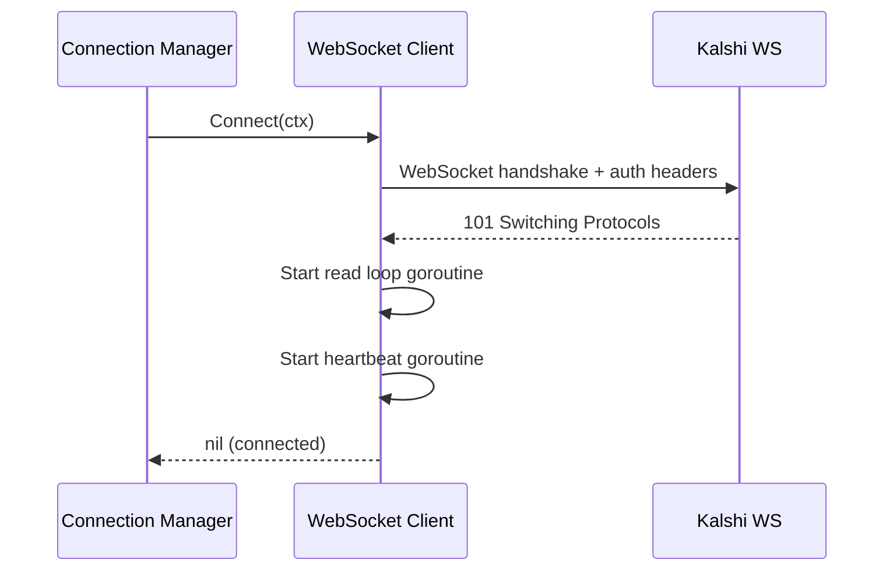
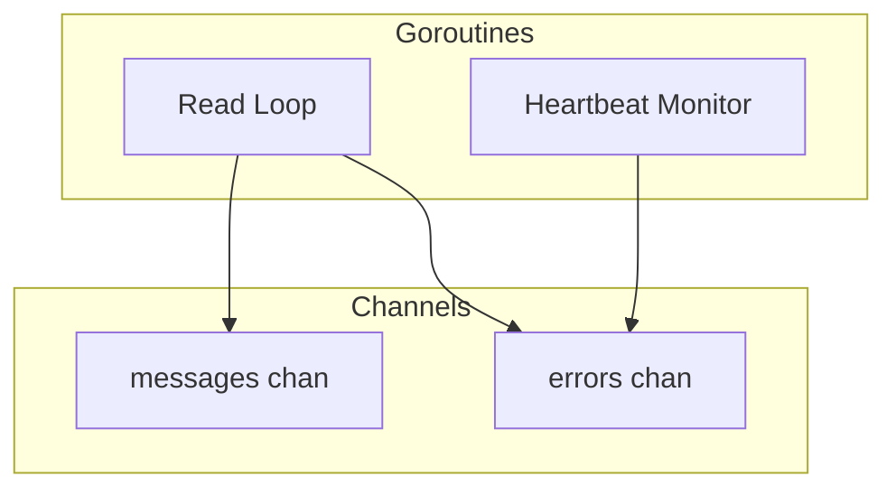

# WebSocket Client

Low-level WebSocket client for connecting to Kalshi's WebSocket API. Used by Connection Manager.

---

## Responsibilities

| Responsibility | Details |
|----------------|---------|
| Connection | Establish WebSocket connection with auth headers |
| Heartbeat | Respond to server pings (every 10s) |
| Commands | Send subscribe/unsubscribe/update commands |
| Message reading | Read and parse incoming messages |
| Connection state | Track connection health |

**Not responsible for** (handled by Connection Manager):
- Deciding which markets to subscribe to
- Managing multiple connections
- Reconnection policy and backoff
- Routing messages to handlers

---

## Interface

```go
// Client represents a single WebSocket connection to Kalshi
type Client interface {
    // Connect establishes the WebSocket connection
    Connect(ctx context.Context) error

    // Close gracefully closes the connection
    Close() error

    // Subscribe sends a subscribe command, returns subscription IDs
    Subscribe(ctx context.Context, channels []string, tickers []string) ([]int64, error)

    // Unsubscribe removes subscriptions by ID
    Unsubscribe(ctx context.Context, sids []int64) error

    // UpdateSubscription adds/removes markets from existing subscription
    UpdateSubscription(ctx context.Context, sid int64, action string, tickers []string) error

    // Messages returns a channel of parsed messages
    Messages() <-chan Message

    // Errors returns a channel of connection errors
    Errors() <-chan error

    // IsConnected returns current connection state
    IsConnected() bool
}
```

---

## Types

### Message

```go
// Message represents a parsed WebSocket message
type Message struct {
    Type string          // "orderbook_delta", "trade", "ticker", "market_lifecycle", etc.
    SID  int64           // Subscription ID
    Seq  int64           // Sequence number (for orderbook_delta)
    Raw  json.RawMessage // Original message for downstream parsing
}
```

<!-- QUESTION 1: Message Parsing Level
How much parsing should the WebSocket client do?

a) Minimal: Return raw bytes, let Message Router parse
b) Partial: Parse envelope (type, sid, seq), return raw msg body
c) Full: Parse entire message into typed structs

I recommend (b) - parse envelope so we can route, but leave body parsing to handlers.
-->

### Command/Response Types

```go
type Command struct {
    ID     int64       `json:"id"`
    Cmd    string      `json:"cmd"`
    Params interface{} `json:"params"`
}

type SubscribeParams struct {
    Channels      []string `json:"channels"`
    MarketTicker  string   `json:"market_ticker,omitempty"`
    MarketTickers []string `json:"market_tickers,omitempty"`
}

type UnsubscribeParams struct {
    SIDs []int64 `json:"sids"`
}

type UpdateParams struct {
    SID           int64    `json:"sid"`
    Action        string   `json:"action"` // "add_markets" or "remove_markets"
    MarketTickers []string `json:"market_tickers"`
}
```

---

## Connection Lifecycle



### Connect Sequence



### Authentication

Include API key headers during WebSocket handshake:

```go
func (c *client) Connect(ctx context.Context) error {
    headers := http.Header{
        "Authorization": []string{fmt.Sprintf("Bearer %s", c.cfg.APIKey)},
    }

    conn, _, err := websocket.DefaultDialer.DialContext(ctx, c.cfg.URL, headers)
    if err != nil {
        return fmt.Errorf("dial failed: %w", err)
    }

    c.conn = conn
    go c.readLoop()
    go c.heartbeatLoop()

    return nil
}
```

<!-- QUESTION 2: Auth Method
The connection.md example shows headers, but Kalshi may also support:
a) Headers during handshake (current approach)
b) Auth message after connection

Which does Kalshi actually require? If you know, confirm. Otherwise I'll assume (a).
-->

---

## Behaviors

### Read Loop

```go
func (c *client) readLoop() {
    defer close(c.messages)
    defer close(c.errors)

    for {
        _, data, err := c.conn.ReadMessage()
        if err != nil {
            c.errors <- err
            return
        }

        msg, err := c.parseMessage(data)
        if err != nil {
            c.logger.Warn("failed to parse message", "err", err)
            continue
        }

        c.messages <- msg
    }
}

func (c *client) parseMessage(data []byte) (Message, error) {
    var envelope struct {
        Type string          `json:"type"`
        SID  int64           `json:"sid"`
        Seq  int64           `json:"seq"`
        Msg  json.RawMessage `json:"msg"`
    }

    if err := json.Unmarshal(data, &envelope); err != nil {
        return Message{}, err
    }

    return Message{
        Type: envelope.Type,
        SID:  envelope.SID,
        Seq:  envelope.Seq,
        Raw:  data,
    }, nil
}
```

### Heartbeat Loop

Server sends ping frames every 10 seconds. Client must respond with pong.

```go
func (c *client) heartbeatLoop() {
    c.conn.SetPingHandler(func(data string) error {
        c.lastPingAt = time.Now()
        return c.conn.WriteControl(
            websocket.PongMessage,
            []byte(data),
            time.Now().Add(time.Second),
        )
    })

    // Monitor for missed pings
    ticker := time.NewTicker(15 * time.Second)
    defer ticker.Stop()

    for {
        select {
        case <-c.done:
            return
        case <-ticker.C:
            if time.Since(c.lastPingAt) > 30*time.Second {
                c.logger.Warn("no ping received in 30s, connection may be stale")
                c.errors <- ErrStaleConnection
                return
            }
        }
    }
}
```

### Subscribe

```go
func (c *client) Subscribe(ctx context.Context, channels []string, tickers []string) ([]int64, error) {
    id := atomic.AddInt64(&c.cmdID, 1)

    cmd := Command{
        ID:  id,
        Cmd: "subscribe",
        Params: SubscribeParams{
            Channels:      channels,
            MarketTickers: tickers,
        },
    }

    // Send command
    if err := c.conn.WriteJSON(cmd); err != nil {
        return nil, err
    }

    // Wait for response(s) - one per channel
    sids := make([]int64, 0, len(channels))
    for i := 0; i < len(channels); i++ {
        select {
        case <-ctx.Done():
            return nil, ctx.Err()
        case resp := <-c.responses:
            if resp.ID == id && resp.Type == "subscribed" {
                sids = append(sids, resp.SID)
            } else if resp.Type == "error" {
                return nil, fmt.Errorf("subscribe error: %s", resp.Error)
            }
        }
    }

    return sids, nil
}
```

<!-- QUESTION 3: Subscription Response Handling
When subscribing to multiple channels for multiple tickers, how should we handle responses?

a) Fire-and-forget: Send command, don't wait for confirmation
b) Wait for all confirmations: Block until all sids received
c) Async callback: Return immediately, notify via callback when confirmed

I lean toward (a) for simplicity - if subscription fails, we'll know from lack of messages.
But (b) gives certainty. Preference?
-->

---

## Internal State

```go
type client struct {
    cfg    ClientConfig
    conn   *websocket.Conn
    logger *slog.Logger

    // Command ID counter
    cmdID int64

    // Channels
    messages chan Message
    errors   chan error
    done     chan struct{}

    // State
    mu          sync.RWMutex
    connected   bool
    lastPingAt  time.Time
}
```

---

## Configuration

```go
type ClientConfig struct {
    // Connection
    URL    string // wss://api.elections.kalshi.com
    APIKey string

    // Timeouts
    DialTimeout  time.Duration // 10s
    WriteTimeout time.Duration // 5s

    // Buffers
    MessageBufferSize int // 1000
    ErrorBufferSize   int // 10

    // Heartbeat
    PingTimeout time.Duration // 30s (consider stale if no ping)
}
```

---

## Error Handling

| Error | Behavior |
|-------|----------|
| Dial failure | Return error from Connect() |
| Read error | Send to Errors() channel, close connection |
| Write error | Return error from command method |
| Ping timeout | Send ErrStaleConnection to Errors() channel |
| Parse error | Log warning, skip message |

**Note**: Client does NOT attempt reconnection. That's Connection Manager's job.

---

## Concurrency Model



| Goroutine | Lifetime | Purpose |
|-----------|----------|---------|
| Read Loop | Connect to Close | Read messages, parse, send to channel |
| Heartbeat Monitor | Connect to Close | Monitor ping health |

---

## Metrics

| Metric | Type | Description |
|--------|------|-------------|
| `ws_client_messages_received_total` | Counter | Messages by type |
| `ws_client_bytes_received_total` | Counter | Bytes received |
| `ws_client_commands_sent_total` | Counter | Commands by type |
| `ws_client_errors_total` | Counter | Errors by type |
| `ws_client_last_ping_timestamp` | Gauge | Last ping received |
| `ws_client_connected` | Gauge | 1 if connected, 0 otherwise |

---

## Open Questions

1. **Message Parsing**: Parse envelope only (type, sid, seq) or full message?
2. **Auth Method**: Headers during handshake or auth message after?
3. **Subscription Response**: Wait for confirmation or fire-and-forget?

---

## Related Docs

- [Kalshi WebSocket API](../../kalshi-api/websocket/connection.md) - Protocol reference
- [Connection Manager](../connection-manager/) - Manages pool of clients (TODO)
