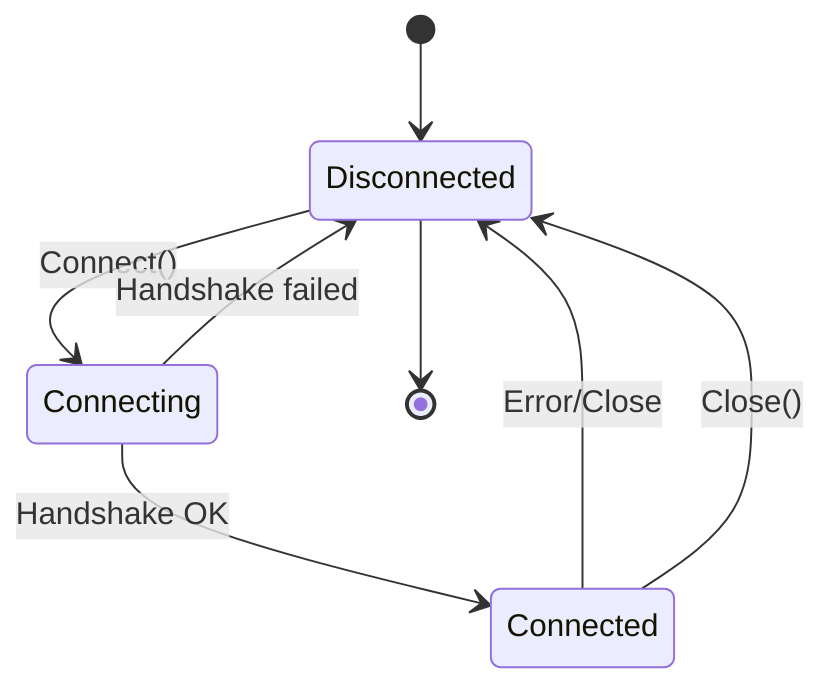
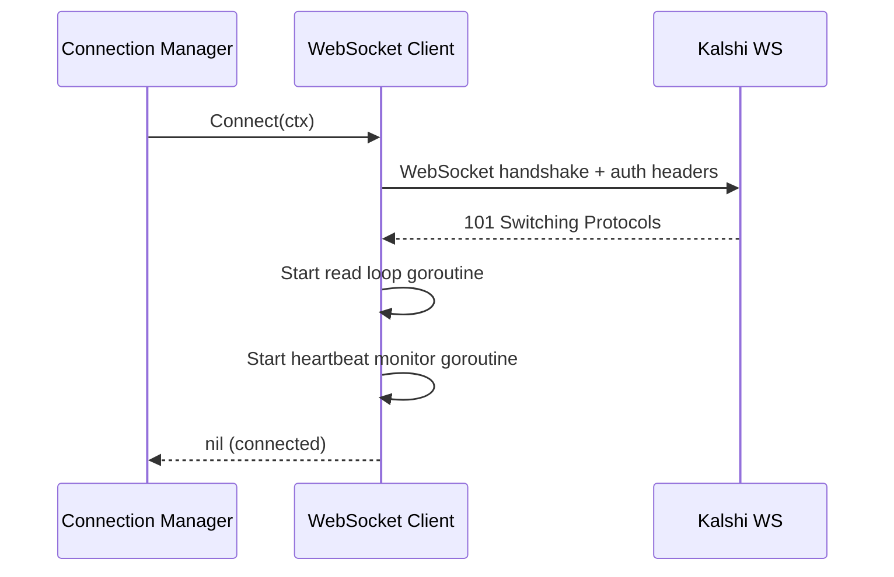

# WebSocket Client

Low-level WebSocket client for connecting to Kalshi's WebSocket API. Used by Connection Manager.

---

## Responsibilities

| Responsibility | Details |
|----------------|---------|
| Connection | Establish WebSocket connection with auth headers |
| Heartbeat | Respond to server pings (every 10s) |
| Commands | Send subscribe/unsubscribe/update commands |
| Message reading | Read raw messages, send to channel |
| Connection state | Track connection health |

**Not responsible for** (handled by Connection Manager):
- Deciding which markets to subscribe to
- Managing multiple connections
- Reconnection policy and backoff
- Parsing message bodies
- Tracking ticker-to-sid mappings

---

## Design Decisions

| Decision | Choice | Rationale |
|----------|--------|-----------|
| Message parsing | Minimal (raw bytes) | Let Message Router handle parsing |
| Authentication | Headers during handshake | Kalshi's documented approach |
| Subscribe response | Wait for confirmation | Need subscription IDs for unsubscribe |

---

## Interface

```go
// Client represents a single WebSocket connection to Kalshi
type Client interface {
    // Connect establishes the WebSocket connection
    Connect(ctx context.Context) error

    // Close gracefully closes the connection
    Close() error

    // Subscribe sends a subscribe command, blocks until confirmation
    // Returns subscription results with SIDs for later unsubscribe
    Subscribe(ctx context.Context, channels []string, tickers []string) ([]SubscriptionResult, error)

    // Unsubscribe removes subscriptions by ID, blocks until confirmation
    Unsubscribe(ctx context.Context, sids []int64) error

    // UpdateSubscription adds/removes markets from existing subscription
    UpdateSubscription(ctx context.Context, sid int64, action string, tickers []string) error

    // Messages returns a channel of raw messages (unparsed bytes)
    Messages() <-chan []byte

    // Errors returns a channel of connection errors
    Errors() <-chan error

    // IsConnected returns current connection state
    IsConnected() bool
}
```

---

## Types

### SubscriptionResult

```go
// SubscriptionResult contains the confirmed subscription details
type SubscriptionResult struct {
    SID     int64  // Subscription ID (needed for unsubscribe)
    Channel string // Channel name
}
```

### Command Types

```go
type Command struct {
    ID     int64       `json:"id"`
    Cmd    string      `json:"cmd"`
    Params interface{} `json:"params"`
}

type SubscribeParams struct {
    Channels      []string `json:"channels"`
    MarketTicker  string   `json:"market_ticker,omitempty"`
    MarketTickers []string `json:"market_tickers,omitempty"`
}

type UnsubscribeParams struct {
    SIDs []int64 `json:"sids"`
}

type UpdateParams struct {
    SID           int64    `json:"sid"`
    Action        string   `json:"action"` // "add_markets" or "remove_markets"
    MarketTickers []string `json:"market_tickers"`
}
```

### Response Types

```go
type Response struct {
    ID   int64           `json:"id"`   // Matches command ID
    Type string          `json:"type"` // "subscribed", "unsubscribed", "error"
    Msg  json.RawMessage `json:"msg"`
}

type SubscribedMsg struct {
    SID     int64  `json:"sid"`
    Channel string `json:"channel"`
}

type UnsubscribedMsg struct {
    SIDs []int64 `json:"sids"`
}

type ErrorMsg struct {
    Code    string `json:"code"`
    Message string `json:"message"`
}
```

---

## Connection Lifecycle



### Connect Sequence



### Authentication

API key included as header during WebSocket handshake:

```go
func (c *client) Connect(ctx context.Context) error {
    headers := http.Header{
        "Authorization": []string{fmt.Sprintf("Bearer %s", c.cfg.APIKey)},
    }

    conn, _, err := websocket.DefaultDialer.DialContext(ctx, c.cfg.URL, headers)
    if err != nil {
        return fmt.Errorf("dial failed: %w", err)
    }

    c.conn = conn
    c.connected = true

    go c.readLoop()
    go c.heartbeatLoop()

    return nil
}
```

---

## Behaviors

### Read Loop

Returns raw bytes - no parsing. Message Router handles parsing.

```go
func (c *client) readLoop() {
    defer close(c.messages)

    for {
        _, data, err := c.conn.ReadMessage()
        if err != nil {
            c.errors <- err
            return
        }

        // Check if this is a command response (for Subscribe/Unsubscribe)
        if c.isCommandResponse(data) {
            c.routeResponse(data)
            continue
        }

        // Data message - send raw bytes to channel
        select {
        case c.messages <- data:
        default:
            c.logger.Warn("message buffer full, dropping message")
        }
    }
}

func (c *client) isCommandResponse(data []byte) bool {
    // Quick check for response types
    return bytes.Contains(data, []byte(`"type":"subscribed"`)) ||
           bytes.Contains(data, []byte(`"type":"unsubscribed"`)) ||
           bytes.Contains(data, []byte(`"type":"error"`))
}
```

### Response Routing

Commands block waiting for their response. Uses map of pending requests.

```go
type pendingRequest struct {
    respChan chan Response
}

func (c *client) routeResponse(data []byte) {
    var resp Response
    if err := json.Unmarshal(data, &resp); err != nil {
        c.logger.Warn("failed to parse response", "err", err)
        return
    }

    c.pendingMu.Lock()
    pending, ok := c.pending[resp.ID]
    if ok {
        delete(c.pending, resp.ID)
    }
    c.pendingMu.Unlock()

    if ok {
        pending.respChan <- resp
    }
}
```

### Heartbeat Monitor

Server sends ping frames every 10 seconds. Client responds with pong (handled by gorilla/websocket automatically). Monitor detects stale connections.

```go
func (c *client) heartbeatLoop() {
    c.conn.SetPingHandler(func(data string) error {
        c.mu.Lock()
        c.lastPingAt = time.Now()
        c.mu.Unlock()

        return c.conn.WriteControl(
            websocket.PongMessage,
            []byte(data),
            time.Now().Add(time.Second),
        )
    })

    ticker := time.NewTicker(15 * time.Second)
    defer ticker.Stop()

    for {
        select {
        case <-c.done:
            return
        case <-ticker.C:
            c.mu.RLock()
            lastPing := c.lastPingAt
            c.mu.RUnlock()

            if time.Since(lastPing) > c.cfg.PingTimeout {
                c.logger.Warn("no ping received, connection stale")
                c.errors <- ErrStaleConnection
                return
            }
        }
    }
}
```

### Subscribe (Blocking)

Sends command, waits for confirmation, returns subscription IDs.

```go
func (c *client) Subscribe(ctx context.Context, channels []string, tickers []string) ([]SubscriptionResult, error) {
    if !c.connected {
        return nil, ErrNotConnected
    }

    id := atomic.AddInt64(&c.cmdID, 1)
    respChan := make(chan Response, len(channels))

    // Register pending request
    c.pendingMu.Lock()
    c.pending[id] = &pendingRequest{respChan: respChan}
    c.pendingMu.Unlock()

    defer func() {
        c.pendingMu.Lock()
        delete(c.pending, id)
        c.pendingMu.Unlock()
    }()

    // Send command
    cmd := Command{
        ID:  id,
        Cmd: "subscribe",
        Params: SubscribeParams{
            Channels:      channels,
            MarketTickers: tickers,
        },
    }

    c.writeMu.Lock()
    err := c.conn.WriteJSON(cmd)
    c.writeMu.Unlock()
    if err != nil {
        return nil, fmt.Errorf("write failed: %w", err)
    }

    // Wait for responses (one per channel)
    results := make([]SubscriptionResult, 0, len(channels))
    timeout := time.After(c.cfg.ResponseTimeout)

    for i := 0; i < len(channels); i++ {
        select {
        case <-ctx.Done():
            return nil, ctx.Err()
        case <-timeout:
            return nil, ErrTimeout
        case resp := <-respChan:
            if resp.Type == "error" {
                var errMsg ErrorMsg
                json.Unmarshal(resp.Msg, &errMsg)
                return nil, fmt.Errorf("subscribe error: %s - %s", errMsg.Code, errMsg.Message)
            }

            var subMsg SubscribedMsg
            json.Unmarshal(resp.Msg, &subMsg)
            results = append(results, SubscriptionResult{
                SID:     subMsg.SID,
                Channel: subMsg.Channel,
            })
        }
    }

    return results, nil
}
```

### Unsubscribe (Blocking)

```go
func (c *client) Unsubscribe(ctx context.Context, sids []int64) error {
    if !c.connected {
        return ErrNotConnected
    }

    id := atomic.AddInt64(&c.cmdID, 1)
    respChan := make(chan Response, 1)

    c.pendingMu.Lock()
    c.pending[id] = &pendingRequest{respChan: respChan}
    c.pendingMu.Unlock()

    defer func() {
        c.pendingMu.Lock()
        delete(c.pending, id)
        c.pendingMu.Unlock()
    }()

    cmd := Command{
        ID:  id,
        Cmd: "unsubscribe",
        Params: UnsubscribeParams{SIDs: sids},
    }

    c.writeMu.Lock()
    err := c.conn.WriteJSON(cmd)
    c.writeMu.Unlock()
    if err != nil {
        return fmt.Errorf("write failed: %w", err)
    }

    select {
    case <-ctx.Done():
        return ctx.Err()
    case <-time.After(c.cfg.ResponseTimeout):
        return ErrTimeout
    case resp := <-respChan:
        if resp.Type == "error" {
            var errMsg ErrorMsg
            json.Unmarshal(resp.Msg, &errMsg)
            return fmt.Errorf("unsubscribe error: %s - %s", errMsg.Code, errMsg.Message)
        }
        return nil
    }
}
```

---

## Internal State

```go
type client struct {
    cfg    ClientConfig
    conn   *websocket.Conn
    logger *slog.Logger

    // Command ID counter (atomic)
    cmdID int64

    // Output channels
    messages chan []byte
    errors   chan error
    done     chan struct{}

    // Pending command responses
    pendingMu sync.Mutex
    pending   map[int64]*pendingRequest

    // Write serialization
    writeMu sync.Mutex

    // State
    mu         sync.RWMutex
    connected  bool
    lastPingAt time.Time
}
```

---

## Configuration

```go
type ClientConfig struct {
    // Connection
    URL    string // wss://api.elections.kalshi.com
    APIKey string

    // Timeouts
    DialTimeout     time.Duration // 10s
    WriteTimeout    time.Duration // 5s
    ResponseTimeout time.Duration // 5s - max wait for command response

    // Buffers
    MessageBufferSize int // 10000
    ErrorBufferSize   int // 10

    // Heartbeat
    PingTimeout time.Duration // 30s (consider stale if no ping)
}
```

| Option | Type | Default | Description |
|--------|------|---------|-------------|
| `URL` | string | `wss://api.elections.kalshi.com` | WebSocket endpoint |
| `APIKey` | string | - | API key for auth header |
| `DialTimeout` | Duration | 10s | Connection timeout |
| `WriteTimeout` | Duration | 5s | Write deadline |
| `ResponseTimeout` | Duration | 5s | Max wait for subscribe/unsubscribe response |
| `MessageBufferSize` | int | 10000 | Buffer for message channel |
| `ErrorBufferSize` | int | 10 | Buffer for error channel |
| `PingTimeout` | Duration | 30s | Mark stale if no ping received |

---

## Error Handling

| Error | Behavior |
|-------|----------|
| Dial failure | Return error from `Connect()` |
| Read error | Send to `Errors()` channel, exit read loop |
| Write error | Return error from command method |
| Ping timeout | Send `ErrStaleConnection` to `Errors()` channel |
| Response timeout | Return `ErrTimeout` from command method |
| Command rejected | Return error with Kalshi's error code/message |

**Note**: Client does NOT attempt reconnection. That's Connection Manager's job.

---

## Concurrency Model

```mermaid
flowchart TD
    subgraph Goroutines
        READ[Read Loop]
        PING[Heartbeat Monitor]
    end

    subgraph Channels
        MSGS[messages chan []byte]
        ERRS[errors chan error]
        RESP[pending response chans]
    end

    READ -->|data messages| MSGS
    READ -->|command responses| RESP
    READ -->|read errors| ERRS
    PING -->|stale connection| ERRS
```

| Goroutine | Lifetime | Purpose |
|-----------|----------|---------|
| Read Loop | Connect to Close | Read messages, route responses |
| Heartbeat Monitor | Connect to Close | Detect stale connections |

**Thread Safety:**
- `writeMu` serializes all writes to connection
- `pendingMu` protects pending request map
- `mu` protects connection state

---

## Metrics

| Metric | Type | Description |
|--------|------|-------------|
| `ws_client_messages_received_total` | Counter | Raw messages received |
| `ws_client_bytes_received_total` | Counter | Bytes received |
| `ws_client_commands_sent_total` | Counter | Commands by type (subscribe, unsubscribe) |
| `ws_client_command_duration_seconds` | Histogram | Time to get command response |
| `ws_client_errors_total` | Counter | Errors by type |
| `ws_client_last_ping_timestamp` | Gauge | Last ping received |
| `ws_client_connected` | Gauge | 1 if connected, 0 otherwise |

---

## Related Docs

- [Kalshi WebSocket API](../../kalshi-api/websocket/connection.md) - Protocol reference
- [Connection Manager](../connection-manager/) - Manages pool of clients (TODO)
