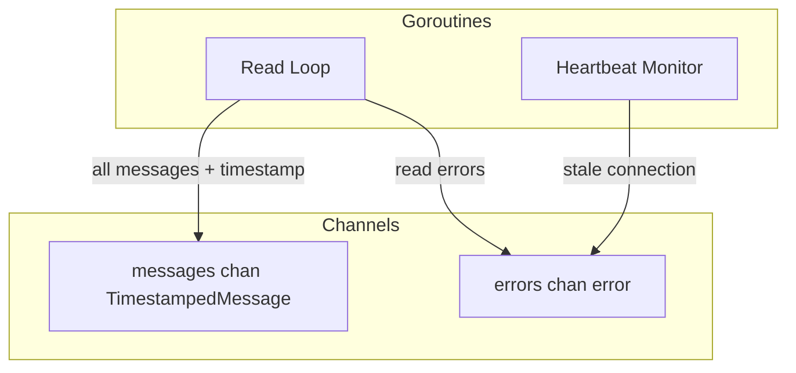

# Interface

Public methods and types for WebSocket Client.

---

## Client Interface

```go
// Client represents a single WebSocket connection to Kalshi
type Client interface {
    // Connect establishes the WebSocket connection
    Connect(ctx context.Context) error

    // Close gracefully closes the connection
    Close() error

    // Send writes raw bytes to the connection
    Send(data []byte) error

    // Messages returns a channel of ALL raw messages (data + command responses)
    // Each message includes a local timestamp for when it was received
    Messages() <-chan TimestampedMessage

    // Errors returns a channel of connection errors
    Errors() <-chan error

    // IsConnected returns current connection state
    IsConnected() bool
}

// TimestampedMessage wraps raw message data with receive timestamp
type TimestampedMessage struct {
    Data       []byte    // Raw message bytes from WebSocket
    ReceivedAt time.Time // Local timestamp when ReadMessage() returned
}
```

---

## Internal State

```go
type client struct {
    cfg    ClientConfig
    conn   *websocket.Conn
    logger *slog.Logger

    // Output channels
    messages chan TimestampedMessage
    errors   chan error
    done     chan struct{}

    // Write serialization
    writeMu sync.Mutex

    // State
    mu         sync.RWMutex
    connected  bool
    lastPingAt time.Time
}
```

---

## Concurrency Model



| Goroutine | Lifetime | Purpose |
|-----------|----------|---------|
| Read Loop | Connect to Close | Read messages, send to channel |
| Heartbeat Monitor | Connect to Close | Detect stale connections |

**Thread Safety:**
- `writeMu` serializes all writes to connection
- `mu` protects connection state
