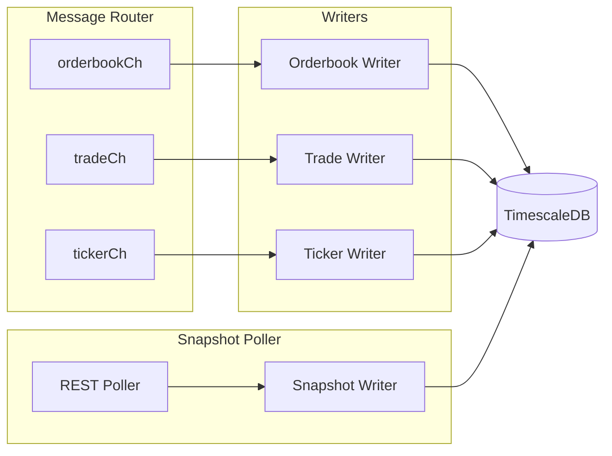
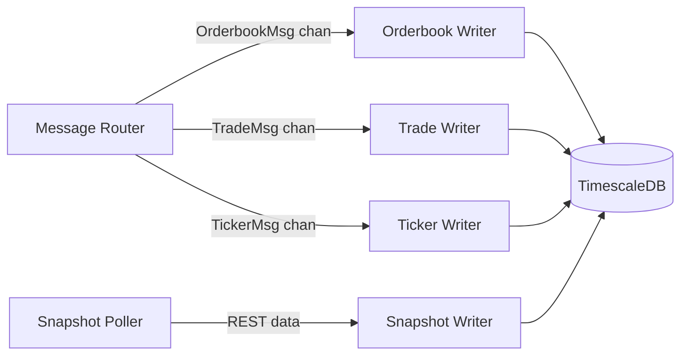

# Writers

Batch database writers that consume parsed messages and persist to local TimescaleDB.

---

## Responsibilities

| Responsibility | Details |
|----------------|---------|
| Price conversion | Convert `*_dollars` strings to internal integer format |
| Batch writing | Accumulate messages, flush on size or interval |
| Deduplication | `ON CONFLICT DO NOTHING` with exchange keys |
| Side conversion | `"yes"/"no"` strings to `TRUE/FALSE` booleans |

**Not responsible for** (handled by other components):
- JSON parsing (Message Router)
- Message routing (Message Router)
- Sequence detection (Connection Manager)
- WebSocket I/O (Connection Manager)

---

## Writer Types

| Writer | Input | Output Table | Source |
|--------|-------|--------------|--------|
| Orderbook Writer | `OrderbookMsg` | `orderbook_deltas`, `orderbook_snapshots` | WebSocket |
| Trade Writer | `TradeMsg` | `trades` | WebSocket |
| Ticker Writer | `TickerMsg` | `tickers` | WebSocket |
| Snapshot Writer | REST response | `orderbook_snapshots` | REST API (1-min polling) |

---

## Data Flow

---

## Dependencies

| Dependency | Direction | Purpose |
|------------|-----------|---------|
| Message Router | Input | Receives parsed WebSocket messages |
| Snapshot Poller | Input | Receives REST orderbook snapshots |
| TimescaleDB | Output | Persists time-series data |

---

## Design Principles

1. **Batch writes**: Accumulate messages, flush on size threshold or time interval
2. **Idempotent inserts**: `ON CONFLICT DO NOTHING` handles duplicates gracefully
3. **Non-blocking consumption**: Drain input channels, never block upstream
4. **Price normalization**: Convert all prices to hundred-thousandths integers

---

## Related Docs

- [Interface](./interface.md) - Public methods and types
- [Lifecycle](./lifecycle.md) - Startup and shutdown
- [Behaviors](./behaviors.md) - Price conversion, batching, insert patterns
- [Configuration](./configuration.md) - Config options and metrics
- [Message Router](../message-router/) - Upstream component
- [Data Model](../architecture/data-model.md) - Database schema
