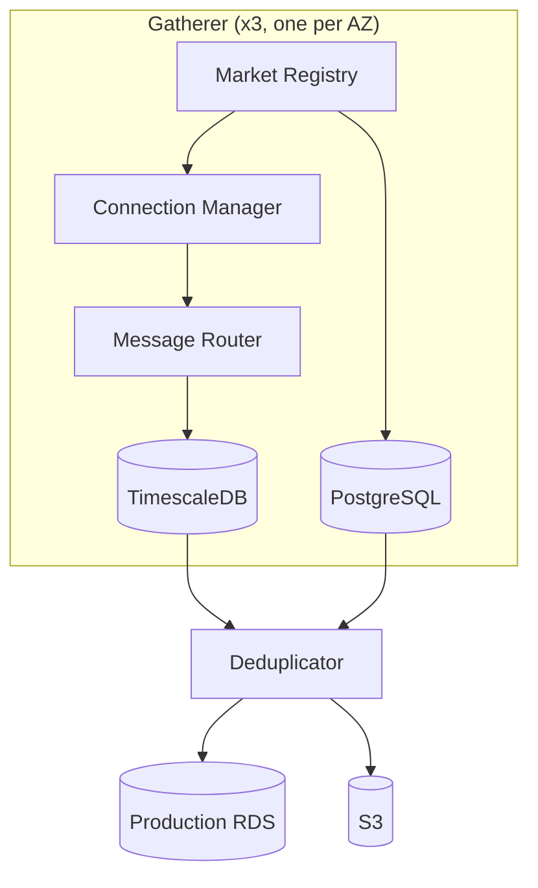

# Kalshi Data Platform

Real-time data capture system for Kalshi prediction market orderbooks and trades. Designed to scale to 1M+ markets.

## Architecture

3 independent gatherer instances (each collecting ALL markets) + 1 deduplicator → Production RDS.



### Components

| Component | Description |
|-----------|-------------|
| **Market Registry** | Discovers markets via REST API, tracks lifecycle via WebSocket |
| **Connection Manager** | Maintains 150 WebSocket connections per gatherer |
| **Message Router** | Routes messages to appropriate writers with fan-out |
| **Writers** | Batch writers for orderbook deltas, trades, tickers, snapshots |
| **Snapshot Poller** | Polls REST API every 15 minutes as backup |
| **Deduplicator** | Merges data from all gatherers, writes to production |

### Data Flow

1. **Market Registry** discovers markets from REST API and `market_lifecycle` WebSocket
2. **Connection Manager** subscribes to `orderbook_delta`, `trade`, `ticker` channels
3. **Message Router** routes messages to appropriate writers
4. **Writers** batch and write to local TimescaleDB
5. **Deduplicator** polls all gatherers, deduplicates, writes to production RDS
6. **S3 Export** archives data to Parquet for long-term storage

## Key Features

- **Triple redundancy**: 3 gatherers independently collect all data
- **No data loss**: Cross-gatherer deduplication fills gaps
- **REST backup**: 15-minute snapshot polling as fallback
- **Automatic recovery**: WebSocket reconnection with exponential backoff
- **Time-series optimized**: TimescaleDB with compression and retention policies
- **Long-term storage**: Parquet export to S3 with lifecycle policies

## Documentation

| Section | Description |
|---------|-------------|
| [Architecture](docs/kalshi-data/architecture/) | System design, data model, scaling |
| [Market Registry](docs/kalshi-data/market-registry/) | Market discovery and tracking |
| [Connection Manager](docs/kalshi-data/connection-manager/) | WebSocket pool management |
| [Message Router](docs/kalshi-data/message-router/) | Message routing and fan-out |
| [Writers](docs/kalshi-data/writers/) | Batch writers for all data types |
| [Snapshot Poller](docs/kalshi-data/snapshot-poller/) | REST API backup polling |
| [Storage](docs/kalshi-data/storage/) | TimescaleDB, PostgreSQL, S3 |
| [Monitoring](docs/kalshi-data/monitoring/) | Metrics, alerts, dashboards |
| [Recovery](docs/kalshi-data/recovery/) | Failure handling, runbooks |
| [Deployment](docs/kalshi-data/deployment/) | Infrastructure, Terraform, IPC |

### Kalshi API Reference

| Section | Description |
|---------|-------------|
| [REST API](docs/kalshi-api/rest-api/) | Markets, orders, portfolio endpoints |
| [WebSocket](docs/kalshi-api/websocket/) | Protocol, channels, message formats |

## Tech Stack

- **Language**: Go
- **Time-series DB**: TimescaleDB (PostgreSQL extension)
- **Relational DB**: PostgreSQL
- **Production DB**: Amazon RDS (TimescaleDB)
- **Object Storage**: Amazon S3
- **Monitoring**: Prometheus + Grafana
- **Infrastructure**: AWS (EC2, RDS, S3)

## Repository Structure

```
kalshi-data/
├── cmd/
│   ├── gatherer/               # Gatherer binary entrypoint
│   └── deduplicator/           # Deduplicator binary entrypoint
├── internal/
│   ├── api/                    # Kalshi API client (REST + WebSocket)
│   ├── config/                 # Configuration loading
│   ├── database/               # Database connection pools
│   ├── market/                 # Market Registry
│   ├── connection/             # Connection Manager
│   ├── router/                 # Message Router
│   ├── writer/                 # Batch writers
│   ├── poller/                 # Snapshot Poller
│   ├── dedup/                  # Deduplication logic
│   └── metrics/                # Prometheus metrics
├── configs/                    # Configuration files
├── deploy/terraform/           # Infrastructure-as-Code
├── docs/                       # Documentation
├── go.mod
└── Makefile
```

## Development

```bash
# Build both binaries
make build

# Run tests
make test

# Build for production (Linux ARM64)
make build-linux-arm64

# Run locally
./bin/gatherer --config configs/gatherer.local.yaml
./bin/deduplicator --config configs/deduplicator.local.yaml
```

## Kalshi API

| Endpoint | URL |
|----------|-----|
| REST (Production) | `https://api.elections.kalshi.com/trade-api/v2` |
| WebSocket | `wss://api.elections.kalshi.com` |
| REST (Demo) | `https://demo-api.kalshi.co/trade-api/v2` |

Key WebSocket channels: `orderbook_delta`, `trade`, `ticker`, `market_lifecycle`
