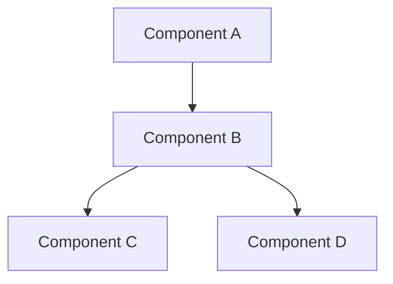
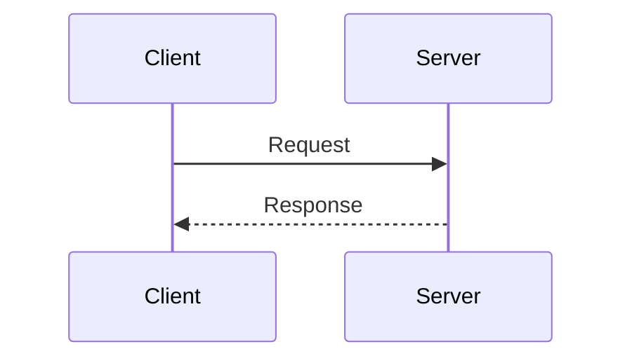
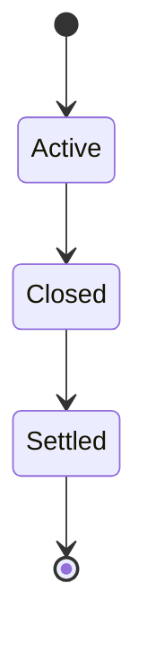

# Documentation Style Guide

## Structure

Each document should follow:

```
# Title

Brief description (1-2 sentences).

---

## Section

Content.
```

## Formatting

### Headers
- `#` - Document title (one per file)
- `##` - Major sections
- `###` - Subsections

### Tables

Use for structured data:

```markdown
| Field | Type | Description |
|-------|------|-------------|
| `name` | string | Field name |
```

### Code Blocks

Always specify language:

```markdown
```go
func Example() {}
```
```

### Inline Code

Use backticks for:
- Field names: `market_ticker`
- Values: `"yes"`, `100`
- Endpoints: `GET /markets`
- Types: `int`, `string`

## Diagrams

Use Mermaid for all diagrams. No ASCII art.

### Flow/Architecture



### Sequence



### State



## Content

- Be concise
- Lead with the most important information
- Use tables over prose for specifications
- Include examples for complex formats
- No fluff or generic advice

## File Naming

- Lowercase with hyphens: `get-markets.md`
- One concept per file
- Group by domain in folders
