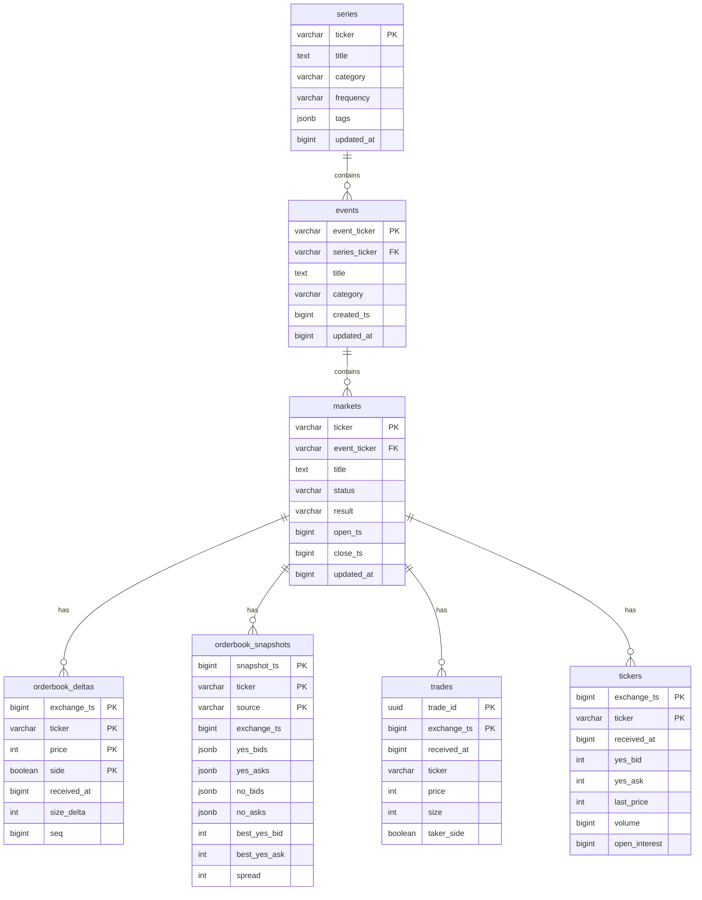

# Data Model (Production RDS)

TimescaleDB schema for the production database. Receives deduplicated data from all gatherers.

---

## Design Principles

1. **Append-only writes** — Never update time-series data, only insert
2. **Microsecond precision** — All timestamps as `BIGINT` (µs since epoch)
3. **Integer pricing** — Hundred-thousandths of a dollar (0-100,000) to avoid float errors
4. **TimescaleDB hypertables** — Automatic partitioning by time for time-series tables
5. **Full history** — Store all markets/events regardless of lifecycle

---

## Schema Overview



---

## Schema Differences: Gatherer vs Production

The production schema intentionally excludes some columns present in gatherer databases:

| Column | Gatherer | Production | Reason |
|--------|----------|------------|--------|
| `sid` | Present | **Excluded** | Subscription ID is gatherer-specific; not meaningful after deduplication |
| `event_ticker` (trades) | Nullable | **Excluded** | Not populated by gatherer; can be JOINed from markets table |

### Why `sid` is Excluded

The `sid` (Subscription ID) column identifies which WebSocket subscription produced each record:

1. **Gatherer-local meaning**: Each gatherer assigns its own `sid` values when establishing subscriptions
2. **Cross-gatherer inconsistency**: The same market on different gatherers has different `sid` values
3. **Post-deduplication irrelevance**: After merging data from 3 gatherers, `sid` loses meaning

```
Gatherer 1: sid = 100 for ticker "BTCUSD"
Gatherer 2: sid = 200 for ticker "BTCUSD"
Gatherer 3: sid = 150 for ticker "BTCUSD"

Production: All three records for "BTCUSD" are deduplicated.
            Which sid should be stored? Answer: None.
```

### Storage Savings

Excluding `sid` saves ~8 bytes per row:

| Table | Rows/Day | Savings/Day |
|-------|----------|-------------|
| trades | 1M | 8 MB |
| orderbook_deltas | 10M | 80 MB |
| tickers | 1M | 8 MB |
| **Total** | | **~96 MB/day** |

---

## Data Formats

### Price Format

Internal format: integer hundred-thousandths (0-100,000 = $0.00000-$1.00000)

| Internal | Dollars | Notes |
|----------|---------|-------|
| 52000 | $0.52 | 1 cent precision |
| 52500 | $0.525 | Subpenny (0.1 cent) |
| 52550 | $0.5255 | Subpenny (0.01 cent) |
| 99990 | $0.9999 | Tail pricing |

### Timestamp Format

All timestamps stored as `BIGINT` in microseconds (µs since Unix epoch).

### All Conversions in Application Layer

**Design principle:** The database stores raw values only. All conversions happen in Go code:

| Conversion | Go Implementation |
|------------|-------------------|
| Internal → dollars | `float64(price) / 100000.0` |
| Dollars → internal | `int(dollars * 100000)` |
| µs → `time.Time` | `time.UnixMicro(ts)` |
| `time.Time` → µs | `t.UnixMicro()` |

**Why no database functions:**
- Simpler schema with no custom functions
- All logic in one place (Go binary)
- Easier testing and debugging
- Portable across database instances

---

## Relational Tables

### series

```sql
CREATE TABLE series (
    ticker              VARCHAR(128) PRIMARY KEY,
    title               TEXT,
    category            VARCHAR(64),
    frequency           VARCHAR(32),
    tags                JSONB,
    settlement_sources  JSONB,
    created_at          BIGINT NOT NULL,
    updated_at          BIGINT NOT NULL
);

CREATE INDEX idx_series_category ON series(category);
```

### events

```sql
CREATE TABLE events (
    event_ticker    VARCHAR(128) PRIMARY KEY,
    series_ticker   VARCHAR(128) REFERENCES series(ticker),
    title           TEXT,
    category        VARCHAR(64),
    sub_title       TEXT,
    mutually_exclusive BOOLEAN,
    created_ts      BIGINT,
    updated_at      BIGINT NOT NULL
);

CREATE INDEX idx_events_series ON events(series_ticker);
CREATE INDEX idx_events_category ON events(category);
```

### markets

Stores all markets regardless of lifecycle status.

```sql
CREATE TABLE markets (
    ticker          VARCHAR(128) PRIMARY KEY,
    event_ticker    VARCHAR(128) REFERENCES events(event_ticker),
    title           TEXT,
    subtitle        TEXT,

    -- Status (stored for all lifecycle stages)
    market_status   VARCHAR(16) NOT NULL,
    trading_status  VARCHAR(16) NOT NULL,
    market_type     VARCHAR(8) NOT NULL,
    result          VARCHAR(8),

    -- Volume
    volume          BIGINT,
    volume_24h      BIGINT,
    open_interest   BIGINT,

    -- Timing (µs since epoch)
    open_ts         BIGINT,
    close_ts        BIGINT,
    expiration_ts   BIGINT,
    created_ts      BIGINT,
    updated_at      BIGINT NOT NULL,

    CONSTRAINT valid_market_status CHECK (market_status IN ('unopened', 'open', 'closed', 'settled')),
    CONSTRAINT valid_market_type CHECK (market_type IN ('binary', 'scalar'))
);

-- Status mapping: see data-model.md "Production Status (4 values) — Authoritative Mapping"

CREATE INDEX idx_markets_event ON markets(event_ticker);
CREATE INDEX idx_markets_status ON markets(market_status);
CREATE INDEX idx_markets_created ON markets(created_ts DESC);
```

---

## Time-Series Tables (TimescaleDB)

### trades

```sql
CREATE TABLE trades (
    trade_id        UUID NOT NULL,

    -- Timing (µs since epoch)
    exchange_ts     BIGINT NOT NULL,
    received_at     BIGINT NOT NULL,

    -- Market
    ticker          TEXT NOT NULL,

    -- Trade data
    price           INTEGER NOT NULL,      -- 0-100,000 (hundred-thousandths)
    size            INTEGER NOT NULL,
    taker_side      BOOLEAN NOT NULL,      -- TRUE = YES, FALSE = NO

    -- TimescaleDB requires partition column in PK
    PRIMARY KEY (trade_id, exchange_ts)
);

SELECT create_hypertable('trades', 'exchange_ts',
    chunk_time_interval => 86400000000);  -- 1 day in µs

CREATE INDEX idx_trades_ticker_time ON trades(ticker, exchange_ts DESC);

-- Compression after 7 days
ALTER TABLE trades SET (
    timescaledb.compress,
    timescaledb.compress_segmentby = 'ticker',
    timescaledb.compress_orderby = 'exchange_ts DESC'
);

SELECT add_compression_policy('trades', INTERVAL '7 days');
```

### orderbook_deltas

```sql
CREATE TABLE orderbook_deltas (
    -- Timing (µs since epoch)
    exchange_ts     BIGINT NOT NULL,       -- Kalshi exchange timestamp
    received_at     BIGINT NOT NULL,       -- When gatherer received

    -- Market
    ticker          TEXT NOT NULL,

    -- Delta data
    side            BOOLEAN NOT NULL,      -- TRUE = YES, FALSE = NO
    price           INTEGER NOT NULL,      -- 0-100,000
    size_delta      INTEGER NOT NULL,      -- Positive = add, negative = remove

    -- Metadata (not part of deduplication key)
    seq             BIGINT,                -- Kalshi sequence number (per-subscription, for gap detection)

    -- TimescaleDB requires partition column (exchange_ts) first in PK
    PRIMARY KEY (exchange_ts, ticker, price, side)
);

-- Note: seq is NOT part of the primary key because it is per-subscription (sid).
-- Two gatherers receiving the same delta will have different seq values.
-- Deduplication uses (exchange_ts, ticker, price, side) which uniquely identifies
-- a price level change at a specific time.

SELECT create_hypertable('orderbook_deltas', 'exchange_ts',
    chunk_time_interval => 86400000000);  -- 1 day in µs

CREATE INDEX idx_orderbook_deltas_ticker_time ON orderbook_deltas(ticker, exchange_ts DESC);

-- Compression after 7 days
ALTER TABLE orderbook_deltas SET (
    timescaledb.compress,
    timescaledb.compress_segmentby = 'ticker',
    timescaledb.compress_orderby = 'exchange_ts DESC'
);

SELECT add_compression_policy('orderbook_deltas', INTERVAL '7 days');
```

### orderbook_snapshots

Stores both WebSocket snapshots and 15-minute REST API snapshots.

```sql
CREATE TABLE orderbook_snapshots (
    -- Timing (µs since epoch)
    snapshot_ts     BIGINT NOT NULL,       -- When snapshot was taken
    exchange_ts     BIGINT,                -- Exchange timestamp if from WS

    -- Market
    ticker          TEXT NOT NULL,

    -- Source
    source          TEXT NOT NULL,         -- 'ws' or 'rest'

    -- Book data (JSONB for flexibility)
    yes_bids        JSONB NOT NULL,        -- [[price, size], ...]
    yes_asks        JSONB NOT NULL,
    no_bids         JSONB NOT NULL,
    no_asks         JSONB NOT NULL,

    -- Derived fields (for fast filtering)
    best_yes_bid    INTEGER,
    best_yes_ask    INTEGER,
    spread          INTEGER,

    -- TimescaleDB requires partition column (snapshot_ts) first in PK
    PRIMARY KEY (snapshot_ts, ticker, source)
);

SELECT create_hypertable('orderbook_snapshots', 'snapshot_ts',
    chunk_time_interval => 86400000000);  -- 1 day in µs

CREATE INDEX idx_ob_snapshots_ticker_time ON orderbook_snapshots(ticker, snapshot_ts DESC);

-- Compression after 7 days
ALTER TABLE orderbook_snapshots SET (
    timescaledb.compress,
    timescaledb.compress_segmentby = 'ticker',
    timescaledb.compress_orderby = 'snapshot_ts DESC'
);

SELECT add_compression_policy('orderbook_snapshots', INTERVAL '7 days');
```

### tickers

```sql
CREATE TABLE tickers (
    -- Timing (µs since epoch)
    exchange_ts     BIGINT NOT NULL,       -- Kalshi exchange timestamp
    received_at     BIGINT NOT NULL,       -- When gatherer received

    -- Market
    ticker          TEXT NOT NULL,

    -- Ticker data
    yes_bid         INTEGER,
    yes_ask         INTEGER,
    last_price      INTEGER,
    volume          BIGINT,
    open_interest   BIGINT,

    -- TimescaleDB requires partition column (exchange_ts) first in PK
    PRIMARY KEY (exchange_ts, ticker)
);

SELECT create_hypertable('tickers', 'exchange_ts',
    chunk_time_interval => 86400000000);  -- 1 day in µs

CREATE INDEX idx_tickers_ticker_time ON tickers(ticker, exchange_ts DESC);

-- Compression after 7 days
ALTER TABLE tickers SET (
    timescaledb.compress,
    timescaledb.compress_segmentby = 'ticker',
    timescaledb.compress_orderby = 'exchange_ts DESC'
);

SELECT add_compression_policy('tickers', INTERVAL '7 days');
```

---

## Deduplication

Uses Kalshi's exchange-provided identifiers for deduplication. TimescaleDB requires the partition column first in all primary keys.

| Table | Primary Key | ON CONFLICT Columns |
|-------|-------------|---------------------|
| `trades` | `(trade_id, exchange_ts)` | `(trade_id, exchange_ts)` |
| `orderbook_deltas` | `(exchange_ts, ticker, price, side)` | `(exchange_ts, ticker, price, side)` |
| `orderbook_snapshots` | `(snapshot_ts, ticker, source)` | `(snapshot_ts, ticker, source)` |
| `tickers` | `(exchange_ts, ticker)` | `(exchange_ts, ticker)` |
| `markets` | `ticker` | Upsert (DO UPDATE) |
| `events` | `event_ticker` | Upsert (DO UPDATE) |
| `series` | `ticker` | Upsert (DO UPDATE) |

**Note:** All time-series tables use `ON CONFLICT DO NOTHING` for idempotent inserts.

---

## Retention Policies

| Table | Retention | Notes |
|-------|-----------|-------|
| `series` | Forever | Relational, small |
| `events` | Forever | Relational, small |
| `markets` | Forever | Relational, small |
| `trades` | Forever | Core data, compressed |
| `orderbook_deltas` | 90 days | High volume, export to S3 |
| `orderbook_snapshots` | Forever | 1-min resolution, compressed |
| `tickers` | 30 days | Can be derived, export to S3 |

```sql
-- Retention policies for high-volume tables
SELECT add_retention_policy('orderbook_deltas', INTERVAL '90 days');
SELECT add_retention_policy('tickers', INTERVAL '30 days');
```

---

## Storage Estimates

| Table | Row Size | Daily Rows | Daily Size | Compressed |
|-------|----------|------------|------------|------------|
| `trades` | ~100 bytes | 1M | ~100 MB | ~10 MB |
| `orderbook_deltas` | ~60 bytes | 10M | ~600 MB | ~60 MB |
| `orderbook_snapshots` | ~2 KB | 1.4M (1M markets × 1440 min) | ~2.8 GB | ~280 MB |
| `tickers` | ~50 bytes | 1M | ~50 MB | ~5 MB |

**Daily total (compressed):** ~355 MB/day

**Note:** orderbook_snapshots is the largest table due to 15-minute REST polling across 3 gatherers.
