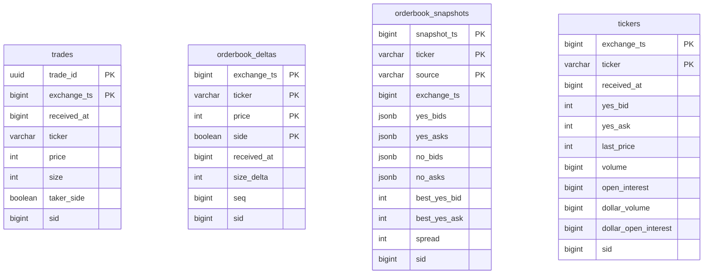

# Data Model (Gatherer-Local)

TimescaleDB schema for individual gatherer instances. Production/Aurora schema documented separately.

---

## Design Principles

1. **Append-only writes** — Never update, only insert
2. **Microsecond precision** — All timestamps as `BIGINT` (µs since epoch)
3. **Integer pricing** — Hundred-thousandths of a dollar (0-100,000) to avoid float errors
4. **TimescaleDB hypertables** — Automatic partitioning by time
5. **Time-series only** — Gatherers store only time-series data; market metadata lives in memory (Market Registry)

---

## Architecture Note

Gatherers maintain an **in-memory Market Registry** for active markets. No relational tables (series, events, markets) are stored locally—these exist only in the production RDS. This simplifies the gatherer architecture:

- Market Registry discovers markets via REST API and WebSocket
- Time-series data (trades, orderbook_deltas, snapshots, tickers) flows to local TimescaleDB
- Deduplicator syncs only time-series data to production RDS

---

## Schema Overview



**Note:** For TimescaleDB hypertables, the partition column (time column) must be first in the primary key.

---

## Data Formats

### Price Format

Kalshi API returns prices in both cent and dollar formats. Use `*_dollars` fields for subpenny precision.

Internal format: integer hundred-thousandths (0-100,000 = $0.00000-$1.00000)

**Conversion (done by gatherer before storage):**

| Kalshi `price_dollars` | Internal | Notes |
|------------------------|----------|-------|
| `"0.52"` | 52000 | 1 cent precision |
| `"0.5250"` | 52500 | Subpenny (0.1 cent) |
| `"0.5255"` | 52550 | Subpenny (0.01 cent) |
| `"0.99"` | 99000 | Near 100% |
| `"0.9999"` | 99990 | Tail pricing |

### Timestamp Format

**Two timestamp fields in time-series tables:**

| Field | Source | Description |
|-------|--------|-------------|
| `exchange_ts` | Kalshi API `ts` field | When Kalshi processed the event (server-side) |
| `received_at` | Gatherer `time.Now()` | When gatherer received the message (client-side) |

Both stored as `BIGINT` in microseconds (µs since Unix epoch).

**Use cases:**
- `exchange_ts`: Ordering events, deduplication, analytics
- `received_at`: Debugging latency, identifying gatherer delays

### All Conversions in Application Layer

**Design principle:** The database stores raw values only. All conversions happen in Go code:

| Conversion | Location | Implementation |
|------------|----------|----------------|
| `"0.52"` → `52000` | `internal/api/convert.go` | `DollarsToCents()` |
| ISO 8601 → µs | `internal/api/convert.go` | `ParseTimestamp()` |
| `time.Time` → µs | Go code | `time.UnixMicro()` |
| µs → `time.Time` | Go code | `time.UnixMicro(ts)` |
| Internal → dollars | Go code | `float64(price) / 100000.0` |

**Why no database functions:**
- Simpler schema with no custom functions to maintain
- All logic in one place (Go binary)
- Easier testing and debugging
- Portable across database instances

---

## Time-Series Tables (TimescaleDB)

### trades

```sql
CREATE TABLE trades (
    trade_id        UUID NOT NULL,

    -- Timing (µs since epoch)
    exchange_ts     BIGINT NOT NULL,       -- Kalshi exchange timestamp
    received_at     BIGINT NOT NULL,       -- When gatherer received

    -- Market
    ticker          TEXT NOT NULL,

    -- Trade data
    price           INTEGER NOT NULL,      -- 0-100,000 (hundred-thousandths)
    size            INTEGER NOT NULL,
    taker_side      BOOLEAN NOT NULL,      -- TRUE = YES, FALSE = NO

    -- Metadata
    sid             BIGINT,                -- Subscription ID for debugging

    -- TimescaleDB requires partition column (exchange_ts) in PK
    PRIMARY KEY (trade_id, exchange_ts)
);

SELECT create_hypertable('trades', 'exchange_ts',
    chunk_time_interval => 86400000000);  -- 1 day in µs

CREATE INDEX idx_trades_ticker ON trades(ticker, exchange_ts DESC);
CREATE INDEX idx_trades_received ON trades(received_at DESC);

-- Compression after 1 day
ALTER TABLE trades SET (
    timescaledb.compress,
    timescaledb.compress_segmentby = 'ticker',
    timescaledb.compress_orderby = 'exchange_ts DESC'
);

SELECT add_compression_policy('trades', INTERVAL '1 day');
```

**Note:** The primary key includes `exchange_ts` because TimescaleDB hypertables require the partition column in all unique constraints.

### orderbook_deltas

```sql
CREATE TABLE orderbook_deltas (
    -- Timing (µs since epoch)
    exchange_ts     BIGINT NOT NULL,       -- Kalshi exchange timestamp
    received_at     BIGINT NOT NULL,       -- When gatherer received

    -- Market
    ticker          TEXT NOT NULL,

    -- Delta data
    side            BOOLEAN NOT NULL,      -- TRUE = YES, FALSE = NO
    price           INTEGER NOT NULL,      -- 0-100,000
    size_delta      INTEGER NOT NULL,      -- Positive = add, negative = remove

    -- Metadata (not part of deduplication key)
    seq             BIGINT,                -- Kalshi sequence number (per-subscription, for gap detection)
    sid             BIGINT,                -- Subscription ID for debugging

    -- TimescaleDB requires partition column (exchange_ts) first in PK
    PRIMARY KEY (exchange_ts, ticker, price, side)
);

-- Note: seq is NOT part of the primary key because it is per-subscription (sid).
-- Two gatherers receiving the same delta will have different seq values.
-- Deduplication uses (exchange_ts, ticker, price, side) which uniquely identifies
-- a price level change at a specific time.

SELECT create_hypertable('orderbook_deltas', 'exchange_ts',
    chunk_time_interval => 3600000000);  -- 1 hour in µs

CREATE INDEX idx_deltas_ticker_time ON orderbook_deltas(ticker, exchange_ts DESC);
CREATE INDEX idx_deltas_received ON orderbook_deltas(received_at DESC);

-- Compression after 1 day, retention 7 days
ALTER TABLE orderbook_deltas SET (
    timescaledb.compress,
    timescaledb.compress_segmentby = 'ticker',
    timescaledb.compress_orderby = 'exchange_ts DESC'
);

SELECT add_compression_policy('orderbook_deltas', INTERVAL '1 day');
SELECT add_retention_policy('orderbook_deltas', INTERVAL '7 days');
```

### orderbook_snapshots

Full orderbook state from WebSocket snapshots and 15-minute REST polling.

```sql
CREATE TABLE orderbook_snapshots (
    -- Timing (µs since epoch)
    snapshot_ts     BIGINT NOT NULL,       -- When snapshot was taken
    exchange_ts     BIGINT,                -- Exchange timestamp if from WS

    -- Market
    ticker          TEXT NOT NULL,

    -- Source
    source          TEXT NOT NULL,         -- 'ws' or 'rest'

    -- Book data (JSONB for flexibility)
    yes_bids        JSONB NOT NULL,        -- [[price, size], ...]
    yes_asks        JSONB NOT NULL,
    no_bids         JSONB NOT NULL,
    no_asks         JSONB NOT NULL,

    -- Derived fields (for fast filtering)
    best_yes_bid    INTEGER,
    best_yes_ask    INTEGER,
    spread          INTEGER,

    -- Metadata
    sid             BIGINT,                -- Subscription ID (0 for REST)

    -- TimescaleDB requires partition column (snapshot_ts) first in PK
    PRIMARY KEY (snapshot_ts, ticker, source)
);

SELECT create_hypertable('orderbook_snapshots', 'snapshot_ts',
    chunk_time_interval => 86400000000);  -- 1 day in µs

CREATE INDEX idx_snapshots_ticker ON orderbook_snapshots(ticker, snapshot_ts DESC);

-- Compression after 1 day, retention 30 days
ALTER TABLE orderbook_snapshots SET (
    timescaledb.compress,
    timescaledb.compress_segmentby = 'ticker',
    timescaledb.compress_orderby = 'snapshot_ts DESC'
);

SELECT add_compression_policy('orderbook_snapshots', INTERVAL '1 day');
SELECT add_retention_policy('orderbook_snapshots', INTERVAL '30 days');
```

### tickers

```sql
CREATE TABLE tickers (
    -- Timing (µs since epoch)
    exchange_ts     BIGINT NOT NULL,       -- Kalshi exchange timestamp
    received_at     BIGINT NOT NULL,       -- When gatherer received

    -- Market
    ticker          TEXT NOT NULL,

    -- Ticker data
    yes_bid         INTEGER,
    yes_ask         INTEGER,
    last_price      INTEGER,
    volume          BIGINT,
    open_interest   BIGINT,
    dollar_volume   BIGINT,                -- Dollar-denominated volume
    dollar_open_interest BIGINT,           -- Dollar-denominated open interest

    -- Metadata
    sid             BIGINT,                -- Subscription ID for debugging

    -- TimescaleDB requires partition column (exchange_ts) first in PK
    PRIMARY KEY (exchange_ts, ticker)
);

SELECT create_hypertable('tickers', 'exchange_ts',
    chunk_time_interval => 3600000000);  -- 1 hour in µs

CREATE INDEX idx_tickers_ticker_time ON tickers(ticker, exchange_ts DESC);
CREATE INDEX idx_tickers_received ON tickers(received_at DESC);

-- Compression after 1 day, retention 7 days
ALTER TABLE tickers SET (
    timescaledb.compress,
    timescaledb.compress_segmentby = 'ticker',
    timescaledb.compress_orderby = 'exchange_ts DESC'
);

SELECT add_compression_policy('tickers', INTERVAL '1 day');
SELECT add_retention_policy('tickers', INTERVAL '7 days');
```

---

## Deduplication Keys

Uses Kalshi's exchange-provided identifiers for deduplication. TimescaleDB requires the partition column first in all primary keys.

| Table | Primary Key | ON CONFLICT Columns |
|-------|-------------|---------------------|
| `trades` | `(trade_id, exchange_ts)` | `(trade_id, exchange_ts)` |
| `orderbook_deltas` | `(exchange_ts, ticker, price, side)` | `(exchange_ts, ticker, price, side)` |
| `orderbook_snapshots` | `(snapshot_ts, ticker, source)` | `(snapshot_ts, ticker, source)` |
| `tickers` | `(exchange_ts, ticker)` | `(exchange_ts, ticker)` |

**Note:** All tables use `ON CONFLICT DO NOTHING` for idempotent inserts.

---

## Storage Estimates

| Table | Row Size | Daily Rows (Peak) | Daily Size |
|-------|----------|-------------------|------------|
| `trades` | ~80 bytes | 1M | ~80 MB |
| `orderbook_deltas` | ~60 bytes | 10M | ~600 MB |
| `orderbook_snapshots` | ~2 KB | 100K | ~200 MB |
| `tickers` | ~50 bytes | 1M | ~50 MB |

**With 10x compression:** ~100 MB/day per gatherer

---

## Queries

### Latest orderbook state

```sql
SELECT price, SUM(size_delta) as quantity, side
FROM orderbook_deltas
WHERE ticker = $1
  AND received_at >= (
    SELECT snapshot_ts FROM orderbook_snapshots
    WHERE ticker = $1
    ORDER BY snapshot_ts DESC
    LIMIT 1
  )
GROUP BY price, side
HAVING SUM(size_delta) > 0
ORDER BY price DESC;
```

### Recent trades

```sql
-- Returns raw values; convert in application layer
SELECT trade_id, exchange_ts, size, price, taker_side
FROM trades
WHERE ticker = $1
ORDER BY exchange_ts DESC
LIMIT 100;
```

**Go code to display results:**
```go
for rows.Next() {
    var t Trade
    rows.Scan(&t.TradeID, &t.ExchangeTs, &t.Size, &t.Price, &t.TakerSide)

    // Convert in Go
    ts := time.UnixMicro(t.ExchangeTs)
    dollars := float64(t.Price) / 100000.0
    fmt.Printf("%s: $%.5f x %d @ %s\n", t.TradeID, dollars, t.Size, ts.Format(time.RFC3339))
}
```

### Trade volume by ticker (last 24h)

```sql
-- Pass cutoff timestamp from Go: time.Now().Add(-24*time.Hour).UnixMicro()
SELECT
    ticker,
    COUNT(trade_id) as trade_count,
    SUM(size) as total_volume
FROM trades
WHERE exchange_ts > $1  -- cutoff_ts parameter
GROUP BY ticker
ORDER BY total_volume DESC
LIMIT 100;
```

**Go code:**
```go
cutoffTs := time.Now().Add(-24 * time.Hour).UnixMicro()
rows, err := db.Query(query, cutoffTs)
```

**Note:** For queries joining with market metadata (title, status), use the production RDS where markets table exists.
