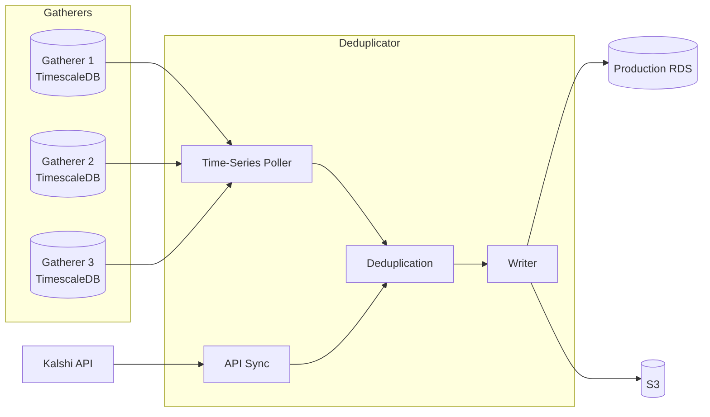
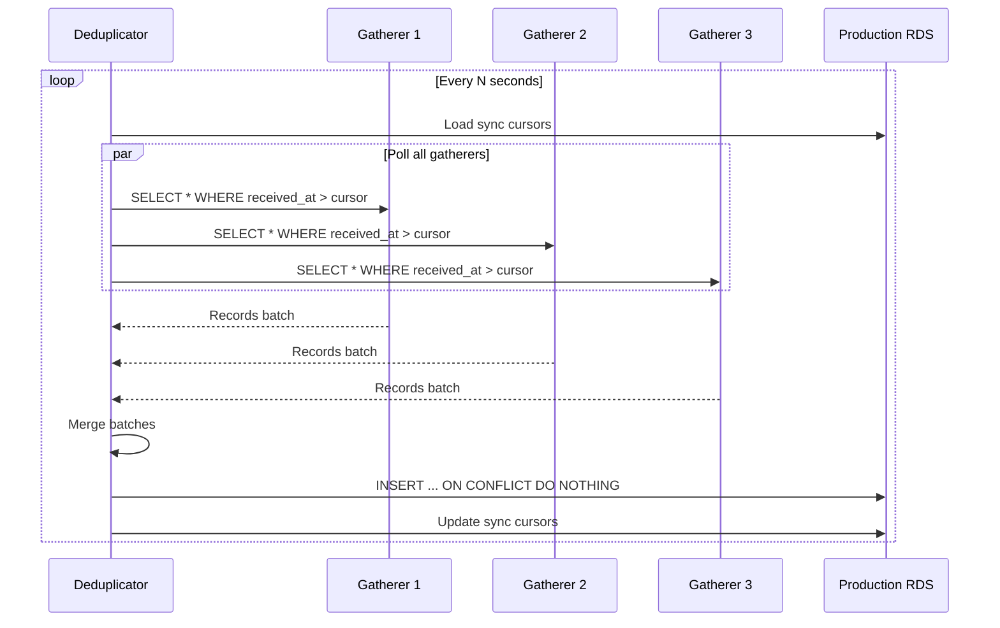
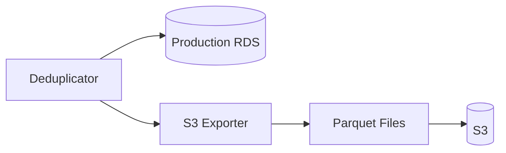

# Deduplicator

Merges data from all gatherers, removes duplicates, writes to production RDS.

---

## Overview



Each gatherer independently collects ALL markets (time-series data only). The deduplicator:
1. Polls new time-series records from all gatherers
2. Syncs market metadata directly from Kalshi API
3. Deduplicates by primary key
4. Writes unique records to production RDS

---

## Sync Cursors

Track last synced position per gatherer per table.

```sql
CREATE TABLE sync_cursors (
    gatherer_id     VARCHAR(32) NOT NULL,
    table_name      VARCHAR(64) NOT NULL,
    last_sync_ts    BIGINT NOT NULL,        -- µs since epoch
    last_sync_at    TIMESTAMPTZ DEFAULT NOW(),
    PRIMARY KEY (gatherer_id, table_name)
);
```

**Example state:**

| gatherer_id | table_name | last_sync_ts |
|-------------|------------|--------------|
| gatherer-1 | trades | 1704067200000000 |
| gatherer-1 | orderbook_deltas | 1704067200000000 |
| gatherer-2 | trades | 1704067195000000 |
| gatherer-2 | orderbook_deltas | 1704067198000000 |
| gatherer-3 | trades | 1704067200000000 |
| gatherer-3 | orderbook_deltas | 1704067200000000 |

---

## Polling Strategy

### Time-Series Tables

Poll by `received_at` timestamp (when gatherer received the data).

```sql
-- Poll new trades from gatherer
SELECT * FROM trades
WHERE received_at > $last_sync_ts
ORDER BY received_at ASC
LIMIT $batch_size;
```

### Market Metadata (from Kalshi API)

Market metadata (series, events, markets) is synced directly from the Kalshi REST API, not from gatherers.

```go
// Sync markets from Kalshi API every 5 minutes
markets, err := kalshiClient.GetAllMarkets(ctx)
for _, market := range markets {
    // Upsert to production RDS
    db.UpsertMarket(ctx, market)
}
```

---

## Deduplication Logic

### Time-Series Tables (Append-Only)

Use `INSERT ... ON CONFLICT DO NOTHING`. Duplicates are silently ignored.

Deduplication uses Kalshi's exchange-provided identifiers (not `received_at`):

| Table | Primary Key | Source |
|-------|-------------|--------|
| `trades` | `trade_id` | Kalshi trade ID |
| `orderbook_deltas` | `(ticker, exchange_ts, price, side)` | Kalshi timestamp + price level |
| `orderbook_snapshots` | `(ticker, snapshot_ts, source)` | Snapshot timestamp + source |
| `tickers` | `(ticker, exchange_ts)` | Kalshi timestamp |

**Note:** `seq` is NOT part of the deduplication key because it is per-subscription (sid). Two gatherers receiving the same delta will have different seq values but identical (ticker, exchange_ts, price, side).

```sql
INSERT INTO trades (trade_id, exchange_ts, received_at, ticker, price, size, taker_side)
VALUES ($1, $2, $3, $4, $5, $6, $7)
ON CONFLICT (trade_id) DO NOTHING;

INSERT INTO orderbook_deltas (ticker, exchange_ts, price, side, size_delta, received_at, seq)
VALUES ($1, $2, $3, $4, $5, $6, $7)
ON CONFLICT (ticker, exchange_ts, price, side) DO NOTHING;
```

### Market Metadata (Upsert from API)

Market metadata is synced from Kalshi API (not gatherers). Use `INSERT ... ON CONFLICT DO UPDATE`. Latest data wins.

| Table | Primary Key | Source |
|-------|-------------|--------|
| `series` | `ticker` | Kalshi REST API |
| `events` | `event_ticker` | Kalshi REST API |
| `markets` | `ticker` | Kalshi REST API |

**Status Mapping:** The deduplicator converts Kalshi's 8-value `status` to production's 4-value status. See [Authoritative Mapping](data-model.md#2-production-status-4-values--authoritative-mapping).

```sql
INSERT INTO markets (ticker, event_ticker, title, market_status, ...)
VALUES ($1, $2, $3, $4, ...)
ON CONFLICT (ticker) DO UPDATE SET
    event_ticker = EXCLUDED.event_ticker,
    title = EXCLUDED.title,
    market_status = EXCLUDED.market_status,
    updated_at = NOW();
```

---

## Sync Flow



---

## Batch Processing

### Batch Size

| Table | Batch Size | Notes |
|-------|------------|-------|
| trades | 10,000 | Low volume |
| orderbook_deltas | 50,000 | High volume |
| orderbook_snapshots | 5,000 | Large rows (JSONB) |
| tickers | 10,000 | Medium volume |
| markets | 1,000 | Low volume, upsert |
| events | 500 | Low volume, upsert |
| series | 100 | Low volume, upsert |

### Sync Interval

| Mode | Interval | Use Case |
|------|----------|----------|
| Real-time | 1-5 seconds | Normal operation |
| Catch-up | 100ms | After deduplicator restart |
| Backfill | As fast as possible | Historical data load |

---

## Connection Management

### Gatherer Connections

```
deduplicator -> gatherer-1 TimescaleDB (read-only)
deduplicator -> gatherer-2 TimescaleDB (read-only)
deduplicator -> gatherer-3 TimescaleDB (read-only)
```

- 3 read connections (1 per gatherer)
- Connection pooling via pgbouncer or app-level

### Kalshi API Connection

```
deduplicator -> Kalshi REST API (read-only)
```

- Syncs market metadata (series, events, markets) every 5 minutes

### Production Connection

```
deduplicator -> production RDS (read-write)
```

- 1-2 write connections
- Connection pooling recommended

---

## Failure Handling

### Gatherer Unreachable

| Scenario | Action |
|----------|--------|
| Connection timeout | Skip gatherer, continue with others |
| Gatherer down | Mark unhealthy, retry next cycle |
| Gatherer recovered | Resume from last cursor |

Data is not lost because other gatherers have the same data.

### Production RDS Unreachable

| Scenario | Action |
|----------|--------|
| Connection timeout | Retry with backoff |
| RDS down | Pause sync, alert, wait for recovery |
| RDS recovered | Resume from last cursor |

Gatherers continue buffering during outage.

### Cursor Management

- Cursors updated only after successful write to production
- On failure, retry from same cursor position
- Atomic: cursor update and data insert in same transaction

---

## S3 Export

In addition to RDS, export to S3 for cold storage.



### Export Format

| Data | Format | Partitioning |
|------|--------|--------------|
| trades | Parquet | `year/month/day/` |
| orderbook_deltas | Parquet | `year/month/day/` |
| orderbook_snapshots | Parquet | `year/month/day/` |

### Export Schedule

| Table | Frequency | Lag |
|-------|-----------|-----|
| trades | Hourly | 1 hour |
| orderbook_deltas | Hourly | 1 hour |
| orderbook_snapshots | Daily | 1 day |

---

## Monitoring

### Metrics

| Metric | Description | Alert Threshold |
|--------|-------------|-----------------|
| `sync_lag_seconds` | Time since last successful sync | > 30s |
| `records_per_second` | Write throughput to RDS | < 100 (warning) |
| `duplicate_rate` | % of records already in RDS | > 50% (investigate) |
| `gatherer_health` | Per-gatherer connection status | Any unhealthy |

### Health Check

```
GET /health
{
  "status": "healthy",
  "gatherers": {
    "gatherer-1": {"status": "connected", "lag_seconds": 2},
    "gatherer-2": {"status": "connected", "lag_seconds": 1},
    "gatherer-3": {"status": "connected", "lag_seconds": 3}
  },
  "production_rds": {"status": "connected"},
  "last_sync": "2024-01-15T10:30:00Z"
}
```
