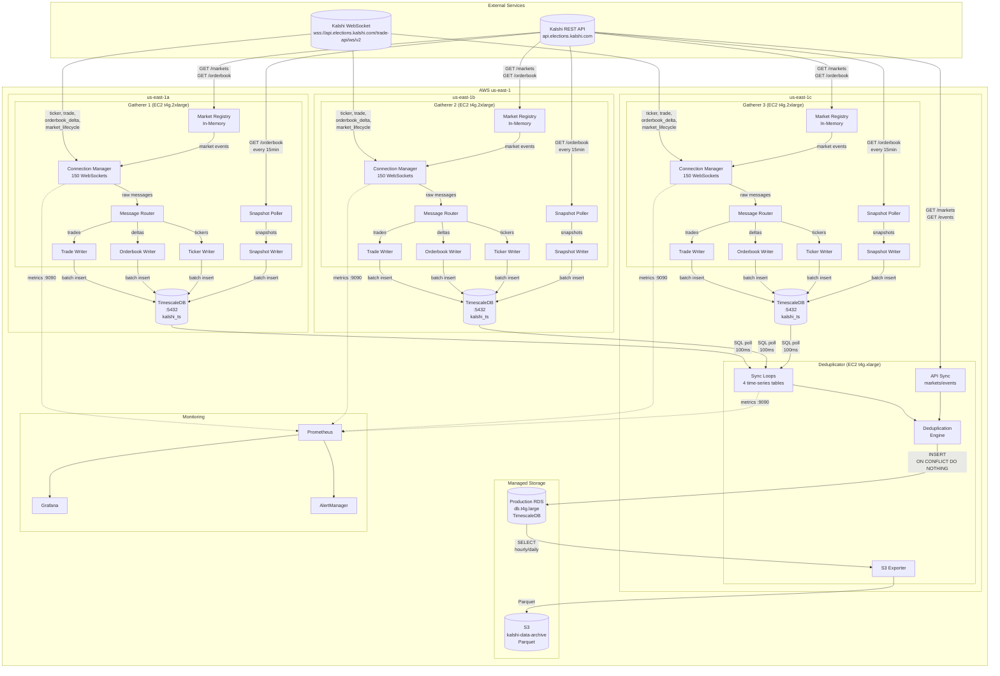
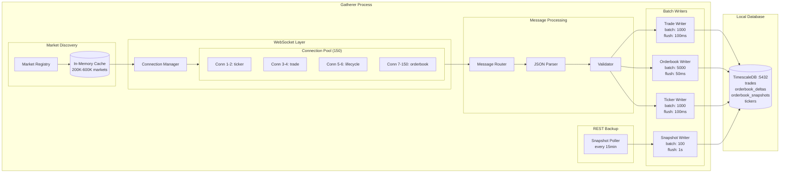
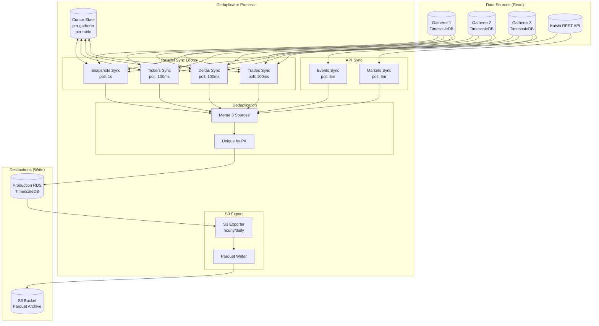
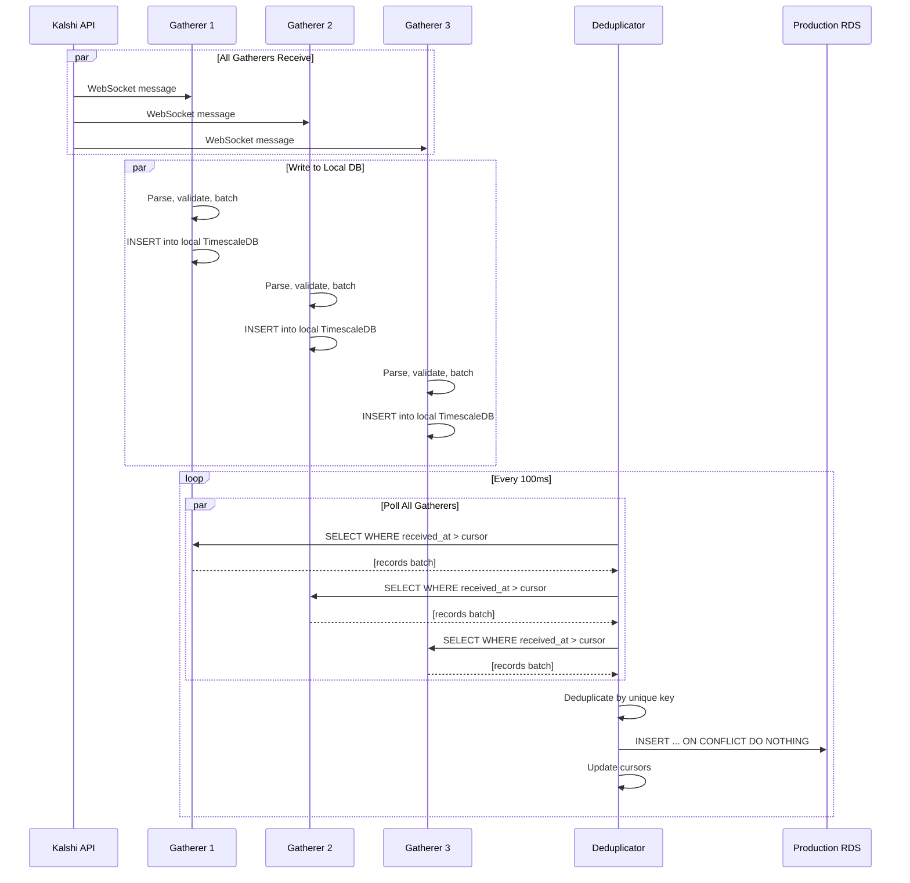
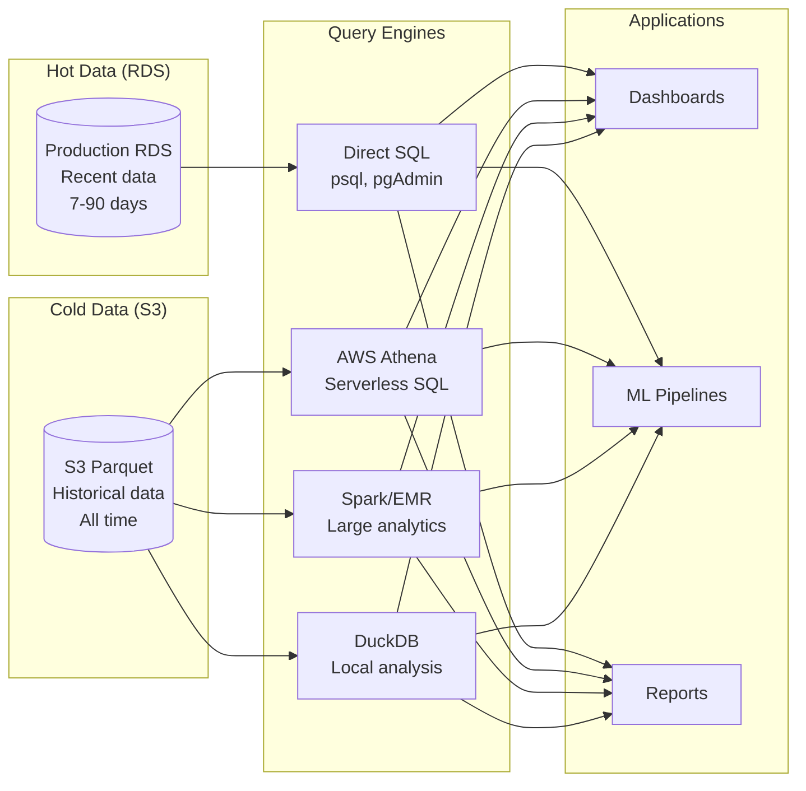
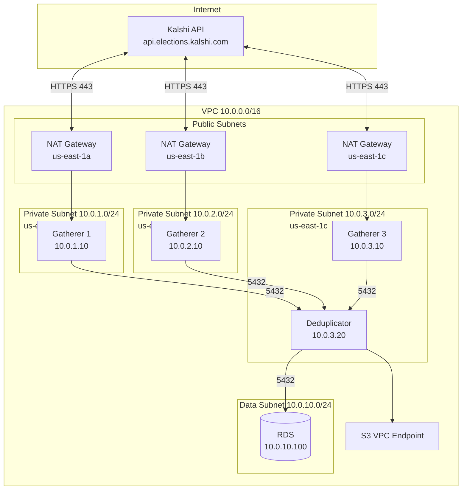
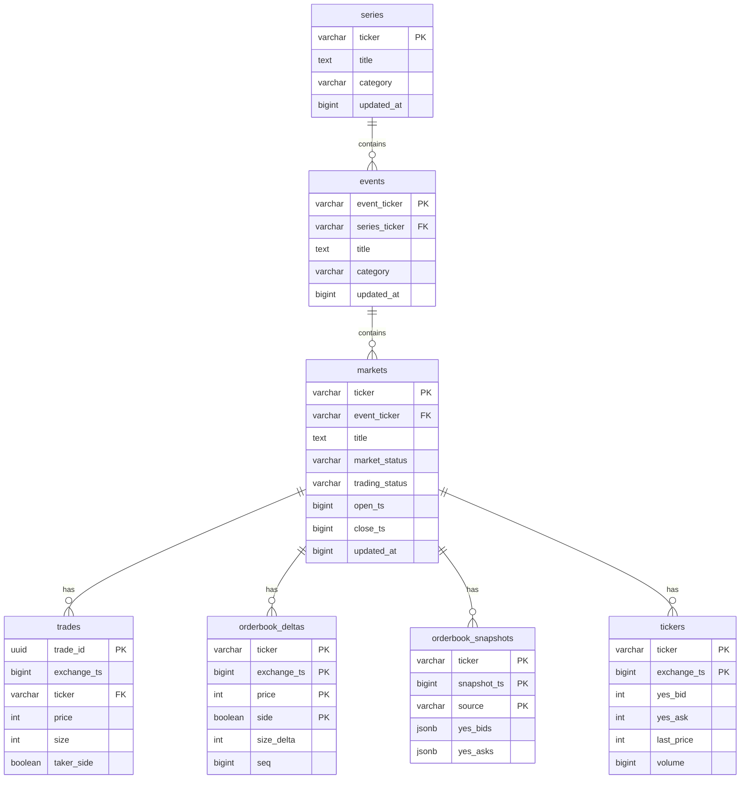
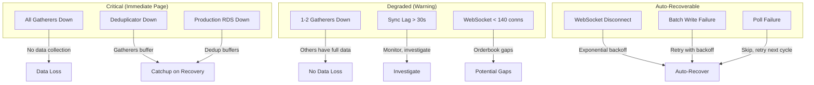
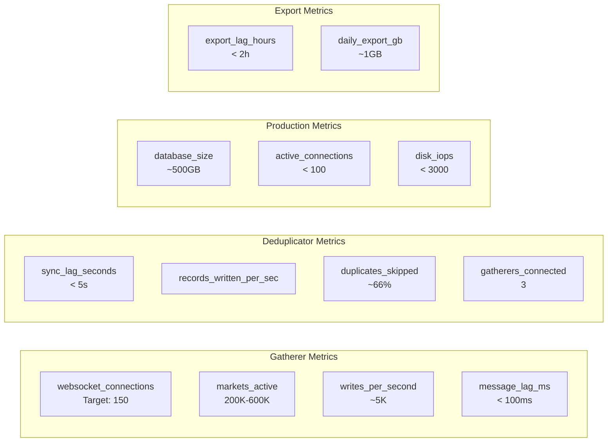

# Overall Architecture

Comprehensive view of the Kalshi Data Platform.

---

## System Overview

---

## Component Detail

### Gatherer Components

---

### Deduplicator Components

---

## Data Flow

### Write Path (Kalshi → Production)

---

### Read Path (Analytics)

---

## Network Topology

---

## Database Schema Overview

---

## Failure Domains

---

## Key Metrics

---

## Summary

| Layer | Components | Purpose |
|-------|------------|---------|
| **Collection** | 3 Gatherers | Redundant time-series capture from Kalshi |
| **Storage (Hot)** | 3 Local TimescaleDBs + 1 RDS | Low-latency reads, 7-90 day retention |
| **Storage (Cold)** | S3 Parquet | Historical archive, analytics |
| **Processing** | 1 Deduplicator | Merge, dedupe, API sync, export |
| **Monitoring** | Prometheus + Grafana | Metrics, alerts, dashboards |

**Data guarantees:**
- **Durability**: 3x redundant capture, no single point of failure for collection
- **Consistency**: Deduplication by exchange-provided keys
- **Latency**: < 500ms end-to-end (Kalshi → Production RDS)
- **Retention**: Forever for trades/snapshots, 30-90 days for high-volume tables (exported to S3)
