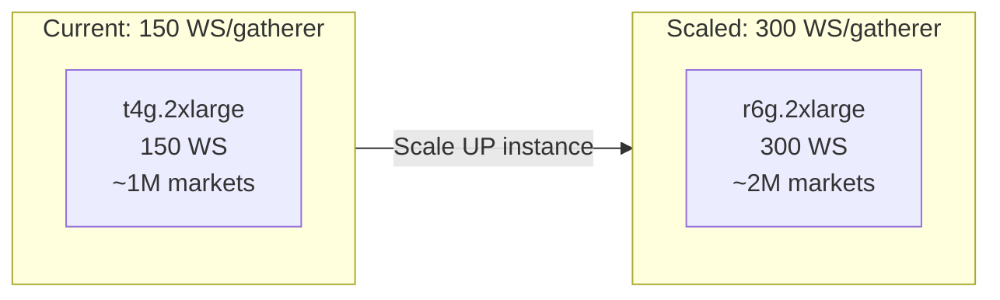
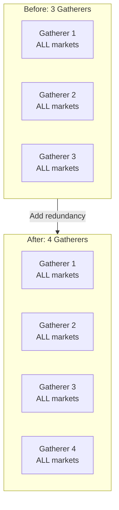
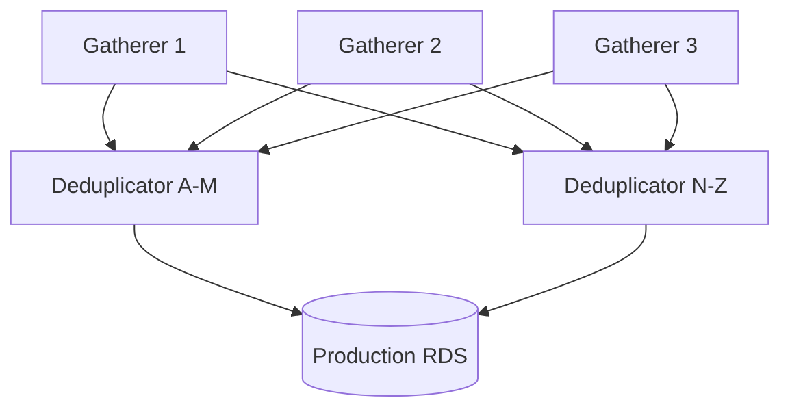
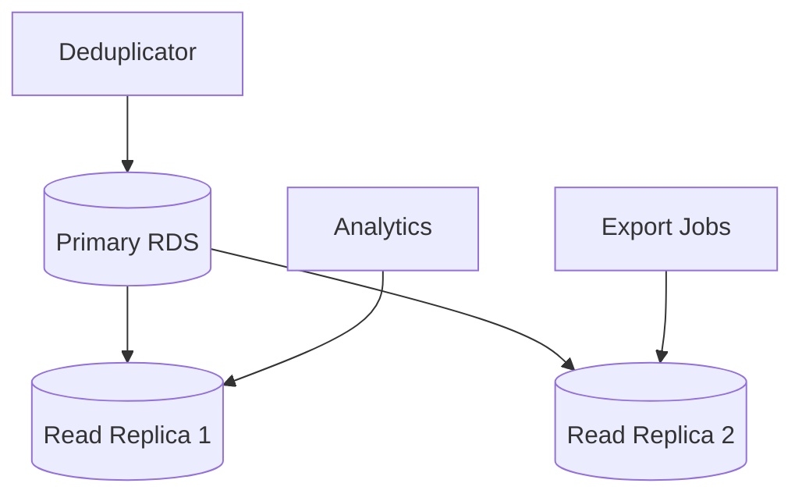

# Scalability

Horizontal scaling strategy and bottleneck analysis.

---

## Current Capacity

Each gatherer independently handles ALL markets (3 complete copies for redundancy).

| Component | Current | Capacity | Headroom |
|-----------|---------|----------|----------|
| Gatherers | 3 (each with ALL markets) | 3 redundant copies | N/A |
| WS connections per gatherer | 150 | 150 | ~1M markets |
| Messages/s per gatherer | ~2K | ~6K | 3x |
| Deduplicator | 1 | 3x gatherer throughput | ~6K msg/s |
| Production RDS | 1 | ~10K writes/s | 5x |

---

## Scaling Dimensions

### Markets (Capacity)

Since each gatherer handles ALL markets, scale UP each gatherer for more markets:



| WS Connections/Gatherer | Markets (~7K/conn) | Instance Type | RAM |
|-------------------------|-------------------|---------------|-----|
| 150 | ~1M | t4g.2xlarge | 32GB |
| 300 | ~2M | r6g.2xlarge | 64GB |
| 750 | ~5M | r6g.4xlarge | 128GB |

### Redundancy

Adding more gatherers increases redundancy (more copies), not market capacity:

| Gatherers | Copies | Fault Tolerance |
|-----------|--------|-----------------|
| 2 | 2 | 1 failure |
| 3 | 3 | 2 failures |
| 4 | 4 | 3 failures |

### Message Throughput

| Stage | Current | Bottleneck | Scaling Strategy |
|-------|---------|------------|------------------|
| WS ingestion | 2K/s per gatherer | CPU | Add gatherers |
| Local DB writes | 2K/s | Disk IOPS | Increase EBS IOPS |
| Deduplicator | 6K/s total | CPU/Memory | Add deduplicator instances |
| Production RDS | 10K/s | Disk IOPS | Scale up instance, add IOPS |

---

## Bottleneck Analysis

### WebSocket Connections per Gatherer

```
Current: 150 connections × 7K markets/conn = 1.05M markets per gatherer
```

**Limit factors:**
- Memory: 50MB per connection → 7.5GB at 150 connections
- CPU: Message parsing at 2K msg/s per gatherer
- Network: ~100 Mbps at peak

**Scaling:** Add more gatherer instances (linear scaling)

### Local Database Writes

```
Current: 2K inserts/s on gp3 with 3000 IOPS baseline
```

**Limit factors:**
- IOPS: 3000 baseline, burst to 16000
- Storage: 200GB with 10x compression

**Scaling:** Increase IOPS (up to 16000) or use io2 volumes

### Deduplicator Throughput

```
Current: 1 deduplicator handling 3 gatherers × 2K msg/s = 6K msg/s
```

**Limit factors:**
- Network I/O polling from gatherers
- CPU for deduplication logic
- RDS connection throughput

**Scaling:** Add deduplicator instances with market sharding

### Production RDS

```
Current: db.t4g.large (2 vCPU, 8GB) with 500GB gp3
```

**Limit factors:**
- CPU: 2 vCPU handles ~10K writes/s
- IOPS: 3000 baseline
- Connections: 100-150 concurrent

**Scaling:**
| Instance | vCPU | RAM | Writes/s | Cost |
|----------|------|-----|----------|------|
| db.t4g.large | 2 | 8GB | 10K | $60 |
| db.t4g.xlarge | 4 | 16GB | 20K | $120 |
| db.r6g.large | 2 | 16GB | 15K | $150 |
| db.r6g.xlarge | 4 | 32GB | 30K | $300 |

---

## Horizontal Scaling: Gatherers

Each gatherer independently collects ALL markets. Adding gatherers increases **redundancy**, not capacity.

### Adding Gatherers (Redundancy)

1. Launch new EC2 instance in target AZ
2. Instance subscribes to ALL markets (same as others)
3. Update deduplicator to poll new gatherer
4. Now have N complete copies instead of N-1



### Scaling for More Markets (Capacity)

To handle more markets, scale UP each gatherer:

| Markets | WS Connections/Gatherer | Instance Type | RAM |
|---------|-------------------------|---------------|-----|
| 1M | 150 | t4g.2xlarge | 32GB |
| 2M | 300 | r6g.2xlarge | 64GB |
| 5M | 750 | r6g.4xlarge | 128GB |

Each gatherer needs enough connections to subscribe to all markets.

---

## Horizontal Scaling: Deduplicator

### Sharding Strategy

At scale, split deduplication by market:



Each deduplicator handles a subset of markets, scaling linearly.

---

## Vertical Scaling: RDS

### When to Scale Up

| Metric | Threshold | Action |
|--------|-----------|--------|
| CPU utilization | > 70% sustained | Scale up instance |
| Write latency | > 10ms p99 | Scale up or add IOPS |
| Connection count | > 80% max | Scale up or add read replicas |
| Storage usage | > 80% | Increase storage |

### Read Replicas

For read-heavy workloads (analytics, exports):



---

## Cost Scaling

Since each gatherer handles ALL markets, scaling for more markets means scaling up instance sizes:

| Markets | Gatherer Instance | Dedup | RDS | Total |
|---------|-------------------|-------|-----|-------|
| 1M | 3x t4g.2xlarge | 1x t4g.xlarge | t4g.large | ~$825 |
| 2M | 3x r6g.2xlarge | 1x t4g.xlarge | t4g.xlarge | ~$1,400 |
| 5M | 3x r6g.4xlarge | 2x t4g.xlarge | r6g.xlarge | ~$3,000 |

**Note:** Adding more gatherers increases redundancy (more copies), not capacity.

---

## Performance Optimization

### Before Scaling

1. **Batch writes:** Group inserts into batches of 100-1000
2. **Connection pooling:** Use pgbouncer or similar
3. **Index optimization:** Review slow queries, add indexes
4. **Compression:** Ensure TimescaleDB compression is enabled
5. **Retention:** Aggressively prune old data to S3

### TimescaleDB Tuning

```sql
-- Increase chunk size for high-volume tables
SELECT set_chunk_time_interval('orderbook_deltas', INTERVAL '1 week');

-- Enable parallel insert
ALTER SYSTEM SET max_worker_processes = 8;
ALTER SYSTEM SET max_parallel_workers = 8;

-- Tune autovacuum for high insert rates
ALTER TABLE orderbook_deltas SET (
    autovacuum_vacuum_scale_factor = 0.01,
    autovacuum_analyze_scale_factor = 0.005
);
```

---

## Scaling Triggers

| Metric | Threshold | Action |
|--------|-----------|--------|
| Gatherer memory | > 80% | Scale up gatherer instance type |
| Gatherer WS connections | Near limit | Scale up gatherer instance type |
| Message rate | > 5K/s per gatherer | Scale up gatherer CPU |
| RDS CPU | > 70% for 1h | Scale up RDS |
| Sync lag | > 30s | Add deduplicator instance |
| Need more redundancy | Business decision | Add 4th gatherer (same size) |
