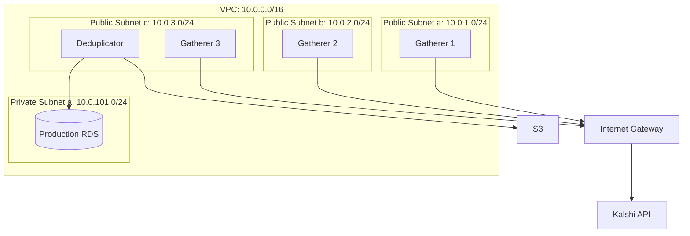

# Infrastructure

AWS resource specifications and network architecture.

---

## Overview



---

## Compute

### Gatherer Instances (3x)

| Specification | Value |
|--------------|-------|
| Instance Type | t4g.2xlarge |
| Architecture | ARM64 (Graviton2) |
| vCPU | 8 |
| Memory | 32 GB |
| Network | Up to 5 Gbps |
| EBS Bandwidth | Up to 2.75 Gbps |

**Storage:**

| Volume | Type | Size | IOPS | Throughput |
|--------|------|------|------|------------|
| Root | gp3 | 200 GB | 3000 | 125 MB/s |

**Placement:**

| Instance | Availability Zone | Private IP |
|----------|-------------------|------------|
| Gatherer 1 | us-east-1a | 10.0.1.10 |
| Gatherer 2 | us-east-1b | 10.0.2.10 |
| Gatherer 3 | us-east-1c | 10.0.3.10 |

### Deduplicator Instance (1x)

| Specification | Value |
|--------------|-------|
| Instance Type | t4g.xlarge |
| Architecture | ARM64 (Graviton2) |
| vCPU | 4 |
| Memory | 16 GB |
| Network | Up to 5 Gbps |

**Storage:**

| Volume | Type | Size | IOPS | Throughput |
|--------|------|------|------|------------|
| Root | gp3 | 50 GB | 3000 | 125 MB/s |

**Placement:**

| Instance | Availability Zone | Private IP |
|----------|-------------------|------------|
| Deduplicator | us-east-1c | 10.0.3.20 |

---

## Database

### Production RDS

| Specification | Value |
|--------------|-------|
| Engine | PostgreSQL 16 + TimescaleDB |
| Instance Class | db.t4g.large |
| vCPU | 2 |
| Memory | 8 GB |
| Multi-AZ | No (Single-AZ) |

**Storage:**

| Type | Size | IOPS | Throughput |
|------|------|------|------------|
| gp3 | 500 GB | 3000 | 125 MB/s |

**Networking:**

| Specification | Value |
|--------------|-------|
| Subnet Group | Private subnets only |
| Publicly Accessible | No |
| Port | 5432 |

**Backups:**

| Setting | Value |
|---------|-------|
| Automated Backups | Enabled |
| Retention Period | 7 days |
| Backup Window | 03:00-04:00 UTC |
| Maintenance Window | Sun 04:00-05:00 UTC |

### Local Databases (per Gatherer)

Each gatherer runs two local database instances:

| Database | Port | Purpose |
|----------|------|---------|
| TimescaleDB | 5432 | Time-series data (trades, orderbook) |
| PostgreSQL | 5433 | Relational data (markets, events) |

Installed via package manager or Docker Compose.

---

## Storage

### S3 Bucket

| Specification | Value |
|--------------|-------|
| Name | `kalshi-data-prod` |
| Region | us-east-1 |
| Versioning | Enabled |
| Encryption | SSE-S3 |

**Structure:**

```
s3://kalshi-data-prod/
├── parquet/
│   ├── trades/
│   │   └── year=2024/month=01/day=15/
│   ├── orderbook_deltas/
│   ├── orderbook_snapshots/
│   └── tickers/
└── backups/
    └── rds/
```

**Lifecycle Policies:**

| Prefix | Transition | Days |
|--------|------------|------|
| `parquet/` | Intelligent-Tiering | 0 |
| `parquet/` | Glacier | 365 |
| `backups/` | Glacier | 30 |

---

## Network

### VPC

| Specification | Value |
|--------------|-------|
| CIDR | 10.0.0.0/16 |
| DNS Hostnames | Enabled |
| DNS Resolution | Enabled |

### Subnets

| Name | CIDR | AZ | Type |
|------|------|-----|------|
| public-a | 10.0.1.0/24 | us-east-1a | Public |
| public-b | 10.0.2.0/24 | us-east-1b | Public |
| public-c | 10.0.3.0/24 | us-east-1c | Public |
| private-a | 10.0.101.0/24 | us-east-1a | Private |
| private-b | 10.0.102.0/24 | us-east-1b | Private |
| private-c | 10.0.103.0/24 | us-east-1c | Private |

### Route Tables

**Public Route Table:**

| Destination | Target |
|-------------|--------|
| 10.0.0.0/16 | local |
| 0.0.0.0/0 | Internet Gateway |

**Private Route Table:**

| Destination | Target |
|-------------|--------|
| 10.0.0.0/16 | local |

---

## Security Groups

### sg-gatherer

| Direction | Protocol | Port | Source/Dest | Purpose |
|-----------|----------|------|-------------|---------|
| Inbound | TCP | 5432 | sg-deduplicator | TimescaleDB access |
| Inbound | TCP | 5433 | sg-deduplicator | PostgreSQL access |
| Inbound | TCP | 22 | Admin IP | SSH |
| Inbound | TCP | 8080 | sg-deduplicator | Health check |
| Inbound | TCP | 9090 | VPC CIDR | Prometheus metrics |
| Outbound | TCP | 443 | 0.0.0.0/0 | Kalshi API |

### sg-deduplicator

| Direction | Protocol | Port | Source/Dest | Purpose |
|-----------|----------|------|-------------|---------|
| Inbound | TCP | 22 | Admin IP | SSH |
| Inbound | TCP | 8080 | VPC CIDR | Health check |
| Inbound | TCP | 9090 | VPC CIDR | Prometheus metrics |
| Outbound | TCP | 5432 | sg-gatherer | Gatherer TimescaleDB |
| Outbound | TCP | 5433 | sg-gatherer | Gatherer PostgreSQL |
| Outbound | TCP | 5432 | sg-rds | Production RDS |
| Outbound | TCP | 443 | 0.0.0.0/0 | S3 (via VPC endpoint) |

### sg-rds

| Direction | Protocol | Port | Source/Dest | Purpose |
|-----------|----------|------|-------------|---------|
| Inbound | TCP | 5432 | sg-deduplicator | Database access |

---

## IAM

### Gatherer Role

```json
{
  "Version": "2012-10-17",
  "Statement": [
    {
      "Effect": "Allow",
      "Action": [
        "logs:CreateLogStream",
        "logs:PutLogEvents"
      ],
      "Resource": "arn:aws:logs:*:*:log-group:/kalshi/*"
    },
    {
      "Effect": "Allow",
      "Action": [
        "cloudwatch:PutMetricData"
      ],
      "Resource": "*",
      "Condition": {
        "StringEquals": {
          "cloudwatch:namespace": "Kalshi"
        }
      }
    }
  ]
}
```

### Deduplicator Role

```json
{
  "Version": "2012-10-17",
  "Statement": [
    {
      "Effect": "Allow",
      "Action": [
        "s3:PutObject",
        "s3:GetObject",
        "s3:ListBucket"
      ],
      "Resource": [
        "arn:aws:s3:::kalshi-data-prod",
        "arn:aws:s3:::kalshi-data-prod/*"
      ]
    },
    {
      "Effect": "Allow",
      "Action": [
        "logs:CreateLogStream",
        "logs:PutLogEvents"
      ],
      "Resource": "arn:aws:logs:*:*:log-group:/kalshi/*"
    },
    {
      "Effect": "Allow",
      "Action": [
        "cloudwatch:PutMetricData"
      ],
      "Resource": "*",
      "Condition": {
        "StringEquals": {
          "cloudwatch:namespace": "Kalshi"
        }
      }
    }
  ]
}
```

---

## Cost Estimate

| Service | Specification | Monthly |
|---------|---------------|---------|
| 3x EC2 t4g.2xlarge | On-Demand | $510 |
| 1x EC2 t4g.xlarge | On-Demand | $100 |
| 3x EBS gp3 200GB | Gatherer storage | $60 |
| 1x EBS gp3 50GB | Deduplicator storage | $10 |
| RDS db.t4g.large | Single-AZ | $60 |
| RDS Storage 500GB | gp3 | $50 |
| S3 1TB | Standard | $25 |
| CloudWatch | Logs + Metrics | $20 |
| **Total** | | **~$835** |

**Savings with Reserved/Savings Plans:**
- 1-year Compute Savings Plan: ~30% savings
- Estimated: **~$600/month**
