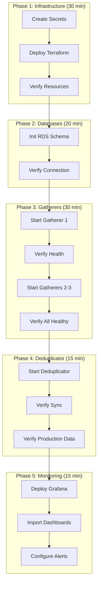

# Deployment Runbook

End-to-end guide for first-time deployment and common operations.

---

## Quick Reference

| Task | Time | Docs |
|------|------|------|
| First deployment (from scratch) | ~2 hours | This document |
| Add new gatherer | ~30 min | [Infrastructure](infrastructure.md) |
| Password rotation | ~10 min | [Startup](startup.md#password-rotation) |
| Recovery from gatherer failure | ~15 min | [Component Failure](../operations/component-failure.md) |

---

## Prerequisites

### Required Access

| Resource | Required | Purpose |
|----------|----------|---------|
| AWS Account | Admin access | Terraform deployment |
| Kalshi API | 3 API keys | One per gatherer |
| Domain (optional) | DNS access | For monitoring endpoints |

### Local Tools

```bash
# Install required tools
brew install terraform awscli go jq

# Verify versions
terraform version  # >= 1.5.0
aws --version      # >= 2.0
go version         # >= 1.21
```

### AWS CLI Configuration

```bash
aws configure
# Enter: Access Key ID, Secret Access Key, Region (us-east-1)

# Verify access
aws sts get-caller-identity
```

---

## First-Time Deployment

### Overview



---

### Phase 1: Infrastructure

#### Step 1.1: Create Secrets in AWS Secrets Manager

```bash
# Set project name
export PROJECT="kalshi-data"
export ENV="prod"

# Generate secure passwords
export RDS_PASSWORD=$(openssl rand -base64 32)
export GATHERER_PASSWORD=$(openssl rand -base64 32)
export DEDUP_READER_PASSWORD=$(openssl rand -base64 32)

# Create secrets
aws secretsmanager create-secret \
  --name "${PROJECT}/${ENV}/rds-master-password" \
  --secret-string "${RDS_PASSWORD}"

aws secretsmanager create-secret \
  --name "${PROJECT}/${ENV}/gatherer-db-password" \
  --secret-string "${GATHERER_PASSWORD}"

aws secretsmanager create-secret \
  --name "${PROJECT}/${ENV}/dedup-reader-password" \
  --secret-string "${DEDUP_READER_PASSWORD}"

# Store Kalshi API keys (get from Kalshi dashboard)
aws secretsmanager create-secret \
  --name "${PROJECT}/${ENV}/kalshi-api-key-1" \
  --secret-string "YOUR_API_KEY_1"

aws secretsmanager create-secret \
  --name "${PROJECT}/${ENV}/kalshi-api-key-2" \
  --secret-string "YOUR_API_KEY_2"

aws secretsmanager create-secret \
  --name "${PROJECT}/${ENV}/kalshi-api-key-3" \
  --secret-string "YOUR_API_KEY_3"

# Verify secrets created
aws secretsmanager list-secrets --filters Key=name,Values="${PROJECT}/${ENV}"
```

#### Step 1.2: Deploy Terraform

```bash
# Navigate to terraform directory
cd terraform/

# Create tfvars file
cat > prod.tfvars << 'EOF'
project         = "kalshi-data"
environment     = "prod"
aws_region      = "us-east-1"
vpc_cidr        = "10.0.0.0/16"
gatherer_count  = 3

# Instance sizing
gatherer_instance_type    = "t4g.2xlarge"
deduplicator_instance_type = "t4g.xlarge"
rds_instance_class        = "db.t4g.large"

# Storage
gatherer_volume_size = 200
rds_storage_size     = 500
EOF

# Initialize and plan
terraform init
terraform plan -var-file=prod.tfvars -out=plan.out

# Review plan carefully, then apply
terraform apply plan.out
```

#### Step 1.3: Verify Resources

```bash
# Get outputs
terraform output

# Expected outputs:
# - gatherer_ips = ["10.0.1.x", "10.0.2.x", "10.0.3.x"]
# - deduplicator_ip = "10.0.3.y"
# - rds_endpoint = "kalshi-prod.xxx.us-east-1.rds.amazonaws.com"
# - s3_bucket = "kalshi-data-archive-xxx"

# Save outputs for later
terraform output -json > ../outputs.json

# Verify RDS is available
aws rds describe-db-instances \
  --db-instance-identifier kalshi-prod \
  --query 'DBInstances[0].DBInstanceStatus'
# Should return: "available"
```

---

### Phase 2: Database Initialization

#### Step 2.1: Initialize Production RDS Schema

```bash
# Get RDS endpoint
RDS_HOST=$(jq -r '.rds_endpoint.value' outputs.json)
RDS_PASSWORD=$(aws secretsmanager get-secret-value \
  --secret-id "${PROJECT}/${ENV}/rds-master-password" \
  --query SecretString --output text)

# Connect and create database
PGPASSWORD="${RDS_PASSWORD}" psql -h "${RDS_HOST}" -U admin -d postgres << 'EOF'
-- Create production database
CREATE DATABASE kalshi_prod;
\c kalshi_prod

-- Enable TimescaleDB
CREATE EXTENSION IF NOT EXISTS timescaledb;

-- Create application user
CREATE USER deduplicator WITH PASSWORD 'REPLACE_WITH_ACTUAL';
GRANT CONNECT ON DATABASE kalshi_prod TO deduplicator;
EOF

# Run migrations
PGPASSWORD="${RDS_PASSWORD}" psql -h "${RDS_HOST}" -U admin -d kalshi_prod \
  -f migrations/production/001_schema.sql

# Verify
PGPASSWORD="${RDS_PASSWORD}" psql -h "${RDS_HOST}" -U admin -d kalshi_prod \
  -c "\dt"
# Should show: trades, orderbook_deltas, orderbook_snapshots, tickers, markets, events, series, sync_cursors
```

#### Step 2.2: Verify Database Connection

```bash
# Test deduplicator user connection
DEDUP_PASSWORD=$(aws secretsmanager get-secret-value \
  --secret-id "${PROJECT}/${ENV}/dedup-reader-password" \
  --query SecretString --output text)

PGPASSWORD="${DEDUP_PASSWORD}" psql \
  -h "${RDS_HOST}" \
  -U deduplicator \
  -d kalshi_prod \
  -c "SELECT 1 AS connected;"
# Should return: connected = 1
```

---

### Phase 3: Start Gatherers

#### Step 3.1: Start First Gatherer

```bash
# SSH to gatherer 1
GATHERER_1_IP=$(jq -r '.gatherer_ips.value[0]' outputs.json)
ssh ec2-user@${GATHERER_1_IP}

# On gatherer 1:
# Check local databases are running
sudo systemctl status postgresql
pg_isready -h localhost -p 5432  # TimescaleDB
pg_isready -h localhost -p 5433  # PostgreSQL

# Check configuration
cat /etc/kalshi/gatherer.yaml

# Start gatherer
sudo systemctl start gatherer

# Watch logs
journalctl -u gatherer -f
# Look for:
# - "connected to Kalshi WebSocket"
# - "subscribed to ticker channel"
# - "loaded N markets from REST API"

# Check health
curl localhost:8080/health | jq
# Should show: status = "healthy"
```

#### Step 3.2: Verify First Gatherer

```bash
# Still on gatherer 1:

# Check WebSocket connections
curl localhost:8080/health | jq '.components.websocket'
# Should show: connections = 150, healthy >= 140

# Check data is flowing
sudo -u postgres psql -d kalshi_ts -c \
  "SELECT COUNT(*) FROM trades WHERE received_at > extract(epoch from now() - interval '5 minutes') * 1000000;"
# Should return > 0 after a few minutes

# Exit SSH
exit
```

#### Step 3.3: Start Remaining Gatherers

```bash
# Start gatherer 2
GATHERER_2_IP=$(jq -r '.gatherer_ips.value[1]' outputs.json)
ssh ec2-user@${GATHERER_2_IP} "sudo systemctl start gatherer"

# Start gatherer 3
GATHERER_3_IP=$(jq -r '.gatherer_ips.value[2]' outputs.json)
ssh ec2-user@${GATHERER_3_IP} "sudo systemctl start gatherer"

# Verify all healthy
for i in 0 1 2; do
  IP=$(jq -r ".gatherer_ips.value[$i]" outputs.json)
  echo "Gatherer $((i+1)): $(curl -s http://${IP}:8080/health | jq -r '.status')"
done
# Should show: healthy, healthy, healthy
```

---

### Phase 4: Start Deduplicator

#### Step 4.1: Start Deduplicator

```bash
# SSH to deduplicator
DEDUP_IP=$(jq -r '.deduplicator_ip.value' outputs.json)
ssh ec2-user@${DEDUP_IP}

# On deduplicator:
# Check configuration
cat /etc/kalshi/deduplicator.yaml

# Test connectivity to gatherers
for g in 1 2 3; do
  pg_isready -h gatherer-${g}.internal -p 5432
done

# Test connectivity to RDS
pg_isready -h ${RDS_HOST} -p 5432

# Start deduplicator
sudo systemctl start deduplicator

# Watch logs
journalctl -u deduplicator -f
# Look for:
# - "connected to gatherer-1"
# - "connected to production RDS"
# - "sync started for trades"

# Check health
curl localhost:8080/health | jq
# Should show: status = "healthy"

exit
```

#### Step 4.2: Verify Sync

```bash
# Check sync lag
curl http://${DEDUP_IP}:8080/health | jq '.components.sync'
# Should show: max_lag_seconds < 5

# Verify data in production RDS
PGPASSWORD="${RDS_PASSWORD}" psql -h "${RDS_HOST}" -U admin -d kalshi_prod << 'EOF'
-- Check record counts
SELECT 'trades' as table_name, COUNT(*) FROM trades
UNION ALL
SELECT 'orderbook_deltas', COUNT(*) FROM orderbook_deltas
UNION ALL
SELECT 'markets', COUNT(*) FROM markets;

-- Check sync cursors
SELECT * FROM sync_cursors;

-- Check latest data timestamps (exchange_ts in µs)
SELECT 'trades' as table_name, MAX(exchange_ts) as latest_ts_us
FROM trades;
EOF
```

---

### Phase 5: Monitoring Setup

#### Step 5.1: Verify Prometheus Scraping

```bash
# Check metrics endpoints
curl http://${GATHERER_1_IP}:9090/metrics | head -20
curl http://${DEDUP_IP}:9090/metrics | head -20

# Key metrics to verify:
# - gatherer_markets_active
# - gatherer_websocket_connections
# - dedup_sync_lag_seconds
# - dedup_records_written_total
```

#### Step 5.2: Import Grafana Dashboards

```bash
# If using managed Grafana:
# 1. Navigate to Grafana UI
# 2. Import dashboards from grafana/dashboards/
# 3. Configure Prometheus data source

# Key dashboards:
# - Gatherer Overview
# - Deduplicator Sync
# - Database Performance
# - WebSocket Health
```

#### Step 5.3: Configure Alerts

```bash
# Verify alert rules are loaded
# In Prometheus UI: /alerts

# Critical alerts that should be configured:
# - AllGatherersDown (immediate page)
# - DeduplicatorDown (immediate page)
# - SyncLagCritical (> 5 min)
# - RDSConnectionFailure

# See: docs/kalshi-data/monitoring/alerts.md
```

---

## Verification Checklist

### After Deployment

- [ ] All 3 gatherers showing `healthy`
- [ ] Each gatherer has 150 WebSocket connections
- [ ] Deduplicator showing `healthy`
- [ ] Deduplicator connected to all 3 gatherers
- [ ] Sync lag < 5 seconds for all tables
- [ ] Production RDS receiving data
- [ ] Prometheus scraping all endpoints
- [ ] Grafana dashboards showing data
- [ ] Test alert fires and is received

### Data Validation

```bash
# Run after 1 hour of operation:

# 1. Compare gatherer record counts (should be similar)
for IP in ${GATHERER_1_IP} ${GATHERER_2_IP} ${GATHERER_3_IP}; do
  ssh ec2-user@${IP} "sudo -u postgres psql -d kalshi_ts -t -c \
    \"SELECT COUNT(*) FROM trades WHERE received_at > extract(epoch from now() - interval '1 hour') * 1000000;\""
done

# 2. Compare to production (should equal highest gatherer count after dedup)
PGPASSWORD="${RDS_PASSWORD}" psql -h "${RDS_HOST}" -U admin -d kalshi_prod -t -c \
  "SELECT COUNT(*) FROM trades WHERE exchange_ts > extract(epoch from now() - interval '1 hour') * 1000000;"

# 3. Check for gaps (should return 0)
PGPASSWORD="${RDS_PASSWORD}" psql -h "${RDS_HOST}" -U admin -d kalshi_prod -c "
  SELECT COUNT(*) as gaps FROM (
    SELECT exchange_ts,
           LEAD(exchange_ts) OVER (ORDER BY exchange_ts) - exchange_ts as gap
    FROM trades
    WHERE exchange_ts > extract(epoch from now() - interval '1 hour') * 1000000
  ) t WHERE gap > 60000000;  -- gaps > 1 minute
"
```

---

## Rollback Procedure

If deployment fails:

```bash
# 1. Stop all services
for IP in ${GATHERER_1_IP} ${GATHERER_2_IP} ${GATHERER_3_IP} ${DEDUP_IP}; do
  ssh ec2-user@${IP} "sudo systemctl stop gatherer deduplicator 2>/dev/null || true"
done

# 2. If RDS has bad data, restore from snapshot
aws rds restore-db-instance-from-db-snapshot \
  --db-instance-identifier kalshi-prod-restored \
  --db-snapshot-identifier pre-deploy-snapshot

# 3. If infrastructure needs to be destroyed
terraform destroy -var-file=prod.tfvars

# 4. Clean up secrets if needed
aws secretsmanager delete-secret \
  --secret-id "${PROJECT}/${ENV}/rds-master-password" \
  --force-delete-without-recovery
```

---

## Common Operations

### Adding a New Gatherer

See [Infrastructure: Scaling](infrastructure.md#scaling).

### Rotating Passwords

See [Startup: Password Rotation](startup.md#password-rotation).

### Handling Alerts

See [Monitoring: Alerts](../monitoring/alerts.md).

### Recovery from Component Failure

See [Operations: Component Failure](../operations/component-failure.md).

---

## Troubleshooting

### Gatherer Won't Start

```bash
# Check logs
journalctl -u gatherer -n 100 --no-pager

# Common issues:
# 1. Database not running
sudo systemctl start postgresql

# 2. Missing configuration
ls -la /etc/kalshi/gatherer.yaml

# 3. Port already in use
ss -tlnp | grep 8080

# 4. Kalshi API unreachable
curl -I https://api.elections.kalshi.com/trade-api/v2/exchange/status
```

### Deduplicator Sync Lag High

```bash
# Check which gatherer is slow
curl localhost:8080/health | jq '.components.sync'

# Check gatherer database size
ssh gatherer-1 "sudo -u postgres psql -d kalshi_ts -c 'SELECT pg_size_pretty(pg_database_size(current_database()));'"

# Check network latency
ping gatherer-1.internal

# Check for long-running queries on gatherer
ssh gatherer-1 "sudo -u postgres psql -c \"SELECT pid, now() - pg_stat_activity.query_start AS duration, query FROM pg_stat_activity WHERE state = 'active' ORDER BY duration DESC LIMIT 5;\""
```

### No Data in Production RDS

```bash
# 1. Verify deduplicator is running
ssh ${DEDUP_IP} "systemctl is-active deduplicator"

# 2. Check deduplicator can reach gatherers
ssh ${DEDUP_IP} "pg_isready -h gatherer-1.internal -p 5432"

# 3. Check deduplicator can reach RDS
ssh ${DEDUP_IP} "pg_isready -h ${RDS_HOST} -p 5432"

# 4. Check sync cursors (are they advancing?)
watch -n 5 "PGPASSWORD='${RDS_PASSWORD}' psql -h ${RDS_HOST} -U admin -d kalshi_prod -c 'SELECT * FROM sync_cursors;'"

# 5. Check deduplicator logs for errors
ssh ${DEDUP_IP} "journalctl -u deduplicator --since '10 minutes ago' | grep -i error"
```
