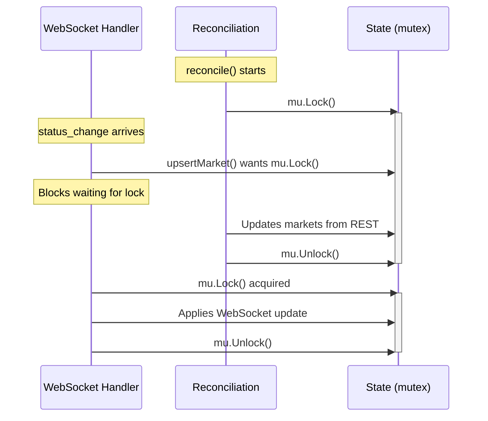

# Behaviors

Event handling, reconciliation, and error handling for Market Registry.

---

## Exchange Status Handling

```go
func (r *Registry) checkExchangeStatus(ctx context.Context) error {
    status, err := r.rest.GetExchangeStatus(ctx)
    if err != nil {
        return err
    }

    r.state.mu.Lock()
    r.state.exchangeActive = status.ExchangeActive
    r.state.tradingActive = status.TradingActive
    r.state.mu.Unlock()

    if !status.ExchangeActive {
        // Wait for resume time, then retry
        waitDuration := time.Until(status.EstimatedResumeTime)
        if waitDuration > 0 {
            select {
            case <-ctx.Done():
                return ctx.Err()
            case <-time.After(waitDuration):
            }
        }
        return r.checkExchangeStatus(ctx) // retry
    }

    return nil
}
```

| Exchange Status | Action |
|----------------|--------|
| `exchange_active: false` | Wait for `estimated_resume_time`, retry |
| `trading_active: false` | Continue (markets still update, just no trades) |

---

## Handling `market_lifecycle` Events

```go
func (r *Registry) handleLifecycleEvent(ctx context.Context, msg MarketLifecycleMsg) {
    switch msg.EventType {
    case "created":
        // Fetch full market data via REST (synchronous)
        market, err := r.rest.GetMarket(ctx, msg.Ticker)
        if err != nil {
            r.logger.Error("failed to fetch new market", "ticker", msg.Ticker, "err", err)
            // Will be picked up by reconciliation
            return
        }
        r.upsertMarket(market)
        r.notifyChange(MarketChange{
            Ticker:    msg.Ticker,
            EventType: "created",
            NewStatus: market.MarketStatus,
            Market:    market,
        })

    case "status_change":
        r.updateMarketStatus(msg.Ticker, msg.NewStatus)
        market, _ := r.GetMarket(msg.Ticker)
        r.notifyChange(MarketChange{
            Ticker:    msg.Ticker,
            EventType: "status_change",
            OldStatus: msg.OldStatus,
            NewStatus: msg.NewStatus,
            Market:    market,
        })

    case "settled":
        r.updateMarketSettled(msg.Ticker, msg.Result)
        r.notifyChange(MarketChange{
            Ticker:    msg.Ticker,
            EventType: "settled",
            NewStatus: "finalized",
        })
    }
}
```

**Design Decision**: Synchronous REST fetch on "created" events. Since market creations are rare (~100/day), the 50-100ms latency is acceptable and keeps the code simple.

---

## Reconciliation Loop

Periodic REST poll to catch any missed WebSocket events. Fetches ALL markets (not just open) to detect any status changes.

```go
func (r *Registry) reconciliationLoop(ctx context.Context) {
    ticker := time.NewTicker(r.cfg.ReconcileInterval) // 5-10 min
    defer ticker.Stop()

    for {
        select {
        case <-ctx.Done():
            return
        case <-ticker.C:
            r.reconcile(ctx)
        }
    }
}

func (r *Registry) reconcile(ctx context.Context) {
    // Fetch all markets from REST (all statuses)
    restMarkets, err := r.rest.GetAllMarkets(ctx)
    if err != nil {
        r.logger.Error("reconciliation failed", "err", err)
        return
    }

    r.state.mu.Lock()
    defer r.state.mu.Unlock()

    for _, m := range restMarkets {
        existing, ok := r.state.markets[m.Ticker]
        if !ok {
            // New market we missed
            r.state.markets[m.Ticker] = m
            if m.MarketStatus == "active" {
                r.state.activeSet[m.Ticker] = struct{}{}
                r.notifyChangeLocked(MarketChange{
                    Ticker:    m.Ticker,
                    EventType: "created",
                    NewStatus: m.MarketStatus,
                    Market:    m,
                })
            }
            continue
        }

        // Check for status changes we missed
        if existing.MarketStatus != m.MarketStatus {
            oldStatus := existing.MarketStatus
            r.state.markets[m.Ticker] = m

            if m.MarketStatus == "active" {
                r.state.activeSet[m.Ticker] = struct{}{}
            } else {
                delete(r.state.activeSet, m.Ticker)
            }

            r.notifyChangeLocked(MarketChange{
                Ticker:    m.Ticker,
                EventType: "status_change",
                OldStatus: oldStatus,
                NewStatus: m.MarketStatus,
                Market:    m,
            })
        }
    }

    r.state.lastSyncAt = time.Now()
}
```

**Design Decision**: Reconciliation fetches ALL markets (not just open) to catch any status changes we may have missed via WebSocket.

---

## Synchronization

The Market Registry uses a mutex (`r.state.mu`) to coordinate concurrent access from two sources:

1. **WebSocket events** (`handleLifecycleEvent`) - real-time updates
2. **REST reconciliation** (`reconcile`) - periodic full sync

### Thread Safety Model

```go
type registryState struct {
    mu            sync.RWMutex
    markets       map[string]Market    // Protected by mu
    activeSet     map[string]struct{}  // Protected by mu
    exchangeActive bool
    tradingActive  bool
    lastSyncAt    time.Time
}

// Write operations acquire write lock
func (r *Registry) upsertMarket(m Market) {
    r.state.mu.Lock()
    defer r.state.mu.Unlock()
    r.state.markets[m.Ticker] = m
    if m.MarketStatus == "active" {
        r.state.activeSet[m.Ticker] = struct{}{}
    }
}

// Read operations acquire read lock
func (r *Registry) GetMarket(ticker string) (Market, bool) {
    r.state.mu.RLock()
    defer r.state.mu.RUnlock()
    m, ok := r.state.markets[ticker]
    return m, ok
}
```

### Race Condition: WebSocket vs Reconciliation

**Scenario:** A WebSocket `status_change` event arrives while reconciliation is in progress.



**Resolution:** The mutex serializes updates. WebSocket events that arrive during reconciliation wait for the lock and then apply their changes. Since WebSocket events contain the most recent state, the final result is correct even if the order is slightly delayed.

### Duplicate Update Handling

Both sources may report the same state change:

| Source | Timing | Behavior |
|--------|--------|----------|
| WebSocket | Real-time | Updates state immediately |
| Reconciliation | Every 5-10 min | Detects changes via status comparison |

**Idempotency:** Updates are compared against current state. If a WebSocket event already applied a change, reconciliation sees `existing.MarketStatus == m.MarketStatus` and skips the update.

```go
// In reconcile():
if existing.MarketStatus != m.MarketStatus {
    // Only notify if status actually changed
    r.notifyChangeLocked(...)
}
```

### Notification Ordering

The `notifyChange` and `notifyChangeLocked` functions ensure Connection Manager receives events in order:

- `notifyChange` - acquires lock, then notifies
- `notifyChangeLocked` - caller already holds lock (used in `reconcile`)

This prevents Connection Manager from receiving out-of-order status transitions.

---

## Error Handling

| Error | Handling |
|-------|----------|
| REST timeout | Retry with exponential backoff (forever) |
| REST 429 (rate limit) | Should not happen (reads not rate limited), but back off anyway |
| REST 5xx | Retry with exponential backoff (forever) |
| WebSocket disconnect | Connection Manager handles reconnect; Registry re-subscribes to `market_lifecycle` |
| Database error | Log, continue (data will be reconciled next cycle) |

**Design Decision**: Retry REST errors forever with exponential backoff. The gatherer should not operate without market data, and transient errors will eventually resolve.

```go
func (r *Registry) fetchWithRetry(ctx context.Context, fn func() error) error {
    backoff := 1 * time.Second
    maxBackoff := 5 * time.Minute

    for {
        err := fn()
        if err == nil {
            return nil
        }

        r.logger.Warn("REST request failed, retrying", "err", err, "backoff", backoff)

        select {
        case <-ctx.Done():
            return ctx.Err()
        case <-time.After(backoff):
        }

        backoff = min(backoff*2, maxBackoff)
    }
}
```
