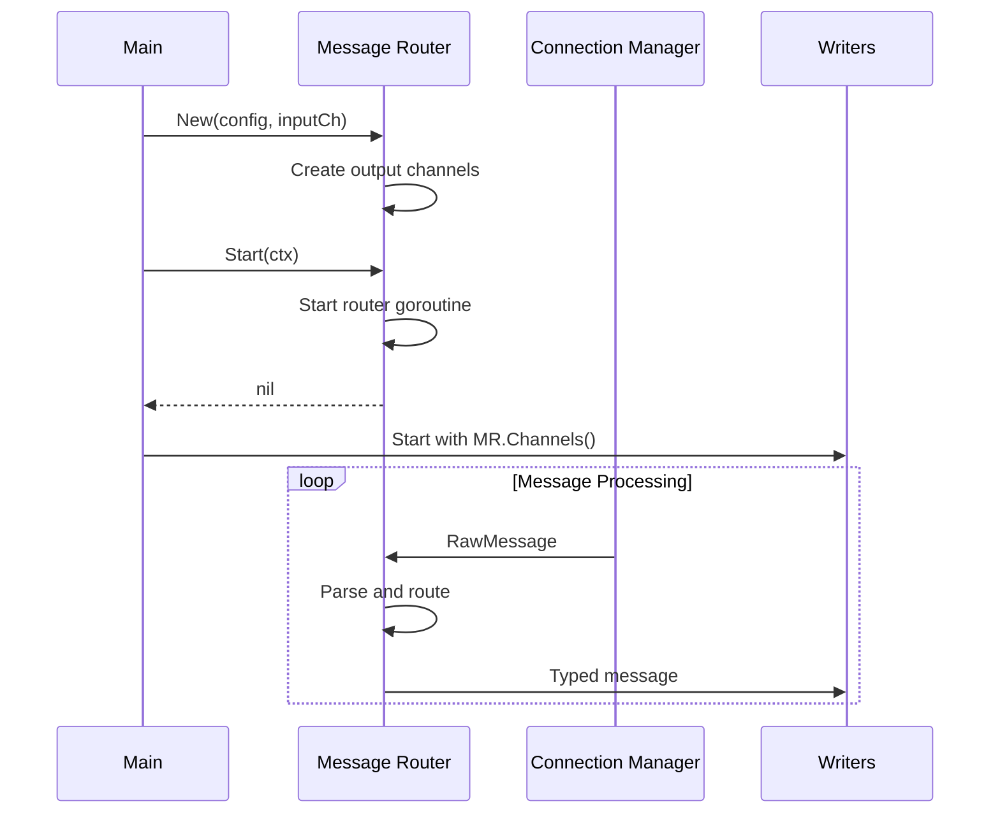
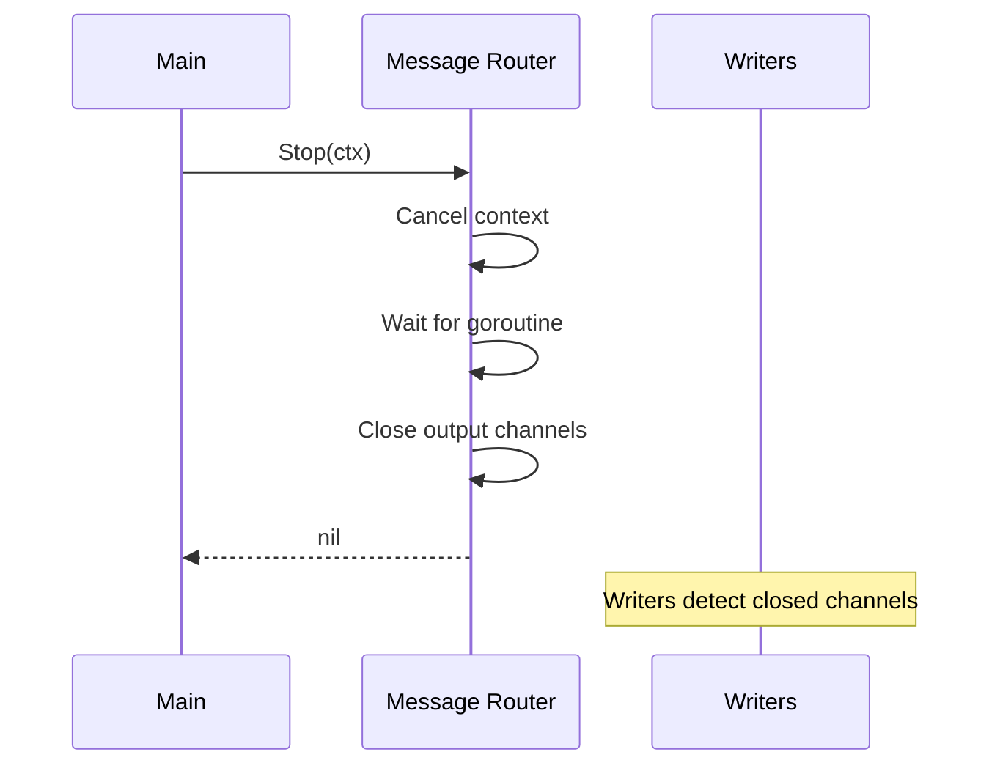

# Lifecycle

Startup and shutdown for Message Router.

---

## Startup Sequence



```go
func New(cfg RouterConfig, input <-chan RawMessage) *router {
    return &router{
        cfg:         cfg,
        input:       input,
        orderbookCh: make(chan OrderbookMsg, cfg.OrderbookBufferSize),
        tradeCh:     make(chan TradeMsg, cfg.TradeBufferSize),
        tickerCh:    make(chan TickerMsg, cfg.TickerBufferSize),
    }
}

func (r *router) Start(ctx context.Context) error {
    r.ctx, r.cancel = context.WithCancel(ctx)

    r.wg.Add(1)
    go r.run()

    return nil
}

func (r *router) Channels() RouterChannels {
    return RouterChannels{
        Orderbook: r.orderbookCh,
        Trade:     r.tradeCh,
        Ticker:    r.tickerCh,
    }
}
```

**Startup order:**
1. Connection Manager starts first (provides input channel)
2. Message Router starts (creates output channels, starts goroutine)
3. Writers start last (consume from Router's output channels)

---

## Shutdown Sequence



```go
func (r *router) Stop(ctx context.Context) error {
    // Signal goroutine to stop
    r.cancel()

    // Wait for goroutine to exit
    done := make(chan struct{})
    go func() {
        r.wg.Wait()
        close(done)
    }()

    select {
    case <-done:
    case <-ctx.Done():
        return ctx.Err()
    }

    // Close output channels (safe: goroutine has exited)
    close(r.orderbookCh)
    close(r.tradeCh)
    close(r.tickerCh)

    return nil
}
```

**Shutdown order:**
1. Connection Manager stops first (closes input channel)
2. Message Router stops (drains input, closes output channels)
3. Writers stop last (detect closed channels)

---

## Graceful Drain

On shutdown, the router drains remaining messages from the input channel:

```go
func (r *router) run() {
    defer r.wg.Done()

    for {
        select {
        case <-r.ctx.Done():
            // Drain remaining messages
            r.drain()
            return
        case raw, ok := <-r.input:
            if !ok {
                return  // Input closed
            }
            r.route(raw)
        }
    }
}

func (r *router) drain() {
    for {
        select {
        case raw, ok := <-r.input:
            if !ok {
                return
            }
            r.route(raw)
        default:
            return  // No more messages
        }
    }
}
```

This ensures messages already in the channel are processed before shutdown completes.
