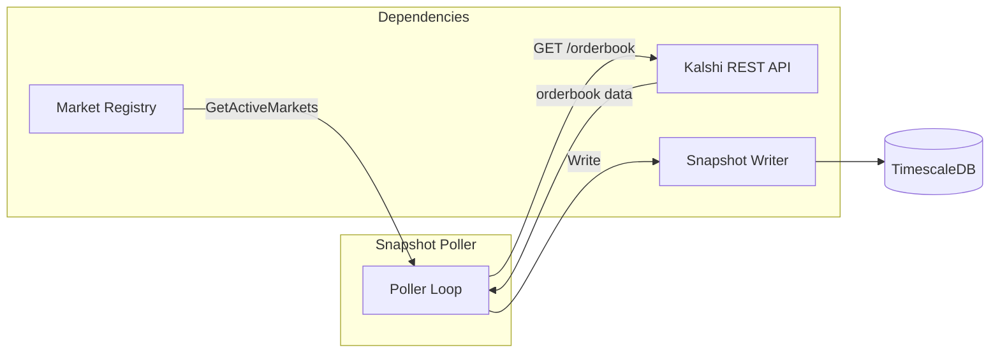
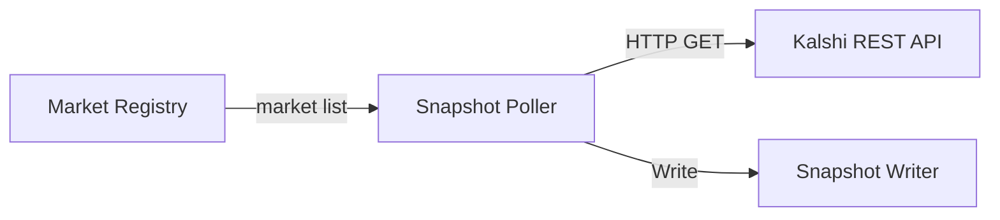

# Snapshot Poller

Backup data source that polls REST API for orderbook snapshots every 15 minutes.

---

## Responsibilities

| Responsibility | Details |
|----------------|---------|
| Periodic polling | Fetch orderbook snapshots every 15 minutes |
| Backup data source | Ensure data availability if WebSocket misses messages |
| Gap recovery | Provide 15-minute resolution recovery points during outages |

**Not responsible for** (handled by other components):
- WebSocket data ingestion (Connection Manager)
- Market discovery (Market Registry)
- Data transformation (Snapshot Writer)
- Deduplication (Deduplicator)

---

## Purpose

The Snapshot Poller acts as a safety net for the WebSocket-based data pipeline:

1. **WebSocket deltas** provide real-time updates but can miss messages during:
   - Network interruptions
   - Sequence gaps
   - Reconnection periods

2. **Snapshot Poller** ensures:
   - 15-minute resolution orderbook snapshots
   - Recovery point for reconstructing orderbook state
   - Independent data source for deduplicator cross-validation

---

## Data Flow

---

## Dependencies

| Dependency | Direction | Purpose |
|------------|-----------|---------|
| Market Registry | Input | Get list of active markets to poll |
| Kalshi REST API | Input | Fetch orderbook snapshots |
| Snapshot Writer | Output | Persist snapshots to database |

---

## Design Principles

1. **Market Registry as single source of truth**: Never maintains own market list
2. **Synchronous writes**: Each snapshot written immediately after fetch
3. **No retry logic**: Relies on next poll cycle and 3-gatherer redundancy
4. **Independent operation**: Runs on fixed 15-minute interval regardless of WebSocket state
5. **Max concurrency always**: Uses maximum concurrent requests to complete polling as fast as possible

---

## Scalability

REST snapshot polling uses **max concurrent HTTP requests** (100) to poll all markets as fast as possible within each 15-minute cycle.

### Capacity

| Concurrency | Avg Latency | Markets/15min | Time for 1M |
|-------------|-------------|---------------|-------------|
| 100 | 100ms | 900,000 | ~17 min |
| 100 | 50ms | 1,800,000 | ~8 min |

**Formula**: `time_to_poll_all = market_count / (concurrency × (1s / avg_latency))`

At 1M markets with 100ms latency, polling takes ~17 minutes. This slightly exceeds the 15-minute interval, meaning some cycles may overlap. This is acceptable because:
- WebSocket deltas are the primary data source (real-time)
- REST snapshots are backup/recovery only
- 3-gatherer redundancy provides coverage even if one gatherer falls behind

See [Behaviors](./behaviors.md#concurrency-scaling) for implementation details.

---

## Table Separation

The Snapshot Poller writes to a **different table** than WebSocket orderbook data:

| Data Source | Target Table | Content |
|-------------|--------------|---------|
| WebSocket `orderbook_delta` | `orderbook_deltas` | Incremental price level changes |
| WebSocket snapshot (on subscribe) | `orderbook_snapshots` | Full orderbook, `source='ws'` |
| REST polling (Snapshot Poller) | `orderbook_snapshots` | Full orderbook, `source='rest'` |

The `orderbook_deltas` table contains real-time incremental updates. The `orderbook_snapshots` table contains point-in-time full orderbook state from both WebSocket subscriptions and REST polling.

## WebSocket vs REST Snapshots

| Aspect | WebSocket Snapshot | REST Snapshot |
|--------|-------------------|---------------|
| Trigger | On subscription | Every 15 minutes |
| Target table | `orderbook_snapshots` | `orderbook_snapshots` |
| Source column | `'ws'` | `'rest'` |
| SID | From subscription | `0` |
| Exchange timestamp | From message | `0` (not provided) |
| Purpose | Initial state | Backup/recovery |

---

## Related Docs

- [Interface](./interface.md) - Public methods and types
- [Lifecycle](./lifecycle.md) - Startup and shutdown
- [Behaviors](./behaviors.md) - Polling loop, REST calls
- [Configuration](./configuration.md) - Config options and metrics
- [Market Registry](../market-registry/) - Source of market list
- [Writers](../writers/) - Snapshot Writer interface
