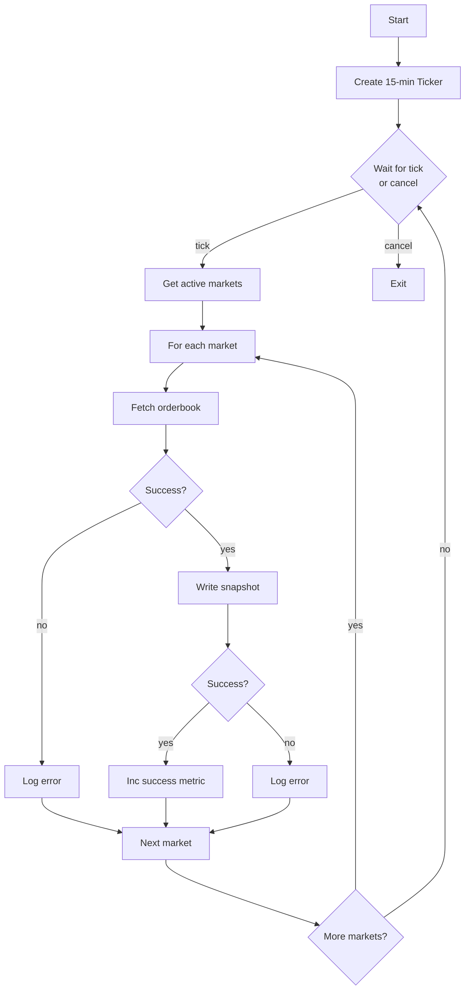

# Behaviors

Polling loop, REST API calls, and response parsing for Snapshot Poller.

---

## Polling Loop



### Main Loop

```go
func (p *snapshotPoller) run() {
    defer p.wg.Done()

    ticker := time.NewTicker(p.cfg.PollInterval)
    defer ticker.Stop()

    // Poll immediately on start, then on ticker
    p.pollAll()

    for {
        select {
        case <-p.ctx.Done():
            return
        case <-ticker.C:
            p.pollAll()
        }
    }
}
```

### Poll All Markets (Concurrent)

The poller uses a worker pool with configurable concurrency to fetch orderbooks in parallel.

```go
func (p *snapshotPoller) pollAll() {
    start := time.Now()

    markets := p.registry.GetActiveMarkets()
    p.metrics.MarketsPolled.Set(float64(len(markets)))

    if len(markets) == 0 {
        p.logger.Debug("no active markets to poll")
        return
    }

    // Use semaphore for bounded concurrency
    sem := make(chan struct{}, p.cfg.Concurrency) // Default: 100 concurrent requests
    var wg sync.WaitGroup
    var fetched, errors atomic.Int64

    for _, market := range markets {
        wg.Add(1)
        go func(ticker string) {
            defer wg.Done()

            // Acquire semaphore slot
            select {
            case sem <- struct{}{}:
                defer func() { <-sem }()
            case <-p.ctx.Done():
                return
            }

            snapshot, err := p.fetchOrderbook(ticker)
            if err != nil {
                p.logger.Warn("failed to fetch orderbook",
                    "ticker", ticker,
                    "err", err,
                )
                p.metrics.FetchErrors.Inc()
                errors.Add(1)
                return
            }

            if err := p.writer.Write(snapshot); err != nil {
                p.logger.Warn("failed to write snapshot",
                    "ticker", ticker,
                    "err", err,
                )
                p.metrics.WriteErrors.Inc()
                errors.Add(1)
                return
            }

            fetched.Add(1)
        }(market.Ticker)
    }

    wg.Wait()

    p.metrics.SnapshotsFetched.Add(float64(fetched.Load()))
    p.metrics.PollDuration.Observe(time.Since(start).Seconds())

    p.logger.Debug("poll cycle complete",
        "markets", len(markets),
        "fetched", fetched.Load(),
        "errors", errors.Load(),
        "duration", time.Since(start),
    )
}
```

### Concurrency Scaling

Always uses max concurrency (100 concurrent requests) to poll all markets as fast as possible within 15-minute cycles.

| Concurrency | Avg Latency | Markets/15min | Time for 1M |
|-------------|-------------|---------------|-------------|
| 100 | 100ms | 900,000 | ~17 min |
| 100 | 50ms | 1,800,000 | ~8 min |

**Formula**: `time_to_poll_all = market_count / (concurrency × (1s / avg_latency))`
```

---

## REST API Call

### Endpoint

```
GET /markets/{ticker}/orderbook
```

See [REST API: Get Orderbook](../../kalshi-api/rest-api/markets/get-orderbook.md) for full API documentation.

### Fetch Implementation

```go
func (p *snapshotPoller) fetchOrderbook(ticker string) (RESTOrderbookSnapshot, error) {
    url := fmt.Sprintf("%s/markets/%s/orderbook", p.cfg.BaseURL, ticker)

    req, err := http.NewRequestWithContext(p.ctx, "GET", url, nil)
    if err != nil {
        return RESTOrderbookSnapshot{}, fmt.Errorf("create request: %w", err)
    }

    resp, err := p.client.Do(req)
    if err != nil {
        return RESTOrderbookSnapshot{}, fmt.Errorf("http request: %w", err)
    }
    defer resp.Body.Close()

    if resp.StatusCode != http.StatusOK {
        return RESTOrderbookSnapshot{}, fmt.Errorf("unexpected status: %d", resp.StatusCode)
    }

    var result orderbookResponse
    if err := json.NewDecoder(resp.Body).Decode(&result); err != nil {
        return RESTOrderbookSnapshot{}, fmt.Errorf("decode response: %w", err)
    }

    return RESTOrderbookSnapshot{
        Ticker:     ticker,
        SnapshotTs: time.Now().UnixMicro(),
        YesBids:    parsePriceLevels(result.Orderbook.YesDollars),
        NoBids:     parsePriceLevels(result.Orderbook.NoDollars),
    }, nil
}
```

---

## Response Parsing

### API Response Format

```go
type orderbookResponse struct {
    Orderbook struct {
        Yes        [][]interface{} `json:"yes"`         // [[price_cents, qty], ...]
        No         [][]interface{} `json:"no"`
        YesDollars [][]interface{} `json:"yes_dollars"` // [["price", qty], ...]
        NoDollars  [][]interface{} `json:"no_dollars"`
    } `json:"orderbook"`
}
```

**Note:** Use `*_dollars` fields for subpenny precision. The `yes`/`no` fields are in cents and lose precision.

### Parse Price Levels

```go
func parsePriceLevels(levels [][]interface{}) []PriceLevel {
    result := make([]PriceLevel, 0, len(levels))

    for _, level := range levels {
        if len(level) != 2 {
            continue
        }

        // level[0] is price as string (e.g., "0.52" or "0.5250")
        dollars, ok := level[0].(string)
        if !ok {
            continue
        }

        // level[1] is quantity as float64 (JSON numbers)
        qtyFloat, ok := level[1].(float64)
        if !ok {
            continue
        }

        result = append(result, PriceLevel{
            Dollars:  dollars,
            Quantity: int(qtyFloat),
        })
    }

    return result
}
```

### Example Response

```json
{
  "orderbook": {
    "yes": [[52, 100], [51, 200]],
    "no": [[48, 150], [47, 250]],
    "yes_dollars": [["0.52", 100], ["0.51", 200]],
    "no_dollars": [["0.48", 150], ["0.47", 250]]
  }
}
```

Parsed to:

```go
RESTOrderbookSnapshot{
    Ticker:     "EXAMPLE-TICKER",
    SnapshotTs: 1704067200000000,  // µs
    YesBids: []PriceLevel{
        {Dollars: "0.52", Quantity: 100},
        {Dollars: "0.51", Quantity: 200},
    },
    NoBids: []PriceLevel{
        {Dollars: "0.48", Quantity: 150},
        {Dollars: "0.47", Quantity: 250},
    },
}
```

---

## Error Handling

| Error | Behavior | Metric |
|-------|----------|--------|
| HTTP timeout | Log, skip market | `fetch_errors_total` |
| Non-200 status | Log, skip market | `fetch_errors_total` |
| JSON decode error | Log, skip market | `fetch_errors_total` |
| Writer error | Log, skip market | `write_errors_total` |
| Context cancelled | Exit loop | None |

**No retry logic**: Failed fetches wait for the next 15-minute poll cycle. With 3 gatherers polling independently, coverage is maintained.

---

## Rate Limiting

Per Kalshi API documentation, **read operations are not rate-limited**. Only order operations (writes) have rate limits.

However, the poller is naturally rate-limited:
- 15-minute poll interval
- Max concurrency (100 concurrent requests)

## Scalability

**Design**: Concurrent fetching with semaphore-based worker pool (see [Poll All Markets](#poll-all-markets-concurrent)).

| Concurrency | Markets/15min | Memory Overhead |
|-------------|---------------|-----------------|
| 100 | ~900,000 | ~10 MB (goroutine stacks) |

**At 1M markets**: Polling takes ~17 minutes at 100ms latency, slightly exceeding the 15-minute interval. This is acceptable since WebSocket deltas are the primary data source and 3-gatherer redundancy provides coverage.

---

## Deduplication Semantics

### Snapshot Timestamp (`snapshot_ts`)

REST snapshots use the gatherer's local time as `snapshot_ts`:

```go
SnapshotTs: time.Now().UnixMicro(),  // Gatherer-local time
```

**Important:** This is NOT the exchange timestamp (which REST API doesn't provide for orderbooks). It's the observation time from the gatherer's perspective.

### Multi-Gatherer Behavior

With 3 gatherers polling every 15 minutes:

| Gatherer | Poll Time | `snapshot_ts` |
|----------|-----------|---------------|
| Gatherer 1 | 12:00:00.123456 | 1704110400123456 |
| Gatherer 2 | 12:00:00.234567 | 1704110400234567 |
| Gatherer 3 | 12:00:00.345678 | 1704110400345678 |

Each produces a **distinct** snapshot (different `snapshot_ts`). The primary key `(ticker, snapshot_ts, source)` ensures all 3 are stored.

### Intentional Non-Deduplication

REST snapshots from different gatherers are **not deduplicated** in production. This is intentional:

1. **Different observation times** - Each snapshot represents the orderbook state at a slightly different moment (±seconds between gatherers)
2. **Redundancy** - If one gatherer misses a poll cycle, others provide coverage
3. **3x sampling rate** - Effective 5-minute resolution instead of 15-minute

### Deduplicator Handling

The deduplicator writes all REST snapshots with `ON CONFLICT DO NOTHING`:

```sql
INSERT INTO orderbook_snapshots (ticker, snapshot_ts, source, ...)
VALUES ($1, $2, 'rest', ...)
ON CONFLICT (ticker, snapshot_ts, source) DO NOTHING;
```

Since each gatherer has a unique `snapshot_ts`, conflicts only occur if:
- Same gatherer sends the same snapshot twice (rare, indicates bug)
- Clock sync issues cause identical microsecond timestamps (extremely rare)

### Storage Impact

| Gatherers | Snapshots/Market/Hour | Daily per 1K Markets |
|-----------|----------------------|----------------------|
| 1 | 4 | ~400 MB (uncompressed) |
| 3 | 12 | ~1.2 GB (uncompressed) |
| 3 (compressed) | 12 | ~120 MB |

The 3x multiplier is acceptable given storage is cheap and compression is effective.
