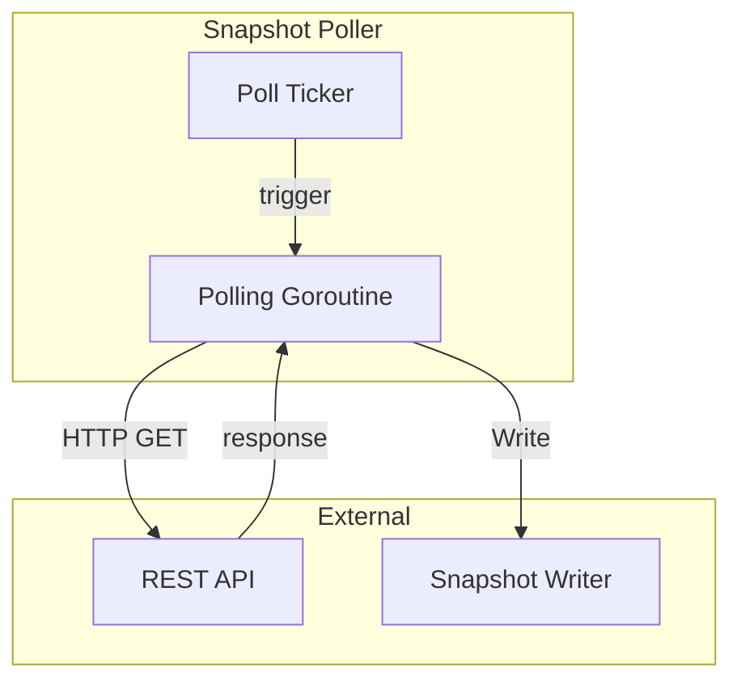

# Interface

Public methods and types for Snapshot Poller.

---

## Poller Interface

```go
type SnapshotPoller interface {
    // Start begins the polling loop
    Start(ctx context.Context) error

    // Stop gracefully shuts down the poller
    Stop(ctx context.Context) error
}
```

---

## Implementation

```go
type snapshotPoller struct {
    cfg      PollerConfig
    ctx      context.Context
    cancel   context.CancelFunc
    wg       sync.WaitGroup
    logger   *slog.Logger

    // Dependencies
    registry MarketRegistry   // Get active markets
    client   *http.Client     // REST API calls
    writer   *SnapshotWriter  // Persist snapshots

    // Metrics
    metrics  *PollerMetrics
}
```

---

## Dependencies

### Market Registry

Used to get the current list of active markets (subset of full interface, see [market-registry/interface.md](../market-registry/interface.md)):

```go
type MarketRegistry interface {
    // GetActiveMarkets returns all markets currently being tracked
    GetActiveMarkets() []Market
}

type Market struct {
    Ticker        string
    EventTicker   string
    Title         string
    MarketStatus  string  // initialized, inactive, active, closed, determined, disputed, amended, finalized
    TradingStatus string
    // ... other fields (see market-registry/interface.md for full type)
}
```

### Snapshot Writer

Used to persist fetched snapshots:

```go
// From writers/interface.md
type SnapshotWriter struct {
    // ...
}

func (w *SnapshotWriter) Write(snapshot RESTOrderbookSnapshot) error
```

---

## Input Type

### REST API Response

The Kalshi REST API returns orderbook data in this format:

```go
type orderbookResponse struct {
    Orderbook struct {
        Yes        [][]interface{} `json:"yes"`         // [[price_cents, qty], ...]
        No         [][]interface{} `json:"no"`
        YesDollars [][]interface{} `json:"yes_dollars"` // [["price", qty], ...]
        NoDollars  [][]interface{} `json:"no_dollars"`
    } `json:"orderbook"`
}
```

**Note:** Use `*_dollars` fields for subpenny precision.

---

## Output Type

### RESTOrderbookSnapshot

Passed to Snapshot Writer:

```go
type RESTOrderbookSnapshot struct {
    Ticker     string
    SnapshotTs int64  // When poller fetched (µs)

    // Kalshi API provides bids only per side
    // Asks are derived by Snapshot Writer
    YesBids []PriceLevel
    NoBids  []PriceLevel
}

type PriceLevel struct {
    Dollars  string  // e.g. "0.52", "0.5250"
    Quantity int
}
```

---

## Concurrency Model



| Goroutine | Count | Purpose |
|-----------|-------|---------|
| Polling Loop | 1 | Wait for ticker, fetch all markets, write snapshots |

**Thread Safety:**
- Single goroutine design - no concurrent access to internal state
- HTTP client is thread-safe
- Snapshot Writer is synchronous (blocks until write completes)
