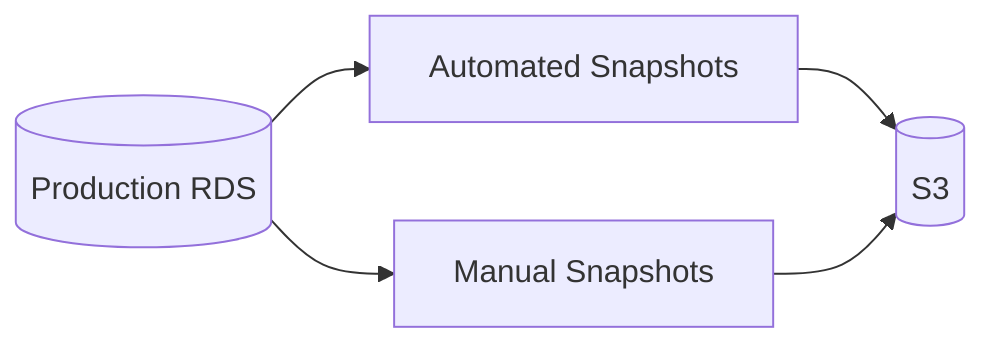
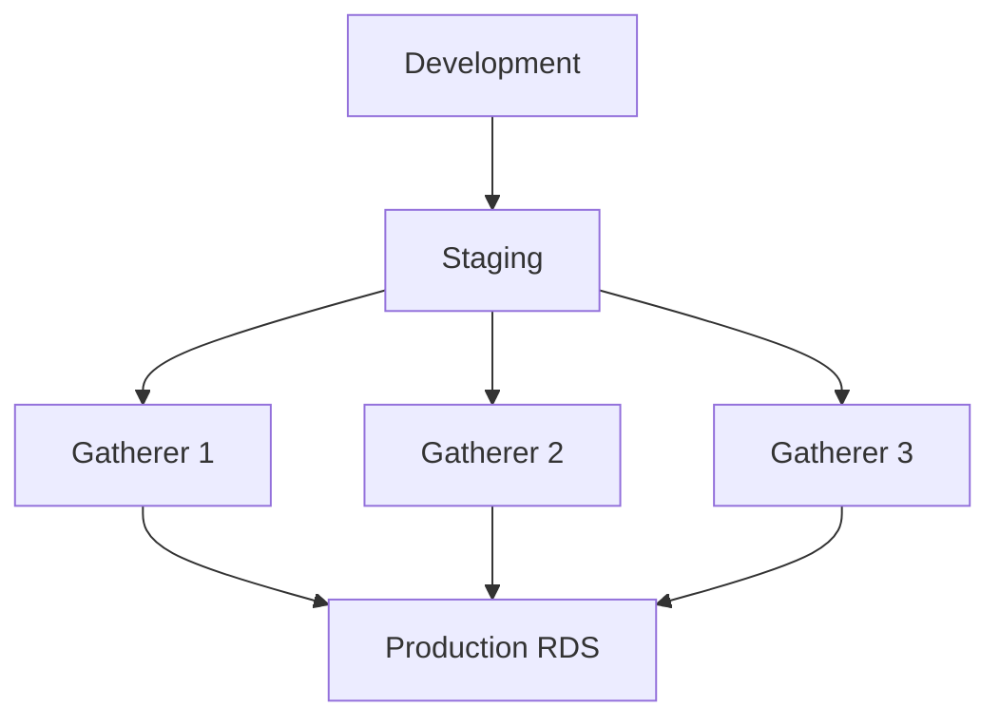

# Operations

Backup, restore, migrations, and maintenance procedures.

---

## Backup Strategy

### Gatherer Databases

Gatherer data is temporary (synced to production), so backups are low priority.

| Method | Frequency | Retention | Purpose |
|--------|-----------|-----------|---------|
| None required | - | - | Data exists in production |

**Recovery:** Re-sync from production or let deduplicator rebuild from other gatherers.

### Production RDS

Critical data requiring automated backups.



| Method | Frequency | Retention | RPO |
|--------|-----------|-----------|-----|
| Automated snapshots | Daily | 7 days | 24 hours |
| Point-in-time recovery | Continuous | 7 days | 5 minutes |
| Manual snapshots | Before changes | 30 days | N/A |

### RDS Backup Configuration

```bash
# AWS CLI: Enable automated backups
aws rds modify-db-instance \
  --db-instance-identifier kalshi-prod \
  --backup-retention-period 7 \
  --preferred-backup-window "03:00-04:00"
```

---

## Restore Procedures

### Point-in-Time Recovery (Production)

Restore to any point within retention window.

```bash
# Restore to specific time
aws rds restore-db-instance-to-point-in-time \
  --source-db-instance-identifier kalshi-prod \
  --target-db-instance-identifier kalshi-prod-restored \
  --restore-time "2024-01-15T10:30:00Z"
```

### Snapshot Restore

```bash
# Restore from snapshot
aws rds restore-db-instance-from-db-snapshot \
  --db-instance-identifier kalshi-prod-restored \
  --db-snapshot-identifier kalshi-prod-2024-01-15
```

### Post-Restore Steps

1. **Verify data integrity**
   ```sql
   -- Check row counts
   SELECT 'trades' as table_name, COUNT(*) FROM trades
   UNION ALL
   SELECT 'orderbook_deltas', COUNT(*) FROM orderbook_deltas
   UNION ALL
   SELECT 'markets', COUNT(*) FROM markets;
   ```

2. **Update connection strings**
   - Point deduplicator to restored instance
   - Update read replicas if needed

3. **Verify TimescaleDB state**
   ```sql
   -- Check hypertables
   SELECT * FROM timescaledb_information.hypertables;

   -- Check jobs
   SELECT * FROM timescaledb_information.jobs;
   ```

---

## Schema Migrations

### Migration Strategy



**Order of migrations:**
1. Production RDS (additive changes first)
2. All gatherers (simultaneously)
3. Production RDS (removals last)

### Migration Files

```
migrations/
├── 001_create_trades.sql
├── 002_create_orderbook_deltas.sql
└── 003_add_dollar_volume.sql
```

### Migration Template

```sql
-- migrations/003_add_dollar_volume.sql

-- Up
ALTER TABLE tickers ADD COLUMN dollar_volume BIGINT;
ALTER TABLE tickers ADD COLUMN dollar_open_interest BIGINT;

-- Down (for rollback)
ALTER TABLE tickers DROP COLUMN dollar_volume;
ALTER TABLE tickers DROP COLUMN dollar_open_interest;
```

### Running Migrations

```bash
# Using golang-migrate
migrate -database "${DB_URL}" -path migrations up

# Rollback last migration
migrate -database "${DB_URL}" -path migrations down 1
```

### Zero-Downtime Migrations

| Change Type | Strategy |
|-------------|----------|
| Add column | Add with NULL default, backfill, add NOT NULL |
| Add index | CREATE INDEX CONCURRENTLY |
| Drop column | Stop writes, deploy, drop column |
| Rename column | Add new, copy data, switch reads, drop old |

**Example: Adding NOT NULL column**

```sql
-- Step 1: Add nullable column
ALTER TABLE tickers ADD COLUMN dollar_volume BIGINT;

-- Step 2: Backfill (in batches)
UPDATE tickers SET dollar_volume = 0
WHERE dollar_volume IS NULL
  AND exchange_ts > $last_processed
LIMIT 10000;

-- Step 3: Add constraint
ALTER TABLE tickers ALTER COLUMN dollar_volume SET NOT NULL;
```

---

## Maintenance Tasks

### Daily

| Task | Command | Automated |
|------|---------|-----------|
| Compression | TimescaleDB policy | Yes |
| Retention | TimescaleDB policy | Yes |
| Statistics | autovacuum | Yes |

### Weekly

| Task | Command | Automated |
|------|---------|-----------|
| VACUUM ANALYZE | Manual or cron | Recommended |
| Reindex | If needed | No |
| Chunk review | Query | No |

```sql
-- Weekly VACUUM ANALYZE
VACUUM ANALYZE trades;
VACUUM ANALYZE orderbook_deltas;
VACUUM ANALYZE orderbook_snapshots;
VACUUM ANALYZE tickers;
```

### Monthly

| Task | Purpose |
|------|---------|
| Review storage growth | Capacity planning |
| Check compression ratios | Verify policies working |
| Audit retention | Verify old data removed |
| Update statistics | ANALYZE on all tables |

---

## Monitoring

### Storage Metrics

```sql
-- Total database size
SELECT pg_size_pretty(pg_database_size(current_database()));

-- Size by table
SELECT
    relname,
    pg_size_pretty(pg_total_relation_size(relid)) as total_size
FROM pg_catalog.pg_statio_user_tables
ORDER BY pg_total_relation_size(relid) DESC;

-- TimescaleDB hypertable sizes
SELECT
    hypertable_name,
    pg_size_pretty(total_bytes) as total,
    pg_size_pretty(table_bytes) as table,
    pg_size_pretty(index_bytes) as index
FROM timescaledb_information.hypertables
ORDER BY total_bytes DESC;
```

### Compression Status

```sql
-- Compression status by hypertable
SELECT
    hypertable_name,
    COUNT(*) FILTER (WHERE is_compressed) as compressed,
    COUNT(*) FILTER (WHERE NOT is_compressed) as uncompressed,
    pg_size_pretty(SUM(total_bytes) FILTER (WHERE is_compressed)) as compressed_size,
    pg_size_pretty(SUM(total_bytes) FILTER (WHERE NOT is_compressed)) as uncompressed_size
FROM timescaledb_information.chunks
GROUP BY hypertable_name;
```

### Job Health

```sql
-- Check job status
SELECT
    job_id,
    application_name,
    schedule_interval,
    last_run_started_at,
    last_successful_finish,
    last_run_status,
    total_runs,
    total_failures
FROM timescaledb_information.job_stats
JOIN timescaledb_information.jobs USING (job_id);
```

---

## Capacity Planning

### Growth Projections

| Table | Daily Growth | Monthly Growth | Annual Growth |
|-------|--------------|----------------|---------------|
| trades | 10 MB | 300 MB | 3.6 GB |
| orderbook_deltas | 60 MB | 1.8 GB | 21.6 GB |
| orderbook_snapshots | 280 MB | 8.4 GB | 100 GB |
| tickers | 5 MB | 150 MB | 1.8 GB |
| **Total** | **355 MB** | **10.6 GB** | **127 GB** |

*After 10x compression. Actual may vary with market activity.*

### Storage Alerts

| Metric | Warning | Critical |
|--------|---------|----------|
| Disk usage | 70% | 85% |
| Growth rate | 2x normal | 5x normal |
| Compression backlog | 24 hours | 72 hours |

---

## Disaster Recovery

### RTO/RPO Targets

| Tier | RTO | RPO |
|------|-----|-----|
| Production RDS | 1 hour | 5 minutes |
| Gatherer DBs | 4 hours | N/A (rebuilt from production) |
| S3 exports | N/A | 1 day |

### Recovery Runbook

1. **Assess damage**
   - Identify failed components
   - Check data integrity
   - Review last successful sync

2. **Restore production RDS**
   ```bash
   # Point-in-time restore
   aws rds restore-db-instance-to-point-in-time \
     --source-db-instance-identifier kalshi-prod \
     --target-db-instance-identifier kalshi-prod-dr \
     --restore-time "YYYY-MM-DDTHH:MM:SSZ"
   ```

3. **Verify TimescaleDB**
   ```sql
   -- Check extension
   SELECT * FROM pg_extension WHERE extname = 'timescaledb';

   -- Check hypertables
   SELECT * FROM timescaledb_information.hypertables;

   -- Verify compression jobs
   SELECT * FROM timescaledb_information.jobs;
   ```

4. **Update connections**
   - Point deduplicator to restored instance
   - Update DNS/endpoints

5. **Verify data flow**
   - Monitor sync lag
   - Check write throughput
   - Verify no duplicate inserts

---

## Troubleshooting

### Slow Queries

```sql
-- Find slow queries
SELECT
    query,
    calls,
    mean_exec_time,
    total_exec_time
FROM pg_stat_statements
ORDER BY mean_exec_time DESC
LIMIT 10;
```

### Lock Contention

```sql
-- View locks
SELECT
    locktype,
    relation::regclass,
    mode,
    granted
FROM pg_locks
WHERE NOT granted;
```

### Connection Issues

```sql
-- View connections
SELECT
    datname,
    usename,
    application_name,
    client_addr,
    state,
    query_start
FROM pg_stat_activity
WHERE state != 'idle';

-- Kill stuck connection
SELECT pg_terminate_backend(pid)
FROM pg_stat_activity
WHERE state = 'active'
  AND query_start < NOW() - INTERVAL '1 hour';
```
